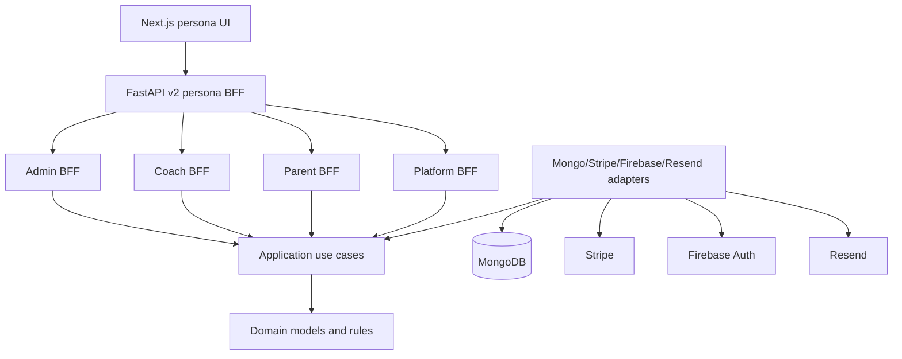
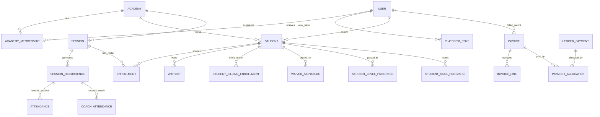

# Application Data Model Architecture Review

Status: Draft for product and architecture review.

Scope:

- v2 production architecture and data model.
- Academy operations: registration, students, family, sessions, attendance, billing, coaching, curriculum, payroll, communications, and SaaS tenancy.
- Legacy `/api/*` routes are out of scope for SaaS readiness except as historical context.
- This document is a review artifact, not an accepted ADR.

Primary sources:

- `docs/adr/0005-clean-architecture-lite-monolith.md`
- `docs/adr/0007-saas-tenant-model-and-membership-auth.md`
- `docs/adr/0011-billing-ledger-payment-storage.md`
- `docs/requirements/2026-05-21-saas-data-model-architecture-assessment.md`
- `docs/reviews/2026-06-17-saas-ddd-bff-architecture-review.md`
- `backend/v2/contexts/**/domain/*.py`
- `backend/v2/contexts/**/infrastructure/*.py`
- `backend/v2/migrations/*.py`
- Read-only production Mongo field-shape audit against `academy_manager` /
  `acad_blno_badminton` on 2026-06-19.

## Executive Summary

The application already has a strong v2 shape: a Clean Architecture Lite monolith with bounded contexts, persona BFF routes, Mongo repositories, Firebase Auth, Stripe billing, and tenant-scoped data access. The model is good enough for a single academy launch and has many SaaS primitives in place.

The main issue is not that the model is absent. The issue is that some product-critical concepts are split across transitional records or not promoted to canonical records yet.

Highest-priority gaps:

1. Student profile is too thin in the domain model, even though production
   student documents already carry imported profile fields.
2. Registration date is absent from all production students.
3. Family/household is implicit, not explicit.
4. Billing enrollment is absent in production even though roster enrollment and
   legacy payments exist.
5. Waiver acceptances exist in production, but per-student waiver signatures do
   not.
6. SaaS tenant primitives exist, but composition still has single-academy/default-academy paths.
7. Billing has a ledger model, but old payment/import concepts still need reconciliation policy.
8. Communications are campaign-oriented, not full two-way parent/admin/coach messaging.
9. Operational audit/logging is uneven around money movement and support workflows.

## Current Architecture

The accepted architecture is a structured monolith, not microservices:



Layer rule:

- Interfaces own HTTP, auth dependencies, and persona-shaped DTOs.
- Application owns use cases and ports.
- Domain owns business rules and entities.
- Infrastructure owns Mongo and external adapters.
- Composition wires concrete implementations.

## Bounded Context Ownership

| Context | Owns | Canonical collections | Notes |
| --- | --- | --- | --- |
| Identity | Global users, academy memberships, platform roles, auth claims | `users`, `academy_memberships`, `platform_roles` | Target SaaS shape is correct; legacy `users.academy_id` still exists for compatibility. |
| Platform tenancy | Tenant lifecycle, domain mapping, plan limits | `academies`, `academy_domains`, `academy_settings`, `academy_feature_flags` | Platform owns tenant status and serving health. |
| Enrollment | Students, sessions, session occurrences, roster enrollments, waitlist, lifecycle events | `students`, `sessions`, `session_occurrences`, `enrollments`, `waitlist`, `enrollment_events`, `pause_requests`, `scheduled_enrollment_actions` | Student is currently under-modeled. |
| Onboarding | Parent registration applications and registration waiver acceptance | `onboarding_applications`, `waivers`, `waiver_templates`, `waiver_signatures`, `waiver_acceptances` | Application data is not fully promoted on approval. |
| Billing | Parent tuition, invoices, ledger payments, payment attempts, Stripe state, billing products | `invoices`, `invoice_lines`, `ledger_payments`, `payment_allocations`, `payment_attempts`, `payments`, `subscriptions`, `student_billing_enrollments`, `session_types`, `account_credit_ledger`, `credit_applications`, `parent_billing_customers` | Ledger model is the right direction; old payment paths still coexist. |
| Coaching | Student attendance, coach attendance, session feedback, progress notes, coach rates | `attendance`, `coach_attendance`, `session_feedback`, `progress_notes`, `lesson_plans`, `coach_skill_notes`, `coach_rates` | Attendance is occurrence-based, which is good. |
| Curriculum | Programs, levels, skills, criteria, lesson resources | `skill_programs`, `skill_levels`, `skills`, `skill_criteria`, `external_lesson_refs`, `lesson_cards`, `curriculum_video_refs` | Strong domain shape. |
| Student progress | Level placement, skill progress, tests, level-up recommendations, certificates | `student_level_progress`, `student_skill_progress`, `test_attempts`, `level_up_recommendations`, `skill_certificates` | Strong domain shape; needs import/placement policy for existing students. |
| Finance | Durable payroll periods, payout audit, reporting snapshots | `payout_periods`, `payout_period_lines`, `payout_audit_log`, `academy_revenue_snapshots`, `session_attendance_snapshots`, `coach_payout_snapshots`, `expenses`, `payouts` | Some older finance-like collections still live in billing/admin history. |
| Communications | Campaigns, deliveries, coach digest sends | `message_campaigns`, `message_deliveries`, `coach_digest_sends`, legacy `messages` | Campaign delivery exists; two-way messaging is not a full model yet. |
| Governance/support | Tenant export/deletion, support access, platform audit | `tenant_export_requests`, `tenant_deletion_requests`, `student_data_deletion_requests`, `support_access_grants`, `support_impersonation_requests`, `platform_governance_audit_logs`, `platform_audit_events` | Good SaaS scaffolding; needs operational polish. |
| Shared operations | Idempotency, outbox, dead-letter/replay | `idempotency_keys`, `outbox_events`, `dead_letter_events`, `event_handler_runs`, `event_audit`, `stripe_webhook_events`, `stripe_invoice_processing` | Useful for replay/idempotency; observability gaps remain. |

## Current Core Model



## Production Data Inspection

Read-only production inspection was run against the Fly backend environment,
using aggregate counts and field coverage only. No production writes were run
and no parent/student PII values were copied into this document.

Production snapshot:

| Area | Production observation |
| --- | --- |
| Tenant | `academy_manager` database, `acad_blno_badminton`, 91 collections. |
| Students | 52 students: 49 active, 2 cancelled, 1 paused. |
| Parents/users | 51 users and 51 academy memberships; all students join to a parent user. |
| Student profile fields | All 52 students have `dob`, `age`, `skill_level`, emergency contact, medical notes, previous experience, and T-shirt fields. |
| Registration date | 0 of 52 students have `registered_at`. |
| Canonical DOB field | 0 students have `date_of_birth`; all 52 use legacy/import field `dob` as a string. |
| Age field | All 52 students have `age` as an integer; 0 have `age_at_registration`. |
| Skill field | All 52 students have `skill_level`; 0 have `skill_level_at_registration`. Current values are 36 beginner and 16 intermediate. |
| Household | `households` and `household_members` are empty. |
| Onboarding applications | `onboarding_applications` is empty in production. Current BLNO data appears imported/seeded rather than approved through the parent application workflow. |
| Roster enrollment | 52 enrollments; all join to students. |
| Session model | 4 scheduled recurring-shaped sessions and 40 scheduled occurrences. Sessions use `days_of_week`; no `recurrence_rule` or `session_type_id` is present. |
| Billing enrollment | `student_billing_enrollments` is empty. |
| Billing records | Legacy `payments` has 126 rows: 62 succeeded, 58 pending, 6 waived. Periods are April, May, and June 2026. Ledger/invoice model has only 1 invoice, 1 invoice line, 1 ledger payment, and 1 allocation. |
| Waivers | 52 `waiver_acceptances` exist and all join to students/parents; 0 `waiver_signatures` exist. |
| Progress | 51 `student_level_progress` rows and 300 `student_skill_progress` rows join to students. |
| Communications | Campaign, delivery, and message collections are empty. |

Implications:

- The next implementation should not treat production students as empty
  profiles. It should normalize existing imported fields into canonical names.
- `registered_at` cannot be recovered from production student documents alone.
  It needs the raw roster timestamp or an import audit source.
- Waiver work is a convergence/backfill problem from `waiver_acceptances` to
  `waiver_signatures`, not just a new-signature capture problem.
- Billing work is a convergence problem from legacy payments/invoices toward
  student billing enrollments and ledger AR, not a greenfield ledger rollout.
- Session truth is currently a mix of recurring session rows and generated
  occurrences. A future template model must migrate from existing `sessions`
  rather than assume template records already exist.

### Identity And Tenancy

Current target model:

- `users` is the global identity.
- `academy_memberships` grants roles inside one academy.
- `platform_roles` grants cross-tenant platform access.
- `academies` and `academy_domains` resolve tenants.

Review:

- The data model direction is correct.
- SaaS request paths must always resolve tenant from subdomain, custom domain, or approved internal header.
- The live composition layer still has single-academy/default-academy paths called out in `docs/reviews/2026-06-17-saas-ddd-bff-architecture-review.md`.

Target decision:

- Keep shared Mongo with tenant scoping.
- Do not introduce per-tenant databases yet.
- Before tenant 2, move composition to per-request/per-tenant wiring and remove default academy from SaaS paths.

### Students And Family

Current domain `Student` aggregate:

```text
student_id
academy_id
parent_id
full_name
```

Production Mongo student documents are richer than the domain aggregate. Admin
detail can read/edit additional fields if they exist on Mongo student docs:

```text
dob
age
skill_level
previous_experience
medical_notes
emergency_contact_name
emergency_contact_phone
t_shirt_size
waiver status summary
payment and attendance summaries
```

Problems:

- `registered_at` is missing.
- Production uses `dob` as a string, while v2 admin DTOs and the recommended
  target use `date_of_birth`.
- Production uses `age` as an integer, but it is not clear whether that is
  current age or age at registration.
- Production uses `skill_level`, but that field currently mixes intake level
  and operational/session language.
- emergency/medical/experience/T-shirt fields are not part of the domain model.
- a student has one `parent_id`; there is no explicit household/family with multiple guardians.
- parent profile phone/name mostly exist on `users`, but there is no household
  contact model.

Recommended target:

```text
students
- student_id
- academy_id
- household_id
- primary_parent_id
- full_name
- date_of_birth
- age_at_registration
- registered_at
- registration_source
- status
- skill_level_at_registration
- previous_experience
- medical_notes
- emergency_contact_name
- emergency_contact_phone
- t_shirt_size
- created_at
- updated_at
```

```text
households
- household_id
- academy_id
- display_name
- primary_contact_user_id
- billing_contact_user_id
- created_at
- updated_at

household_members
- household_member_id
- academy_id
- household_id
- user_id
- relationship
- can_manage_billing
- can_sign_waivers
- can_receive_notifications
- status
```

If household is too much for the next cut, add only `students.registered_at` and `students.primary_parent_id` now, but reserve naming for a future household.

Production normalization:

- Add `registered_at` from the raw roster timestamp or reviewed import audit,
  not from `created_at`.
- Map `dob` -> `date_of_birth` after validating parseability. Keep `dob` as a
  legacy compatibility field only during migration.
- Map current `age` -> `age_at_registration` only when the raw roster or import
  batch proves the age came from registration time.
- Map current `skill_level` -> `skill_level_at_registration`, then keep actual
  placement in `student_level_progress`.
- Promote existing `previous_experience`, `medical_notes`,
  `emergency_contact_name`, `emergency_contact_phone`, and `t_shirt_size` into
  the domain model instead of leaving them as ad hoc Mongo fields.

### Registration And Onboarding

Current model:

- `onboarding_applications` stores parent profile, child profile, selected session, waiver acceptance, payment id, student id, enrollment id, and status.
- Admin approval creates a minimal `Student` and an `Enrollment`.
- Production currently has no `onboarding_applications`; BLNO students appear
  to come from import/seed data, with profile fields already on `students`.

Problems:

- Application `created_at` is not copied into `students.registered_at` for new
  onboarding flow approvals.
- Existing imported production students have no `registered_at`, even though
  the raw roster has a timestamp.
- child profile fields are promoted in production import data under legacy
  field names, not canonical domain names.
- parent profile phone/name mostly exist on `users`, but household/contact
  semantics are missing.
- waiver acceptance exists in production as `waiver_acceptances`, but it has
  not converged into `waiver_signatures`.
- raw historical imports need idempotent reconciliation with existing production users/students/enrollments/billing.

Recommended target:

- Treat onboarding application as intake/workflow state, not the long-term student profile.
- On approval or reviewed import, atomically promote:
  - parent profile -> `users` and membership/household contact fields.
  - child profile -> `students`.
  - waiver acceptance -> `waiver_signatures`.
  - selected class -> `enrollments`.
  - selected billing product/session type -> `student_billing_enrollments`.
  - initial invoice/payment -> ledger records.

For historical imports, introduce an import audit collection:

```text
student_import_batches
- import_batch_id
- academy_id
- source_name
- imported_by
- imported_at
- status
- row_count
- notes

student_import_rows
- import_row_id
- academy_id
- import_batch_id
- source_row_hash
- matched_student_id
- matched_parent_user_id
- proposed_changes
- status
- reviewed_by
- reviewed_at
```

This avoids writing raw spreadsheet rows directly into production tables without review.

### Sessions, Occurrences, Enrollment

Current model:

- `sessions` includes recurring template-ish fields and coach assignment.
- `session_occurrences` represents dated classes.
- `enrollments` represents student roster membership in a session.
- `enrollment_events` tracks lifecycle actions.
- `waitlist`, `pause_requests`, and `scheduled_enrollment_actions` support operational workflows.

Review:

- Occurrence model is the right direction for attendance, cancellation, billing, and payout.
- Production `sessions` currently represent four recurring-shaped classes with
  `days_of_week`; production `session_occurrences` has 40 dated rows.
- `sessions` still mixes template and scheduled-class concerns.
- Enrollment and billing enrollment are separate concepts, which is correct but needs clearer linking.

Recommended target:

```text
session_templates
- template_session_id
- academy_id
- title
- location
- coach_id
- recurrence_rule
- capacity
- session_type_id
- status

session_occurrences
- occurrence_id
- academy_id
- template_session_id
- start_at
- end_at
- scheduled_coach_id
- actual_coach_id
- status
- is_billable
- is_payable
```

Keep `enrollments` as roster truth. Use lifecycle events for moves, pauses, withdrawals, and billing impacts.

### Billing And Payments

Current model:

- New ledger: `invoices`, `invoice_lines`, `ledger_payments`, `payment_allocations`, `payment_attempts`, `account_credit_ledger`.
- Legacy/payment projection: `payments`, `subscriptions`.
- Billing product/session type model: `session_types`, `student_billing_enrollments`, `billing_products`.
- Stripe support: webhook events, invoice processing, parent billing customers.

Review:

- Ledger separation is the correct architecture.
- Redirects do not prove payment success; webhooks and ledger allocations must own money state.
- Manual payments, partial payments, overpayments, failed attempts, and allocations are modeled.
- There is still coexistence between legacy payment and ledger payment concepts.
- Production is still mostly legacy for BLNO billing: 126 `payments` rows versus
  1 ledger invoice/payment/allocation set, and 0 `student_billing_enrollments`.

Recommended target:

- Make ledger invoices the source of truth for parent AR.
- Keep Stripe as collection mechanism, not business truth.
- Keep `student_billing_enrollments` tied to billing products/session types.
- Ensure every invoice line has a source:
  - monthly tuition
  - manual charge
  - adjustment
  - credit application
  - refund/void action
- Ensure every money movement has actor/source/idempotency metadata.

### Attendance, Coaching, Payroll

Current model:

- Student attendance is occurrence-based.
- Coach attendance is occurrence-based.
- Coach rates are versioned.
- Payout periods snapshot lines and totals.
- Payout audit log exists.

Review:

- This model is strong.
- Payroll should remain based on actual payable occurrences, not template sessions.
- Admin corrections need immutable audit entries.

Recommended target:

- Standardize completion semantics for occurrence:
  - scheduled
  - completed
  - cancelled
  - no_show / low_attendance policy if needed later
- Link payout lines to occurrence id and rate id permanently.
- Keep payout periods immutable once approved unless reopened with audit reason.

### Curriculum And Student Progress

Current model:

- Curriculum program -> levels -> skills -> criteria/resources.
- Student progress -> current level, per-skill progress, test attempts, level-up recommendations, certificates.

Review:

- Strong model.
- Existing students need placement/import strategy.
- Skill level from raw registration is not the same as curriculum placement.

Recommended target:

- Treat registration `skill_level` as intake assessment only.
- Store it separately from curriculum placement:
  - `students.skill_level_at_registration`
  - `student_level_progress` for actual pathway placement.
- Add admin workflow to place imported students into a default program/level.

### Waivers And Compliance

Current model:

- Waiver templates and signatures exist.
- Legacy waiver acceptance rows still exist.
- Student detail checks signatures, acceptances, or legacy fields on student docs.

Problem:

- Onboarding waiver acceptance is not automatically the same as a durable per-student waiver signature.
- Production has 52 `waiver_acceptances` and 0 `waiver_signatures`; every
  production student currently needs convergence into the target signature
  model or an explicit re-sign state.

Recommended target:

- Each active student should have either:
  - current `waiver_signatures` row, or
  - explicit missing/outdated waiver state.
- Approval/import should create or reconcile per-student signature rows.
- Store the exact template id, content hash, signer, email, timestamp, and artifact pointer when available.

### Communications

Current model:

- Admin campaign send model exists.
- Deliveries and provider ids are tracked.
- Coach daily digest send idempotency exists.

Missing:

- Full two-way parent/admin/coach messaging thread model.
- Delivery bounce/complaint/read receipts beyond basic delivery status.

Recommended target:

```text
message_threads
- thread_id
- academy_id
- subject
- related_student_id
- related_session_id
- status
- created_by
- created_at

message_thread_participants
- participant_id
- thread_id
- user_id
- role
- last_read_at

message_events
- message_id
- thread_id
- sender_user_id
- body
- channel
- created_at
```

### Reporting And Analytics

Current model:

- Snapshot collections exist for revenue, attendance, and coach payout.
- Admin reports still read some raw operational data directly.

Recommended target:

- Use snapshots for high-level reports.
- Use domain tables for drill-down.
- Add retention/cohort metrics only after canonical student registration dates exist.

## Review Against The Raw Academy Roster

The provided roster contains:

- registration timestamp
- child full name
- child age
- parent/guardian name
- parent phone
- parent email
- skill level
- preferred batch
- previous experience
- emergency contact
- medical/allergy/injury notes
- T-shirt size
- waiver agreement text
- payment confirmation text
- historical April/May payments

Mapping recommendation:

| Raw field | Target | Import stance |
| --- | --- | --- |
| `Timestamp` | `students.registered_at` and import audit row | Use. This is missing for all production students. |
| `Child Full Name` | `students.full_name` | Use with match/review. |
| `Child Age` | `students.age_at_registration` | Use as intake-only. Production currently stores `age`, but should normalize only when matched to the registration row. |
| `Parent/Guardian Full Name` | `users.display_name` or household contact | Use if user record is empty/stale. |
| `Parent Phone Number` | `users.phone` or household contact | Use after validation. |
| `Parent Email Address` | `users.email` / match key | Use as primary parent match key. |
| `Skill Level` | `students.skill_level_at_registration` | Use as intake assessment, not curriculum placement. Production currently stores this as `students.skill_level`. |
| `Preferred Batch` | existing prod session/enrollment | Ignore for production session truth as requested. |
| `Previous Badminton Experience` | `students.previous_experience` | Use. |
| `Emergency Contact Name and Phone Number` | split into `emergency_contact_name`, `emergency_contact_phone` | Use after cleanup. |
| `Any medical condition...` | `students.medical_notes` | Use; preserve meaningful notes. |
| `T-shirt Size` | `students.t_shirt_size` | Use if present. |
| `Waiver Agreement` | `waiver_signatures` or import waiver acceptance evidence | Use only if legally acceptable as signed evidence. |
| `Payment Confirmation` | ignore for ledger truth | Do not use as proof of payment. |
| `Payment_Apr` / `Payment_May` | historical review only | Production already has legacy payment rows for April/May/June 2026. Do not directly update ledger without reconciliation. |
| `Enrolled` | no value in provided data | Ignore. |

## Prioritized Missing Architecture Work

### P0 - Student Registration Canonicalization

Add a durable student profile extension and approval/import promotion path.

Acceptance:

- New approved registrations set `students.registered_at`.
- Existing production students can be backfilled with `registered_at` only from
  matched raw roster/import evidence.
- New approved registrations copy child DOB, skill level, and optional profile fields.
- Existing production `dob`, `age`, and `skill_level` are normalized into
  canonical fields with a reviewed migration plan.
- Parent phone/name are synced or explicitly left unchanged with audit.
- Registration approval creates/reconciles per-student waiver evidence.
- Historical import can preview diffs before writing.

### P0 - SaaS Composition Readiness

Remove single-tenant composition assumptions before adding tenant 2.

Acceptance:

- No SaaS request path uses `default_academy_id`.
- Webhooks route by trusted metadata/resolved tenant.
- Admin/coach/parent composition uses request tenant.
- Multi-tenant integration test proves two academies work in one process.

### P1 - Household And Guardian Model

Make family relationships explicit.

Acceptance:

- A student can have multiple guardians.
- One household can contain multiple students.
- Billing contact, waiver signer, and notification recipients are explicit.
- Parent portal only exposes children through authorized household/member links.

### P1 - Waiver Convergence

Unify registration waiver acceptance and per-student waiver signature.

Acceptance:

- Every active student has signed, missing, outdated, or not-required waiver state.
- Existing production `waiver_acceptances` are either converted into
  `waiver_signatures` with legal approval or marked for parent re-sign.
- Admin can see exact waiver template/version/hash/signature timestamp.
- Parent can sign missing/outdated waiver per child.

### P1 - Billing Reconciliation For Imports

Separate historical payment review from live invoice truth.

Acceptance:

- Imports create review rows, not direct ledger mutations.
- Admin can reconcile imported payments into invoices/ledger payments with actor and reason.
- Old payment columns never mark invoices paid automatically.
- Existing legacy `payments` rows are reconciled against invoices/ledger rather
  than copied blindly.

### P2 - Two-Way Messaging

Add threads if parent/admin/coach communication is a product requirement.

Acceptance:

- Thread participants and read state are explicit.
- Messages can be related to student/session/invoice.
- Delivery events are tracked for email/push/SMS later.

### P2 - Reporting Read Models

Move dashboards to stable snapshots where possible.

Acceptance:

- Revenue, attendance, enrollment, retention, and payroll KPIs have documented sources.
- Reports expose source timestamps and calculation windows.
- Student registration date powers cohort/retention reports.

## Proposed Near-Term Implementation Sequence

1. Add canonical student fields to the enrollment student model and Mongo validators: `registered_at`, `date_of_birth`, `age_at_registration`, `skill_level_at_registration`, and the existing profile fields already present in production.
2. Build a read-only production normalization preview that maps `dob`, `age`, and `skill_level` to canonical fields and reports unmatched/missing raw roster timestamps.
3. Backfill `registered_at` only from reviewed raw roster/import evidence; do not infer it from `created_at`.
4. Convert or classify existing `waiver_acceptances` into per-student `waiver_signatures` or missing/outdated waiver states.
5. Update registration approval to promote onboarding application data into canonical student/user/waiver records for future registrations.
6. Add import preview/reconciliation tables and a dry-run script for any remaining raw roster deltas.
7. Add household/guardian model if multi-guardian access is required before broad parent rollout.
8. Reconcile legacy `payments` into ledger/invoice state through an admin-reviewed workflow, not a blind migration.
9. Address SaaS composition blocker before adding any second academy tenant.

## Open Decisions

1. Should student age be stored only as `age_at_registration`, or should admins collect DOB before import approval?
2. Is the raw Google Form waiver agreement legally sufficient to create a `waiver_signature`, or should imported students be marked `waiver_status=missing` and re-sign in-app?
3. Is household/multiple guardians required now, or can it be deferred behind a one-parent-per-student model?
4. Should historical April/May payment amounts become ledger entries, or only reconciliation notes?
5. What is the canonical source for a student's current skill level: intake skill level, session level, or curriculum placement?
6. Should production `dob` remain as a compatibility alias after `date_of_birth`
   is backfilled, or should it be retired from write paths immediately?

## Architecture Decision Candidates

These are not accepted yet, but should become ADRs if approved:

1. ADR: Canonical student profile and registration timestamp.
2. ADR: Household/guardian model.
3. ADR: Registration approval promotes onboarding application to student/user/waiver records.
4. ADR: Historical import review and reconciliation workflow.
5. ADR: SaaS per-request composition and webhook tenant routing.

## Verification Notes

This review combines static source/doc inspection with read-only production
field-shape checks. It does not verify individual production data correctness
and did not mutate production data.

Commands to validate future implementation should include:

```bash
cd backend
source .venv/bin/activate
pytest v2/tests/application/test_admin_registration_review.py \
       v2/tests/application/test_admin_student_edit.py \
       v2/tests/interface/test_parent_waivers.py \
       v2/tests/contract/test_admin_directory_mongo_student_repo.py -q
```

For import tooling, add focused tests before running any production data write.
