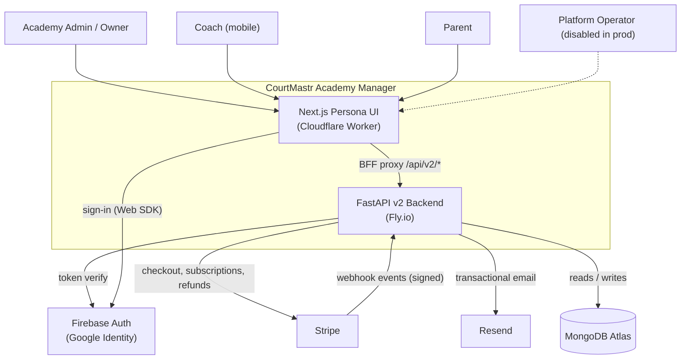

# 01 — System Context

**Confidence: High**

CourtMastr Academy Manager is a hosted SaaS for racquet-sports academies. It is a
structured monolith (FastAPI v2 backend) fronted by a Next.js persona UI, backed by
MongoDB, and integrated with Firebase Auth, Stripe, and Resend. This diagram shows
the external actors and systems and the trust boundaries between them.

## Actors

Roles are academy-scoped and resolved from membership records, not from the user
identity alone (see [07-auth-identity-flow.md](07-auth-identity-flow.md)).

- **Academy Admin / Owner** — runs sessions, billing, payroll, registration review.
- **Coach** — mobile-first; daily agenda, attendance, teaching plans, feedback.
- **Parent** — self-serve portal; enrollment, payments/autopay, child progress, waivers.
- **Platform operator** — cross-tenant platform roles (`platform_admin`, `platform_support`); routes currently disabled in production (`ENABLE_PLATFORM_ROUTES=false`).
- **Stripe (inbound webhook caller)** — calls `POST /api/v2/parent/webhooks/stripe`; authenticated by signature, not by a user token.

## Context Diagram

## Trust boundaries

- **Browser ↔ Worker**: Public internet. The Worker serves the persona UI and proxies API calls; it injects the Firebase ID token into a server-set `Authorization` header before forwarding (see [03-frontend-architecture.md](03-frontend-architecture.md)).
- **Worker ↔ Backend**: `BFF_API_ORIGIN` (prod: `https://api.academy.courtmastr.com`). CORS is restricted to exact origins; wildcard with credentials is forbidden.
- **Backend ↔ Firebase**: Admin SDK verifies ID tokens with `check_revoked=True`.
- **Backend ↔ Stripe**: Outbound API uses `STRIPE_API_KEY`; inbound webhooks verified with `STRIPE_WEBHOOK_SECRET`.
- **Stripe webhook ↔ Backend**: Unauthenticated route; signature verification is the only auth.

## Sources inspected

- `README.md`, `AGENTS.md`, `DEPLOYMENT.md`
- `backend/v2/main.py` (app assembly, CORS, routers)
- `backend/v2/shared/config/settings.py` (env gating)
- `backend/fly.toml`, `frontend/wrangler.jsonc`
- `frontend/next.config.ts`, `frontend/lib/api/client.ts`

## Assumptions

- Production serves a single academy (`APP_TENANCY_MODE=single_academy`, `PRIMARY_ACADEMY_ID=acad_blno_badminton`). SaaS multi-tenant mode exists in code but is launch-gated.

## Gaps / Unknowns

- Platform-operator flows are present in code but disabled in production; the actor is shown dashed.
