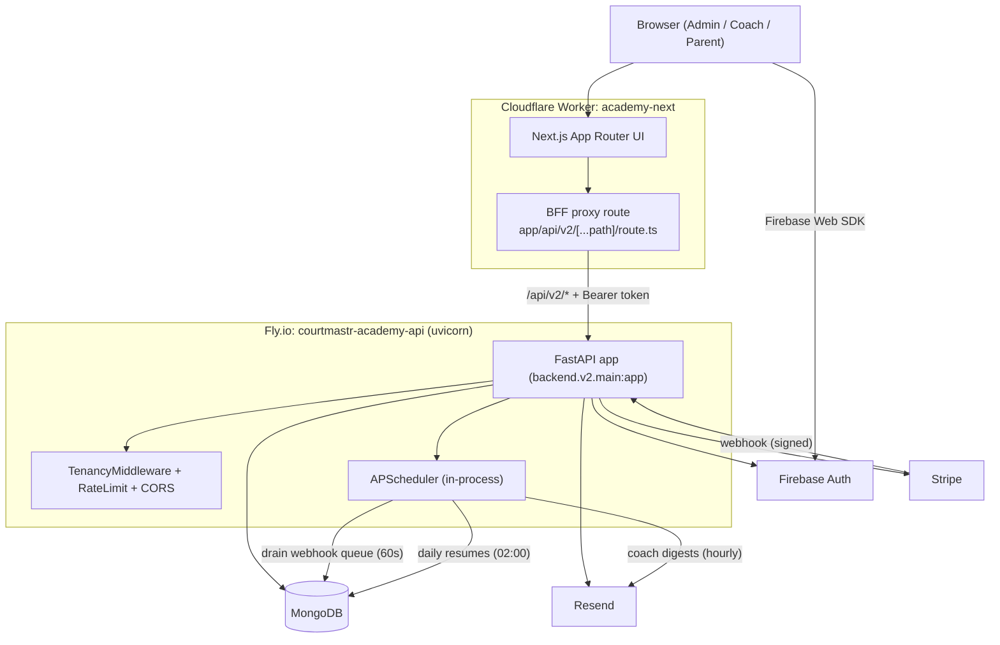

# 02 — Container Architecture

**Confidence: High**

Runtime containers/processes and the jobs that run inside the backend process.

## Containers

| Container | Runtime | Responsibility | Key files |
|---|---|---|---|
| Persona UI | Next.js 15 / React 19 on Cloudflare Worker (`academy-next`) | Persona UIs + same-origin BFF proxy | `frontend/`, `frontend/wrangler.jsonc` |
| API backend | FastAPI (uvicorn) on Fly.io (`courtmastr-academy-api`) | BFF routes, use cases, domain, adapters, scheduler | `backend/v2/main.py` |
| Database | MongoDB (Atlas in prod) | All persistence (91 collections) | `backend/v2/.../infrastructure/*` |
| Firebase Auth | Google Identity Platform | Identity provider / token issuer | `contexts/identity/infrastructure/firebase_*` |
| Stripe | External SaaS | Payment collection, subscriptions, refunds | `contexts/billing/infrastructure/stripe_gateway.py` |
| Resend | External SaaS | Transactional + digest email | `contexts/communications/infrastructure/resend_send_port.py` |

The scheduler is **not** a separate worker container — APScheduler runs in-process inside
the single FastAPI app (started in the lifespan). This is a notable coupling point
(see [11-risk-map.md](11-risk-map.md)).

## Container Diagram

## In-process scheduled jobs

Registered in `backend/v2/main.py` lifespan (`AsyncIOScheduler`, tz `settings.scheduler_tz`):

| Job | Schedule | Effect |
|---|---|---|
| `process_scheduled_resume_actions` | cron 02:00 daily | Resume paused enrollments (≤100 / academy / tick) |
| `process_stripe_webhook_events` | interval 60s, max 1 instance | Drain queued Stripe events (≤25 / academy / tick) |
| `send_coach_daily_digests` | cron hourly (:00) | Send coach teaching-plan digest at each academy's configured hour |

## Event infrastructure (intra-process)

- `MongoOutbox` + `EventDispatcher` (transactional outbox, async dispatch) — `app.state.outbox`, `app.state.dispatcher`.
- `MongoIdempotencyStore` — request/operation dedup.
- Dead-letter + replay collections: `dead_letter_events`, `event_handler_runs`, `event_audit`.

## Sources inspected

- `backend/v2/main.py` (lifespan, scheduler, composition, middleware)
- `backend/fly.toml`, `backend/Dockerfile`
- `frontend/wrangler.jsonc`, `frontend/app/api/v2/[...path]/route.ts`
- `docker-compose*.yml`

## Gaps / Unknowns

- Monthly invoice generation is **admin-triggered** (`POST /api/v2/admin/payments/generate-monthly`); no in-process scheduled job was found for it — see [08-billing-stripe-flow.md](08-billing-stripe-flow.md). Marked "needs verification" whether a cron/external trigger exists.
