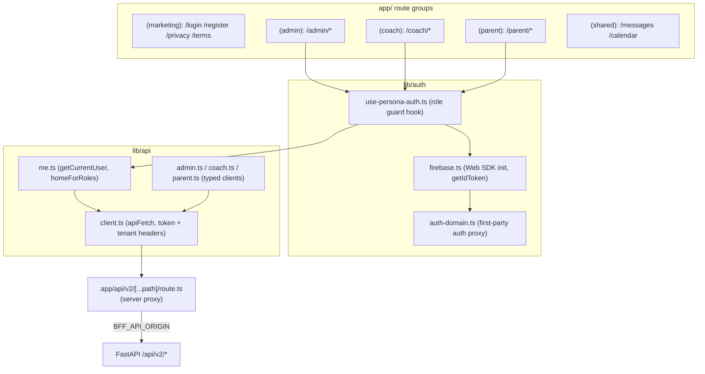

# 03 — Frontend Architecture

**Confidence: High**

Next.js 15 (App Router) / React 19, deployed to a Cloudflare Worker via
`opennextjs-cloudflare`. The frontend is presentation-focused; business truth lives in
the backend. It talks to the backend through a **same-origin BFF proxy** so the browser
never calls the API origin directly.

## Stack

- Next.js `15.5.18`, React `19.x` (`frontend/package.json`)
- `@tanstack/react-query` (data fetching/caching), `firebase` Web SDK (auth)
- `@serwist/next` (PWA service worker; `app/sw.ts` → `public/sw.js`)
- Tailwind CSS 4
- Deploy: `pnpm deploy:cloudflare` → `opennextjs-cloudflare build && deploy`

## Frontend Diagram

## Routing & role areas

Route groups under `frontend/app/`:

- `(marketing)` — public auth/legal pages, **no role guard**.
- `(admin)` → `/admin/*`, `(coach)` → `/coach/*`, `(parent)` → `/parent/*` — each layout calls `usePersonaAuth(<role>)`.
- `(shared)` — `/messages`, `/calendar` (cross-role; guard status *needs verification*).

There is **no Next.js `middleware.ts`** at the root — all role gating is **client-side**
in layout components. (See [11-risk-map.md](11-risk-map.md): client-only gating is a UX
guard, not a security boundary; the backend enforces authorization.)

## API client & BFF proxy

- `lib/api/client.ts` (`apiFetch<T>`): resolves base URL from `NEXT_PUBLIC_API_BASE` (`/api/v2`), attaches the Firebase ID token as `Authorization: Bearer <token>`, and adds an identity bridge (`X-CourtMastr-Identity` header + `__cm_identity` cookie) for the same-origin proxy. Tenant override via `X-Academy-Id` from `localStorage["am.activeAcademy"]`. In-flight dedup + 20s abort.
- `app/api/v2/[...path]/route.ts`: the server-side proxy. `buildProxyHeaders` normalizes the identity bridge into `Authorization: Bearer`, sets `x-forwarded-host/proto`, then **strips identity headers/cookies** before forwarding to `{BFF_API_ORIGIN}/api/v2/{path}`.
- `lib/api/proxy-headers.ts`: header/cookie name constants (`x-courtmastr-identity`, `x-courtmastr-auth`, `__cm_identity`).
- `lib/api/me.ts`: `homeForRoles()` → admin `/admin`, coach `/coach/today`, parent `/parent/payments`, fallback `/login`.

## Auth handling

- `lib/auth/firebase.ts`: Firebase Web SDK init; `getIdToken`, email/password + Google sign-in (popup desktop / redirect mobile), email verification, sign-out (clears `__cm_identity`). E2E bypass via `NEXT_PUBLIC_E2E_AUTH_BYPASS=1`.
- `lib/auth/auth-domain.ts`: when `NEXT_PUBLIC_FIREBASE_AUTH_PROXY=1`, uses the page host as `authDomain` so Google sign-in stays first-party on tenant subdomains (mobile third-party-cookie fix; see `DEPLOYMENT.md`). `next.config.ts` rewrites `/__/auth/*` to the `firebaseapp.com` helper.
- `lib/auth/use-persona-auth.ts`: subscribes to Firebase auth state → fetches `/me` → checks `roles.includes(requiredRole)` → renders, redirects to role home with `access_denied=<role>`, or redirects to `/login`.

## API type generation

- `pnpm generate:api` runs `openapi-typescript` against the backend OpenAPI into `lib/api/generated/v2.d.ts`. Currently a placeholder; typed clients are hand-declared. CI checks for OpenAPI drift.

## Sources inspected

- `frontend/package.json`, `frontend/next.config.ts`, `frontend/wrangler.jsonc`
- `frontend/app/(admin|coach|parent|marketing|shared)/layout.tsx`
- `frontend/lib/api/{client,me,admin,coach,parent,proxy-headers,proxy-origin}.ts`
- `frontend/app/api/v2/[...path]/route.ts`
- `frontend/lib/auth/{firebase,auth-domain,use-persona-auth}.ts`

## Gaps / Unknowns

- `lib/auth/token-readiness.ts` and `google-sign-in-mode.ts` exist but were not deeply traced — "needs verification".
- `(shared)` layout guard status not confirmed.
