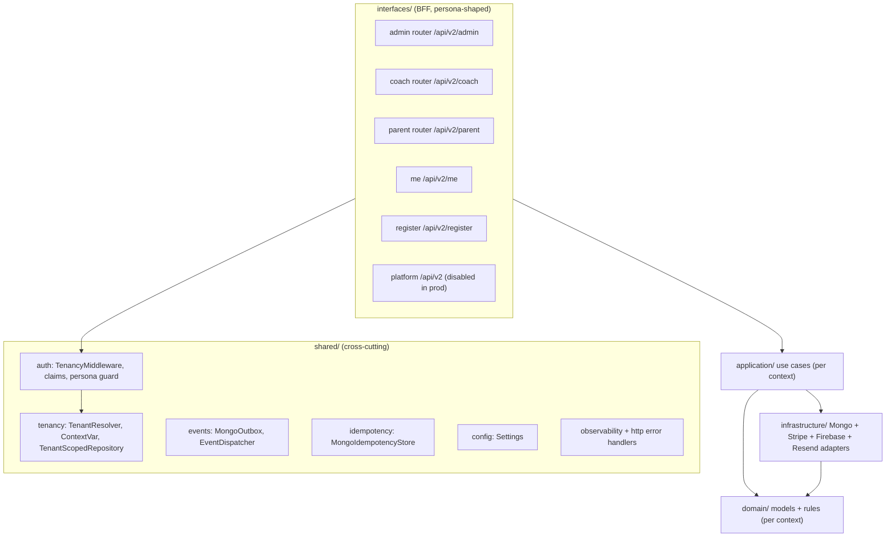

# 04 — Backend Architecture

**Confidence: High**

FastAPI "Clean Architecture Lite" monolith (ADR-0005). Per-persona BFF interfaces sit
on top of application use cases, which orchestrate domain models and depend on
infrastructure adapters through ports. Composition wires concrete implementations at
startup and stores them on `app.state`.

## Layering

## App assembly (`backend/v2/main.py`)

- `create_app()` builds the FastAPI app (`backend.v2.main:app`), registers exception handlers, mounts persona routers, exposes `GET /api/v2/healthz`.
- Middleware (outer→inner): `CORSMiddleware` → `InMemoryRateLimitMiddleware` → `TenancyMiddleware` (lazily bound to `app.state.load_auth_claims`).
- Lifespan: open Motor client → run pending migrations (if `run_migrations_on_boot`) → build outbox/dispatcher/idempotency → wire identity services → build tenant resolver (SaaS) → platform audit/governance/lifecycle → Stripe gateway → compose admin/coach/parent → start APScheduler.

## BFF interfaces

| Persona | Prefix | Representative routes |
|---|---|---|
| Admin | `/api/v2/admin` | `sessions`, `invoices`, `payments/generate-monthly`, `coaching/payroll/process`, `registration`, `waivers`, `reports/revenue`, `dues`, `pause` |
| Coach | `/api/v2/coach` | `today`, `today/plan`, `sessions/{id}/attendance`, `sessions/{id}/roster`, `feedback`, `notes` |
| Parent | `/api/v2/parent` | `enrollments/quote`, `checkout/start`, `payments/start-autopay`, `payments/history`, `invoices`, `webhooks/stripe`, `waivers` |
| Current user | `/api/v2` | `me` (user_id, email, academy_id, roles, platform_roles) |
| Public registration | `/api/v2/register` | `parent` (no tenant requirement) |
| Platform | `/api/v2` | `bootstrap` (gated by `enable_platform_routes`) |

Persona enforcement: `shared/http/persona.py` `require_persona(persona)` returns **404**
(not 403) when the role is absent, to avoid leaking route existence.

## Composition / DI (`backend/v2/composition/`)

`compose_admin / compose_coach / compose_parent(db, outbox, idempotency_store, stripe_gw, ...)`
each return a frozen dataclass of wired use cases, stored on `app.state` and injected
via `Depends(get_*_use_cases)`. Other wiring: `digests.py` (coach daily digest),
`admin_registration_review.py`, `pathway.py`, `coaching_lookups.py`, `event_handlers.py`.

## Integrations (infrastructure adapters)

- **Stripe**: `contexts/billing/infrastructure/stripe_gateway.py` (`RealStripeGateway`); `FakeStripeGateway` in non-prod when keys absent; prod **raises** if keys missing.
- **Firebase**: `contexts/identity/infrastructure/firebase_admin_adapter.py` + `firebase_token_verifier.py` (async wrapper, `check_revoked=True`).
- **Resend**: `contexts/communications/infrastructure/resend_send_port.py` + `stub_send_port.py`; gated by `email_delivery_enabled` + key.
- **MongoDB**: Motor; one repository per collection, all extending `TenantScopedRepository`.

## Legacy backend

`backend/routers/` is effectively empty — legacy `/api/*` routes are **not mounted**
(return 404, per `DEPLOYMENT.md`). The backend runs `backend.v2.main:app` directly.

## Sources inspected

- `backend/v2/main.py`, `backend/v2/composition/*.py`
- `backend/v2/interfaces/{admin,coach,parent,platform}/`, `interfaces/me_routes.py`, `interfaces/registration_routes.py`
- `backend/v2/shared/{auth,tenancy,events,idempotency,http,config}/`
- `backend/v2/contexts/*/{application,domain,infrastructure}/`

## Gaps / Unknowns

- Exact per-route platform-admin enforcement for `platform` routes not fully traced (disabled in prod).
