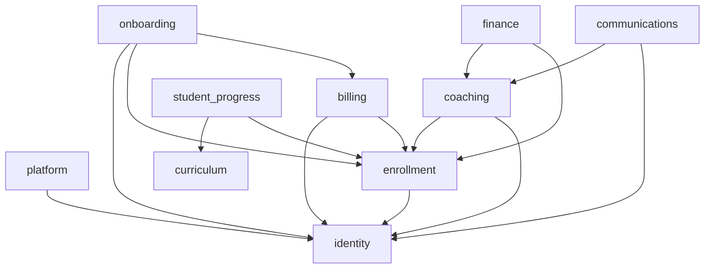

# 05 — DDD Bounded Contexts

**Confidence: High**

Ten bounded contexts under `backend/v2/contexts/`, each with `application/`, `domain/`,
and `infrastructure/` layers. Identity and tenancy are foundational; billing, coaching,
and communications depend on enrollment and identity.

## Contexts

| Context | Owns | Path |
|---|---|---|
| identity | Global users, academy memberships, platform roles, academies, auth claims, Firebase verify | `contexts/identity` |
| platform | Tenant lifecycle, domain mapping, audit, governance, platform billing | `contexts/platform` |
| enrollment | Students, sessions, occurrences, enrollments, waitlist, pauses, lifecycle events | `contexts/enrollment` |
| onboarding | Parent applications, waiver templates/acceptances/signatures | `contexts/onboarding` |
| billing | Invoices, ledger payments, allocations, payments (legacy), credits, subscriptions, Stripe state | `contexts/billing` |
| coaching | Student + coach attendance, feedback, notes, coach rates | `contexts/coaching` |
| curriculum | Programs, levels, skills, criteria, lesson resources | `contexts/curriculum` |
| student_progress | Level placement, skill progress, tests, recommendations, certificates | `contexts/student_progress` |
| finance | Payout periods/lines, payout audit, expenses, reporting snapshots | `contexts/finance` |
| communications | Campaigns, deliveries, coach digest sends, email port | `contexts/communications` |

## Dependency Diagram

Arrows = "depends on / reads from". Cross-context coupling is intentionally narrow;
most flow through application use cases and the shared event outbox.

## Boundary enforcement

- Import boundaries are enforced in CI with `import-linter` (`lint-imports --config pyproject.toml`); caches in `.import_linter_cache/` / `.grimp_cache/`.
- Layer rule (AGENTS.md): interfaces own HTTP/persona shaping; application owns workflow; domain owns rules; infrastructure owns Mongo/Stripe/Firebase/Resend; composition wires implementations.

## Cross-context messaging

Contexts communicate asynchronously via the transactional outbox
(`MongoOutbox` → `EventDispatcher`), with `dead_letter_events`, `event_handler_runs`,
and `event_audit` for replay/observability. Example: payment events emitted by billing,
enrollment lifecycle consumed by finance/coaching.

## Sources inspected

- `backend/v2/contexts/*/` (all ten contexts, three layers each)
- `docs/architecture/application-data-model.md` (context→collection ownership, verified against repos)
- `pyproject.toml` (import-linter config)

## Assumptions

- Dependency arrows are derived from observed repo references and use-case wiring; exact import-linter contract definitions were not enumerated line-by-line — directionality is "needs verification" at the contract level but consistent with observed code.
