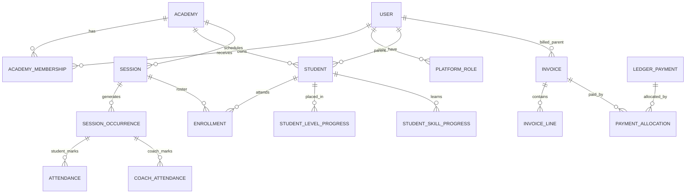
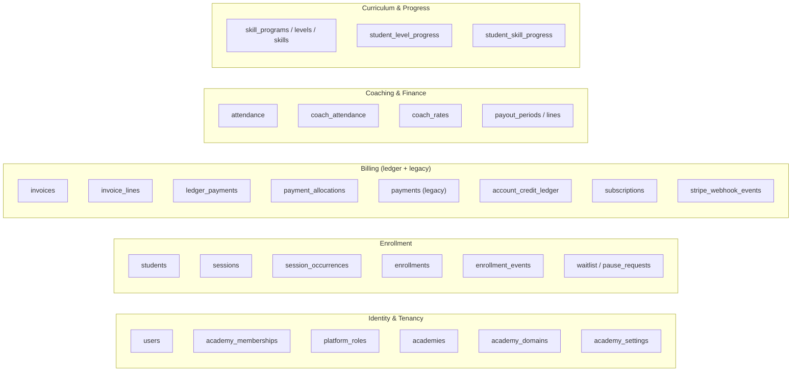

# 06 — Data Architecture

**Confidence: High** (collection inventory & ownership grounded in repos; some field-level
details Medium — see Gaps)

Single shared MongoDB database (`academy_manager`), ~91 collections, tenant-scoped by
`academy_id`. No per-tenant databases. Connection via Motor; indexes/validators applied
by boot-time migrations.

## Connection & tenancy

- Settings: `mongo_url` (`V2_MONGO_URL` → `MONGO_URL`), `mongo_db` (`V2_MONGO_DB` → `DB_NAME`, default `academy_manager`).
- Client opened in `backend/v2/main.py` lifespan; `app.state.db`.
- Migrations: `backend/v2/migrations/runner.py` tracks applied versions in `_migration_registry`; `0132_launch_indexes_and_validators.py` applies JSON-schema validators + indexes to critical money/identity collections.
- **Tenant scoping**: `shared/tenancy/repository.py` `TenantScopedRepository` auto-injects `academy_id` into every query and document; composite indexes lead with `academy_id`. Tenant set via `current_academy_id()` ContextVar from middleware.

## Core ER (canonical model)

## Collections by domain

| Domain | Collections (representative) | Owning repo |
|---|---|---|
| Identity & tenancy | `users`, `academy_memberships`, `platform_roles`, `academies`, `academy_domains`, `academy_settings`, `academy_feature_flags` | `contexts/identity/infrastructure/*` |
| Enrollment | `students`, `sessions`, `session_occurrences`, `enrollments`, `enrollment_events`, `waitlist`, `pause_requests`, `scheduled_enrollment_actions` | `contexts/enrollment/infrastructure/*` |
| Onboarding | `onboarding_applications`, `waiver_templates`, `waiver_acceptances`, `waiver_signatures` | `contexts/onboarding/infrastructure/*` |
| Billing | `invoices`, `invoice_lines`, `ledger_payments`, `payment_allocations`, `payments`, `payment_attempts`, `account_credit_ledger`, `credit_applications`, `parent_billing_customers`, `student_billing_enrollments`, `subscriptions`, `session_types` | `contexts/billing/infrastructure/*` |
| Coaching | `attendance`, `coach_attendance`, `session_feedback`, `progress_notes`, `coach_skill_notes`, `coach_rates` | `contexts/coaching/infrastructure/*` |
| Curriculum / progress | `skill_programs`, `skill_levels`, `skills`, `skill_criteria`, `student_level_progress`, `student_skill_progress`, `test_attempts`, `level_up_recommendations`, `skill_certificates` | `contexts/curriculum` + `contexts/student_progress` |
| Finance | `payout_periods`, `payout_period_lines`, `payout_audit_log`, `expenses`, `payouts`, `*_snapshots` | `contexts/finance/infrastructure/*` |
| Communications | `message_campaigns`, `message_deliveries`, `coach_digest_sends`, `messages` (legacy) | `contexts/communications/infrastructure/*` |
| Platform / governance | `platform_audit_events`, `platform_governance_audit_logs`, `tenant_export_requests`, `tenant_deletion_requests`, `support_access_grants` | `contexts/platform/*` |
| Shared infra | `idempotency_keys`, `outbox_events`, `dead_letter_events`, `event_handler_runs`, `event_audit`, `stripe_webhook_events`, `stripe_invoice_processing`, `billing_invoice_keys`, `billing_calculation_snapshots`, `_migration_registry` | `shared/*` + billing |

## Dual billing model (latent risk)

Two payment models coexist:

- **Canonical AR ledger**: `invoices` + `invoice_lines` + `ledger_payments` + `payment_allocations` (+ `account_credit_ledger`).
- **Legacy projection**: `payments` (+ `subscriptions`).

`MongoPaymentRepository` (`payments`) and `MongoBillingLedgerRepository` (`ledger_payments`)
are **separate collections**, but the monthly-generation path went through a dual-write era
(Phase 2A — legacy `payments` write now removed, ledger only). Production is still
legacy-heavy (per the data-model review: 126 `payments` vs 1 ledger set). This is the
billing convergence project tracked in [11-risk-map.md](11-risk-map.md). Note: the
project-memory phrase "shared collection" is **corrected** here — they are distinct
collections with a dual-write/coexistence problem, not one shared collection.

## Indexes & validators (startup)

`0132_launch_indexes_and_validators.py` applies `collMod` JSON-schema validators to
`invoices`, `invoice_lines`, `ledger_payments`, `payment_allocations`, `account_credit_ledger`,
`payment_attempts`, `subscriptions`, `enrollments`, `students`, `users`, `academy_memberships`,
`stripe_webhook_events`, and creates unique/compound indexes (e.g. `coach_attendance`
unique on `(academy_id, occurrence_id, coach_id)`; `billing_invoice_keys` unique on
`(academy_id, enrollment_id, period)`).

## Sources inspected

- `backend/v2/main.py`, `backend/v2/migrations/runner.py`, `migrations/0132_launch_indexes_and_validators.py`
- `backend/v2/contexts/*/infrastructure/mongo_*_repo.py`
- `backend/v2/shared/tenancy/repository.py`
- `docs/architecture/application-data-model.md` (verified against repos)

## Gaps / Unknowns

- Some collections (e.g. `payment_attempts`, `expenses`, `payouts`, snapshots) had no single dedicated repo confirmed — field lists are inferred from usage and the data-model review; marked Medium confidence.
- Legacy compatibility fields (`users.academy_id`, `students.dob` string, `parent_user_id`) still queried alongside canonical fields.
