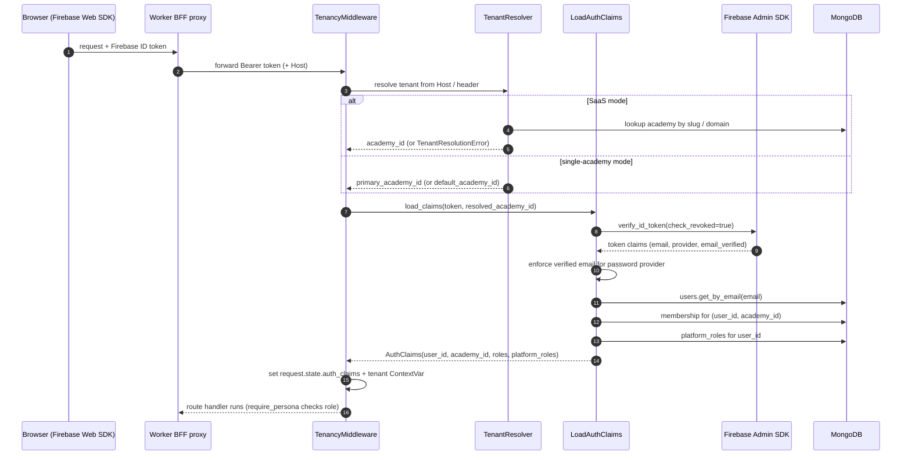

# 07 — Auth / Identity Flow

**Confidence: High**

Authentication is Firebase-first. Identity is split into global `users` and per-academy
`academy_memberships`; roles are resolved from membership, never inferred from the user
alone. Tenant is resolved explicitly from the request (subdomain / custom domain /
approved internal header), with a non-SaaS fallback to the configured academy.

## Flow

## Token verification

- `contexts/identity/infrastructure/firebase_admin_adapter.py` → `verify_id_token(token, check_revoked=True)`; handles revoked/expired/disabled/invalid. Non-prod fallback verifies via public certs.
- `firebase_token_verifier.py` wraps the sync SDK call onto an async thread.

## User & role resolution

- `application/use_cases/load_auth_claims.py`: verify token → require verified email (password provider only; Google/Apple/phone exempt) → `users.get_by_email` (404 `UserNotFound`, 403 `UserInactive`) → membership lookup (active) → platform roles.
- Domain (`identity/domain/models.py`): `Role = "admin" | "coach" | "parent"` on `AcademyMembership`; `PlatformRoleName = "platform_admin" | "platform_support"` separate.
- `User.firebase_uid` links the Mongo identity to Firebase.

## Tenant resolution

- `shared/tenancy/resolver.py` `TenantResolver.resolve(host, headers)`: order = subdomain slug → custom domain (`academy_domains`) → approved internal header (`V2_ALLOWED_INTERNAL_TENANT_HEADER`, only when configured). **Never** falls back to default in SaaS mode — raises `TenantResolutionError`.
- `shared/auth/middleware.py`: SaaS mode delegates to resolver; single-academy mode resolves to `primary_academy_id` and 403s on mismatch; legacy multi-academy resolves to `default_academy_id`.
- Production runs `tenancy_mode=single_academy`, `primary_academy_id=acad_blno_badminton`.

## Authorization at the route

- `shared/http/persona.py` `require_persona(persona)` → checks `persona in claims.roles`; returns **404** if absent (route-existence hiding).
- `shared/auth/claims.py` `has_role` / `has_platform_role` / `is_platform_admin`.

## Settings that gate auth/identity/tenancy

`firebase_project_id`, `saas_mode`, `default_academy_id`, `allowed_internal_tenant_header`,
`tenancy_mode`, `primary_academy_id`, `cors_origins` (wildcard forbidden), `env`
(prod requires Firebase + Stripe keys). See `shared/config/settings.py`.

## Sources inspected

- `backend/v2/contexts/identity/infrastructure/firebase_admin_adapter.py`, `firebase_token_verifier.py`, `mongo_user_repo.py`
- `backend/v2/contexts/identity/application/use_cases/load_auth_claims.py`, `register_public_parent.py`
- `backend/v2/contexts/identity/domain/models.py`
- `backend/v2/shared/auth/{middleware.py,claims.py}`, `shared/tenancy/resolver.py`, `shared/http/persona.py`
- `backend/v2/shared/config/settings.py`, `DEPLOYMENT.md`

## Gaps / Unknowns

- Tenant-servability check (`check_tenant_servable`) flows into `TenantLifecycleService` — not fully traced.
- v2 uses Bearer tokens (via header / proxy identity bridge); confirm no residual cookie-session path — "needs verification".
