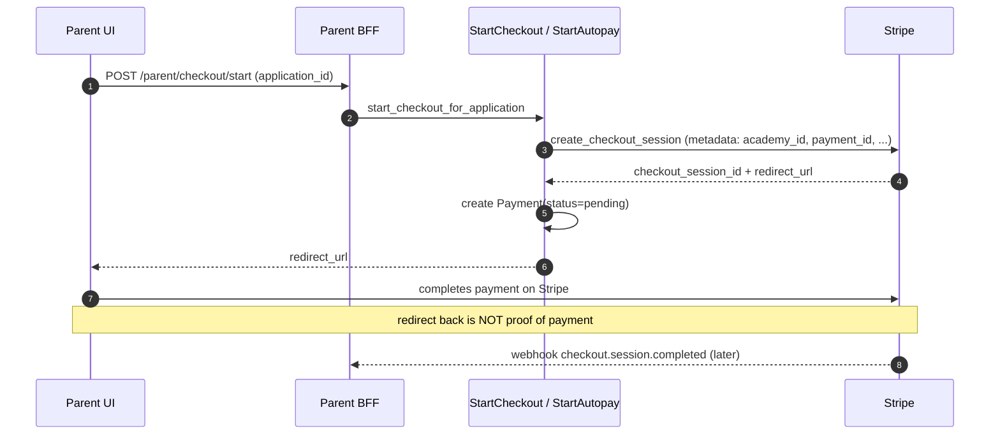
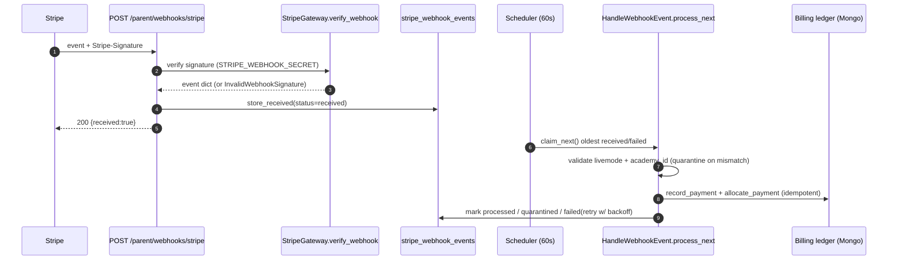
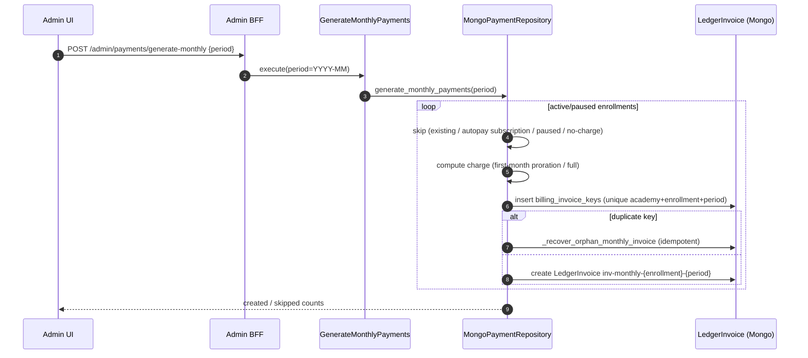

# 08 — Billing / Stripe Flow

**Confidence: High**

The app ledger owns invoices; Stripe owns payment collection. Redirects never prove
payment — only signed webhooks update ledger state, and all allocations are idempotent.
Webhooks are received fast, queued, and drained by a background job.

## Money-truth rules (enforced in code)

- App ledger (`invoices`) is AR source of truth; Stripe IDs are links only.
- Webhooks (not redirects) record `ledger_payments` and `payment_allocations`.
- Allocations idempotent via deterministic keys (e.g. `autopay-pi:{pi_id}`, `stripe-invoice-allocation:{invoice_id}`).
- Paid invoices cannot be double-paid → events that would re-pay are **quarantined**.
- Failed autopay logs the decline; invoice status is **unchanged** (no false close).

## Checkout & autopay

Autopay (`POST /parent/payments/start-autopay`) uses
`create_subscription_checkout_session` (mode=subscription), creates a `Subscription`
(`status=incomplete`), and on webhook completion backfills `stripe_subscription_id`,
sets `active`, and updates enrollment autopay state.

## Webhook processing (receive-fast, drain-async)

Handled event types (`handle_webhook_event.py`): `checkout.session.completed`
(invoice-pay-link vs application checkout via metadata), `checkout.session.expired`,
`payment_intent.succeeded` / `payment_failed` (autopay vs one-off), `invoice.paid`,
`invoice.payment_failed` (logs decline only), `charge.refunded`,
`customer.subscription.*`. Dedup/quarantine in `mongo_stripe_dedup.py` (insert-first
lock, stale-reclaim after 5 min, exponential backoff 1m→5m→15m→1h).

## Monthly invoice generation

The **Orphan Invoice Key Lock** (`mongo_payment_repo.py` ~L569) guarantees that if a run
dies after inserting the invoice key but before creating the invoice, a retry recovers
and completes the invoice rather than silently skipping the enrollment.

## Refunds & portal

- Refunds: `issue_refund(payment_intent_id, amount)` for Stripe-captured payments; `charge.refunded` webhook updates `refunded_cents` and emits `PaymentRefunded`. Manual (cash/Zelle) payments tracked in local records.
- Subscription management: `cancel_subscription`, `pause/resume_subscription_collection`, `update_subscription_proration`.

## Configuration

- `STRIPE_API_KEY`, `STRIPE_WEBHOOK_SECRET` required in prod (missing → billing endpoints 503; webhook 503 and confirmations dropped). `RealStripeGateway` vs `FakeStripeGateway`.

## Sources inspected

- `backend/v2/interfaces/parent/{payment_routes.py,webhook_routes.py}`, `interfaces/admin/billing_routes.py`
- `backend/v2/contexts/billing/application/use_cases/{start_checkout.py,handle_webhook_event.py,admin_payment_ops.py}`
- `backend/v2/contexts/billing/infrastructure/{stripe_gateway.py,mongo_payment_repo.py,mongo_billing_ledger_repo.py,mongo_stripe_dedup.py}`
- `backend/v2/contexts/billing/domain/{models.py,ledger.py}`
- `DEPLOYMENT.md` (Stripe setup)

## Gaps / Unknowns

- No in-process scheduler job found for monthly generation — it is admin-triggered. Whether an external cron calls it is "needs verification".
- Parent-facing invoice PDF/artifact generation is a separate use case, not traced here.
