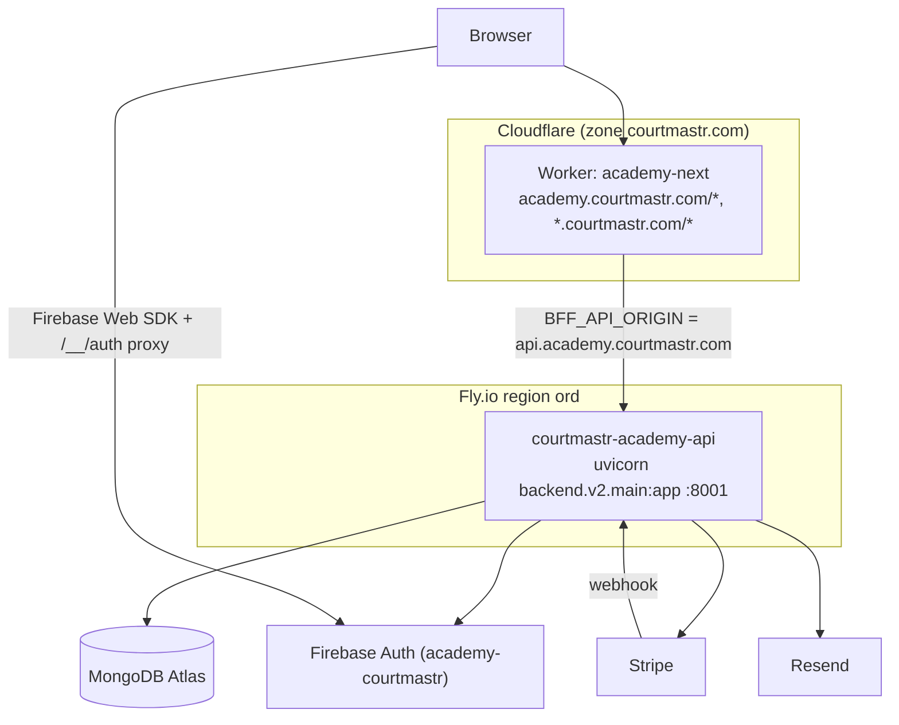
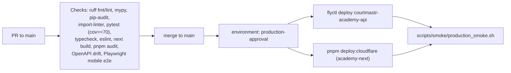

# 09 — Deployment Architecture

**Confidence: High**

Backend on Fly.io, frontend on Cloudflare Workers, MongoDB Atlas, with Firebase/Stripe/
Resend as external SaaS. CI/CD via GitHub Actions with a gated production deploy.

## Runtime topology

## CI/CD

- Workflow: `.github/workflows/production.yml` (triggers: PR/push to `main`, manual). Deploy job gated by `production-approval` environment and only on `main` push.

## Components

| Component | Platform | Config | Notes |
|---|---|---|---|
| Backend | Fly.io `courtmastr-academy-api` (region `ord`) | `backend/fly.toml`, `backend/Dockerfile` (py3.12-slim, :8001) | min 1 machine, force HTTPS, healthcheck `GET /api/v2/healthz` |
| Frontend | Cloudflare Worker `academy-next` | `frontend/wrangler.jsonc` | `opennextjs-cloudflare`; serves `*.courtmastr.com` |
| Edge router | (deprecated) | `edge/wrangler.toml` (`academy-edge-router`, empty routes) | superseded by `academy-next` |
| Database | MongoDB Atlas | `MONGO_URL` secret | managed backups recommended |

## Configuration / secrets

- Backend env (fly.toml): `APP_ENV=production`, `V2_ENV=prod`, `V2_RUN_MIGRATIONS_ON_BOOT=true`, `APP_TENANCY_MODE=single_academy`, `PRIMARY_ACADEMY_ID=acad_blno_badminton`, `ENABLE_PLATFORM_ROUTES=false`, `SCHEDULER_TZ=America/Chicago`, `FIREBASE_AUTH_ENABLED=true`, `FIREBASE_PROJECT_ID=academy-courtmastr`, CORS/frontend origins.
- Backend secrets (`flyctl secrets set`): `MONGO_URL`, `JWT_SECRET`, `ADMIN_EMAIL`, `STRIPE_API_KEY`, `STRIPE_WEBHOOK_SECRET`, `FIREBASE_CREDENTIALS_FILE`/`_JSON`, `RESEND_API_KEY`, `SENDER_EMAIL`.
- GitHub secrets: `FLY_API_TOKEN`, `CLOUDFLARE_API_TOKEN`, `CLOUDFLARE_ACCOUNT_ID`, `LHCI_GITHUB_APP_TOKEN`. GitHub vars: `(REACT|NEXT_PUBLIC)_FIREBASE_*`, `NEXT_PUBLIC_FIREBASE_AUTH_PROXY`.
- Frontend build env: `BFF_API_ORIGIN`, `NEXT_PUBLIC_API_BASE=/api/v2`, public `NEXT_PUBLIC_FIREBASE_*` (baked into client bundle — not secret).
- Settings precedence: `V2_*` then legacy unprefixed (`shared/config/settings.py` `apply_legacy_deploy_fallbacks`); prod validation requires Firebase + Stripe keys; wildcard CORS forbidden.

## Local & staging

- `scripts/local_test_stack.sh` orchestrates Mongo (27017), Firebase Auth emulator (9099), backend (8001), frontend (3001).
- Compose: `docker-compose.yml` (mongo/backend/frontend), `.dev.yml` (firebase emulator + stripe-cli), `.saas.yml` / `.saas-dev.yml` (SaaS mode, isolated DB), `.tunnel.yml` (Cloudflare quick tunnels for SaaS smoke).

## Sources inspected

- `backend/fly.toml`, `backend/Dockerfile`
- `frontend/wrangler.jsonc`, `frontend/Dockerfile`, `frontend/Dockerfile.dev`
- `edge/wrangler.toml`, `edge/router.ts`
- `.github/workflows/production.yml`
- `docker-compose*.yml`, `scripts/local_test_stack.sh`, `scripts/smoke/production_smoke.sh`
- `backend/v2/shared/config/settings.py`, `DEPLOYMENT.md`

## Gaps / Unknowns

- Full list of GitHub Actions jobs/matrix not enumerated line-by-line; check summary inferred from workflow + AGENTS.md. Lighthouse CI runs only if config present.
