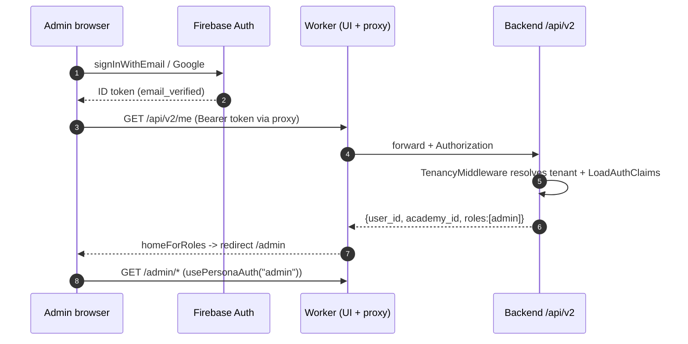
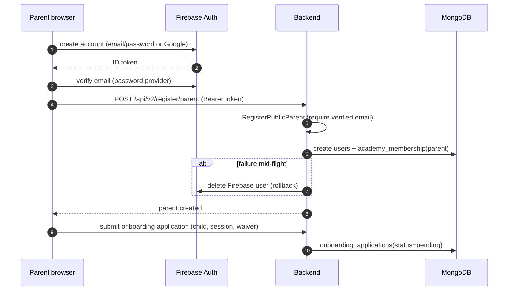
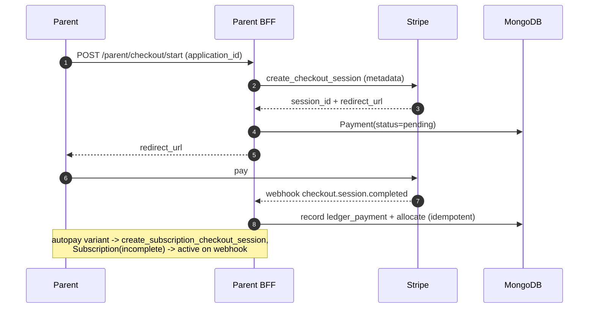
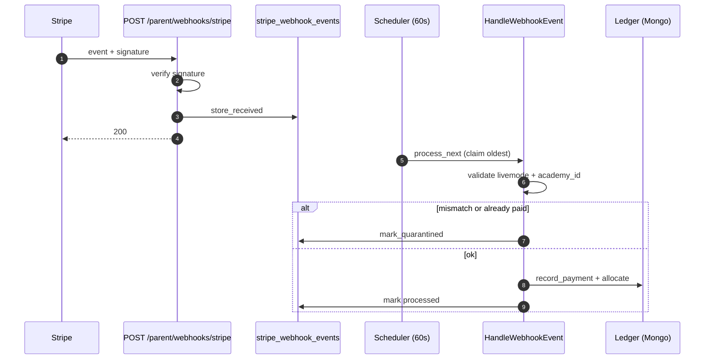
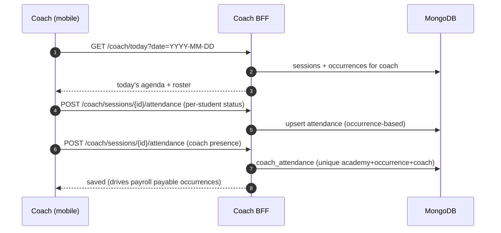
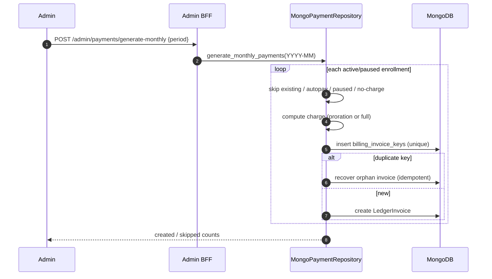

# 10 — Sequence Diagrams

**Confidence: Medium–High** (transport/auth and billing flows High; some intermediate
use-case steps condensed — see per-diagram notes)

All diagrams below are grounded in the routes and use cases identified in
[04-backend-architecture.md](04-backend-architecture.md), [07-auth-identity-flow.md](07-auth-identity-flow.md),
and [08-billing-stripe-flow.md](08-billing-stripe-flow.md).

## 1. Admin login

Note: `/me` returns roles; client `homeForRoles` routes admins to `/admin`. Backend
`require_persona("admin")` guards admin routes.

## 2. Parent registration

Note: registration route is public (no tenant requirement). Admin later reviews/approves
the application (creates `Student` + `Enrollment`).

## 3. Parent payment / autopay

## 4. Stripe webhook processing

## 5. Coach session attendance

Note: coach app supports offline auto-sync (frontend `startAutoSync`).

## 6. Monthly invoice generation

## Sources inspected

- Routes & use cases per docs 04 / 07 / 08 and their cited files.

## Gaps / Unknowns

- Registration approval → student/enrollment promotion steps are summarized; exact admin-review use case (`admin_registration_review.py`) internals not expanded.
- Monthly generation trigger is admin-initiated; scheduled trigger "needs verification".
