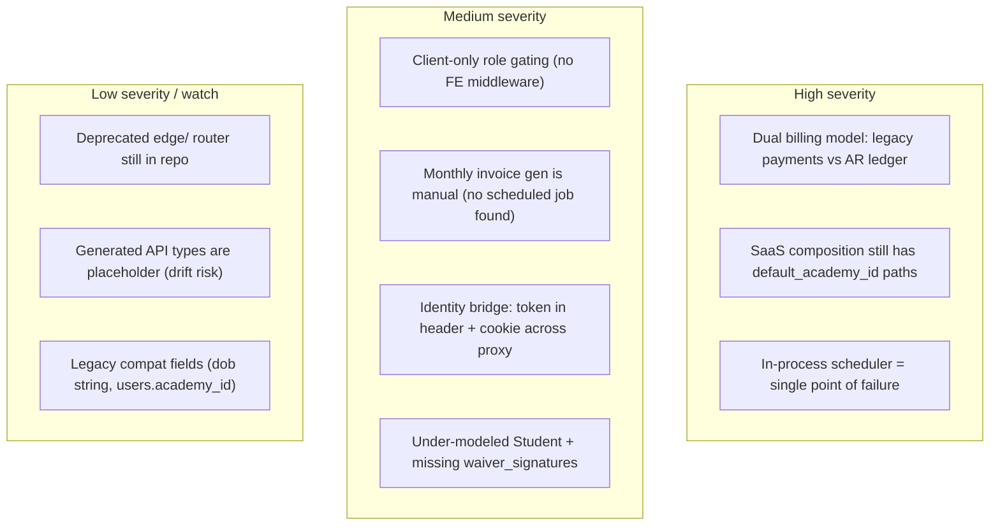

# 11 — Risk Map

**Confidence: High** (risks grounded in code and the existing data-model review)

Real, observed risks — shown honestly, not smoothed over. Severity reflects blast radius
× likelihood for a production single-academy launch moving toward SaaS.

## Risk overview

## Details

| ID | Risk | Evidence | Impact | Recommendation |
|---|---|---|---|---|
| R1 | **Dual billing model.** `payments` (legacy) and `invoices`/`ledger_payments` coexist; prod is legacy-heavy (~126 payments vs 1 ledger set). | `mongo_payment_repo.py`, `mongo_billing_ledger_repo.py`; data-model review | Reconciliation ambiguity; money truth split across models | Drive ledger as sole AR truth; admin-reviewed reconciliation of legacy `payments`; retire legacy via strangler-fig (delete last) |
| R2 | **SaaS composition not tenant-clean.** Default/primary academy still used in composition paths; `default_academy_id` must not appear in SaaS request paths. | `main.py` compose/tenant wiring; AGENTS.md SaaS rules; data-model review P0 | Cross-tenant correctness risk before tenant 2 | Per-request/per-tenant composition; webhook tenant routing by metadata; multi-tenant isolation tests |
| R3 | **APScheduler runs in the API process.** Webhook drain (60s), daily resumes, coach digests all in one app. | `main.py` lifespan scheduler | If app restarts/scales >1, jobs may not run or may double-run; webhook queue stalls | Confirm single-instance or externalize scheduler; add job observability/alerting |
| R4 | **Role gating is client-side only.** No `middleware.ts`; layouts use `usePersonaAuth`. | `frontend/app/*/layout.tsx`; no root middleware | UX guard only; relies entirely on backend `require_persona` | Keep backend authoritative; document that FE guard is non-security; consider edge middleware |
| R5 | **Monthly invoice generation is manual.** Admin endpoint only; no scheduled job found. | `interfaces/admin/billing_routes.py`; scheduler list in `main.py` | Missed runs -> unbilled months | Verify external cron or add scheduled job; alert if a period is never generated |
| R6 | **Identity bridge across proxy.** Firebase token carried as `Authorization`, `X-CourtMastr-Identity`, and `__cm_identity` cookie; proxy strips before forwarding. | `lib/api/client.ts`, `app/api/v2/[...path]/route.ts`, `proxy-headers.ts` | Token-handling surface area; cookie hygiene critical | Confirm Secure/HttpOnly + strip logic in all paths; minimize duplication |
| R7 | **Domain under-modeling.** `Student` aggregate is thin; 52 `waiver_acceptances` and 0 `waiver_signatures`; `student_billing_enrollments` empty. | data-model review; `mongo_student_repo.py` | Compliance + billing-enrollment gaps | Canonicalize student profile + registered_at; converge waivers; link billing enrollment |
| R8 | **Deprecated edge router.** `edge/` present with empty routes. | `edge/wrangler.toml` | Confusion / accidental deploy | Remove once confirmed unused |
| R9 | **Placeholder generated API types.** `lib/api/generated/v2.d.ts` is a stub; clients hand-declared. | `frontend/lib/api/generated/` | Contract drift FE<->BE | Wire `generate:api` in CI as enforced gate |
| R10 | **Legacy compatibility fields.** `users.academy_id`, `students.dob` (string), `parent_user_id` still queried. | repos; data-model review | Subtle query/normalization bugs | Plan retirement after canonical backfill |

## Tightly coupled / fragile areas

- **Billing webhook handler** (`handle_webhook_event.py`) is large and central — many event branches, quarantine, recovery points; high-change-risk module.
- **`main.py` lifespan** is the composition root + scheduler + tenant wiring — broad blast radius for changes.
- **Tenant resolution** spans middleware + resolver + settings fallbacks; single-academy vs SaaS branches must stay consistent.

## Sources inspected

- All files cited in docs 02, 04, 06, 07, 08, 09
- `docs/architecture/application-data-model.md` (gaps, production snapshot)

## Gaps / Unknowns

- Fly machine count / scaling policy not confirmed — central to R3 severity. "Needs verification".
