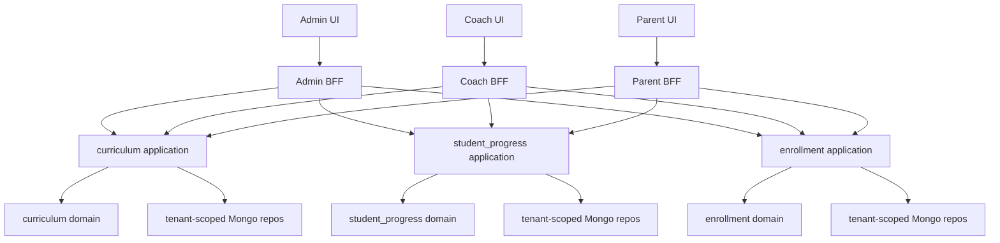

# Canonical Tenant Skill Pathway Architecture Plan

**Goal:** Make Skill Pathway the only curriculum and progression system for a tenant. Coaches should see the tenant curriculum, students should be placed into that curriculum, and every progress view should derive from the same pathway placement and skill progress records.

**Status:** Architecture plan. This replaces the "two apparent level systems" framing with a single canonical model.

**Architecture style:** FastAPI v2 persona BFF routes, DDD contexts under `backend/v2/contexts`, tenant-scoped Mongo repositories, Next.js App Router frontend.

---

## Business Problem

The academy needs one trusted answer to these questions:

- What curriculum does this tenant teach?
- Which level is each student currently in?
- Which skills inside that level are complete, incomplete, or ready for test?
- What should the coach do next in a session?
- What should an admin or parent see when reviewing progress?

Today those answers can come from different places. The session roster can show a simple legacy level value, while Skill Pathway has curriculum programs, levels, skills, tests, certificates, and progress summaries. That creates operational confusion:

- Coaches cannot reliably tell whether a roster level maps to the skills they should assess.
- Admins can change a student "level" without initializing skills or progress.
- Parents and admins may see pathway progress that does not match the roster.
- Certificates and level completion are harder to trust because they depend on pathway data, not the legacy roster level.

The business outcome is a single curriculum-backed student progression system that works for daily coaching, admin oversight, and parent visibility.

## Current Issue

There are two concepts currently leaking into the product:

1. Legacy student level fields
   - `students.level`
   - sometimes `students.skill_level`
   - admin session roster dropdowns and student detail training display

2. Skill Pathway progression
   - `skill_programs`
   - `skill_levels`
   - `skills`
   - `student_level_progress`
   - `student_skill_progress`
   - `test_attempts`
   - recommendations and certificates

The second system is the real curriculum system. The first one is a compatibility artifact and should stop driving workflows.

Concrete gaps found in the codebase:

- Admin session roster reads `students.level` through enrollment/admin directory composition.
- Admin session roster writes `students.level` through the old student update flow.
- Student detail Training tab still displays old training level text.
- BLNO's current entered pathway has six curriculum levels, but older UI wording and roster fields still imply a separate numeric level system.
- Seeded students are not guaranteed to be placed into pathway levels.
- Some frontend flows still depend on passing raw `program_id` and `level_id` instead of letting the BFF resolve the tenant pathway context.

## Architecture Decision

Skill Pathway is the only source of truth for tenant curriculum levels.

Level count, level names, and level order come from the selected pathway program's `skill_levels`. They are not hardcoded as 6 or 10 in application logic. The current BLNO seeded pathway has six entered levels; another tenant program can have a different number of levels and different skills.

The canonical student level is:

```txt
active student_level_progress row
  -> joined to skill_levels by level_id
  -> scoped by academy_id and program_id
```

Student placement is always program-scoped. If a tenant has different programs, each program has its own levels and skills, and the student must be mapped to the program whose curriculum they are following.

`students.level` is deprecated. It can be used only as a migration/backfill input or short-term read fallback. No new BFF route or UI flow should write it.

## Target Model

```txt
Tenant
  -> one or more Skill Programs
    -> Skill Levels
      -> Skills
        -> Criteria / references

Student
  -> program mapping / selected pathway program
  -> active Student Level Progress for that program
    -> Student Skill Progress
      -> Test Attempts
        -> Level completion / recommendations / certificates
```

Current student level calculation:

1. Resolve tenant from request context.
2. Resolve the student's selected pathway program, or the tenant's default active program when there is only one active program.
3. Read active `student_level_progress` for `(academy_id, student_id, program_id)`.
4. Join `level_id` to `skill_levels`.
5. Use `skill_levels.sequence` as the displayed order within that program.
6. Use `skill_levels.name` as the displayed level name.
7. Load skills for that level.
8. Load `student_skill_progress` for those skills.
9. Mark the level complete when required skills are passed according to pathway rules.
10. Use recommendation and approval workflows to move the student to the next level.

## BFF And DDD Boundaries

Persona BFF routes own HTTP shape, auth, tenant checks, persona-specific response shaping, and orchestration across contexts. Business rules remain in application/domain code.



Context ownership:

- `curriculum` owns programs, levels, skills, criteria, and references.
- `student_progress` owns placement, skill progress, attempts, recommendations, certificates, and progress summaries.
- `enrollment` owns student identity, sessions, enrollment status, and rosters.
- `coaching` owns coaching-specific session notes and feedback.

BFF responsibilities:

- Admin BFF can combine student identity, session roster, and pathway placement for admin operations.
- Coach BFF must verify assignment before reading or writing a student's pathway data.
- Parent BFF must restrict rows to children owned by the parent.
- BFF routes should resolve default tenant program when there is one active pathway.
- BFF routes should require explicit program selection when the tenant/student can map to multiple programs.
- BFF routes should not expose legacy `students.level` as the primary level field.

Application/domain responsibilities:

- A single `student_progress` application read service should resolve canonical pathway placement and summary data. BFF routes call this service; they do not reimplement placement calculation per persona.
- `PlaceStudentInLevel` creates active placement and initializes level skills.
- Skill status/test workflows update `student_skill_progress` and test attempts.
- Level completion and level-up recommendation logic stays in `student_progress`.
- Curriculum validation stays in `curriculum`.
- MVP read models should read live from tenant-scoped repositories. Add batching before roster/admin overview cutover if N+1 behavior appears in tests or local smoke; defer materialized/cached summaries until there is a measured need.

Infrastructure responsibilities:

- Mongo repositories apply tenant scope.
- Repositories do not decide business meaning of student level.
- Cross-tenant isolation stays covered by contract tests.

## Things To Add

1. Tenant pathway resolver
   - Resolve the active/default skill program for the request tenant.
   - If a tenant has multiple active programs, require explicit selection.

2. Program mapping policy
   - Define where student-to-program mapping is stored or derived.
   - Support multiple tenant programs without inventing a second level system.
   - Treat one active program as the default only when the tenant truly has one active pathway.

3. Canonical placement read model
   - Return student id, program id, level id, level sequence, level name, placement status, and next action.
   - Used by admin roster, student detail, coach progress, parent progress, and summary views.

4. Admin session roster pathway enrichment
   - Roster rows should show `pathway_level_sequence` and `pathway_level_name`.
   - Roster level metrics should derive from pathway placements.

5. Pathway placement BFF route
   - Admin placement endpoint should call `PlaceStudentInLevel`.
   - It should validate tenant, program, level, and student.
   - It should never patch `students.level`.

6. Coach pathway workflow cleanup
   - Coach session progress and passport flows should resolve the tenant program server-side when possible.
   - Skill updates and test attempts should derive the active pathway level instead of trusting arbitrary client level ids where possible.

7. Parent progress summary
   - Parent views should show the same canonical level and skill completion data as admin/coach, scoped to owned children.

8. Local seed/backfill
   - Seed tenant pathway with the levels and skills entered for that pathway program.
   - Current BLNO local seed should keep its six entered curriculum levels unless the tenant curriculum is explicitly changed.
   - Place seeded students into pathway levels.
   - Initialize skill progress rows through the same placement use case.

9. Tests
   - Unit tests for placement read model.
   - Interface tests for admin/coach/parent BFF routes.
   - Contract tests for tenant isolation.
   - Regression tests proving old `students.level` writes are not used by pathway workflows.

10. Cutover observability
   - Report unplaced students by tenant/program.
   - Report backfill placed/skipped/unmappable counts.
   - Track deprecated `students.level` write attempts after the new placement route is live.

## Things To Remove Or Deprecate

Remove from active workflows:

- Admin roster dropdown writes to `students.level`.
- Student detail display that treats `students.level` as current training level.
- UI wording that presents "legacy 1-10" as a separate system.
- Frontend dependence on raw `program_id`/`level_id` where BFF can resolve the tenant pathway context.

Deprecate but keep temporarily:

- `students.level` as a read fallback during migration.
- `students.skill_level` as an intake preference or backfill input only.
- Existing admin student update shape until all frontend call sites stop sending `level`.

Eventually remove:

- `level` from admin student update requests.
- Any roster-level composition that reads directly from student documents.
- Any tests that assert session roster level comes from `students.level`.

## Implementation Plan

### Phase 1: Confirm And Seed Tenant Curriculum As Entered

Files likely affected:

- `backend/v2/contexts/curriculum/application/use_cases/seed_curriculum.py`
- `backend/v2/tests/seed/test_badminton_seed.py`
- `scripts/dev/seed_badminton_pathway.py`

Work:

1. Confirm the entered BLNO pathway is the canonical curriculum for that program.
2. Keep the current six entered pathway levels unless the admin changes the pathway itself.
3. Do not create a separate Level 1 through Level 10 system.
4. Each level owns its own skills; adding a level means adding skills under that level.
5. Keep BWF or other framework references as metadata, not as separate operational levels.
6. Make seed idempotent.

Verification:

```bash
cd /Users/ramc/Documents/Code/academy-manager/backend
/Users/ramc/Documents/Code/academy-manager/backend/.venv/bin/pytest v2/tests/seed/test_badminton_seed.py -q
```

### Phase 2: Add Default Tenant Program Resolution

Files likely affected:

- `backend/v2/contexts/curriculum/application/use_cases/manage_program.py`
- `backend/v2/composition/pathway.py`
- `backend/v2/tests/contexts/curriculum/`

Work:

1. Add an application query that resolves the default active program for a tenant only when exactly one active program exists.
2. Add or document the student/session-to-program mapping rule for tenants with multiple programs.
3. Return a clear error if zero active programs exist.
4. Require explicit program selection if multiple active programs exist and no student/session mapping resolves the program.
5. Wire BFF routes to use this resolver.

Verification:

- Single active program resolves.
- Student/session program mapping resolves when multiple programs exist.
- No active program returns expected error.
- Multiple active programs without mapping require explicit selection.

### Phase 3: Add Canonical Student Pathway Placement Read Model

Files likely affected:

- `backend/v2/contexts/student_progress/application/use_cases/`
- `backend/v2/contexts/student_progress/application/ports.py`
- `backend/v2/tests/contexts/student_progress/`

Work:

1. Add a `StudentPathwayPlacement` read model.
2. Accept or resolve the pathway program first.
3. Read active `student_level_progress` for that program.
4. Join level details from curriculum.
5. Return an unplaced/next-action state when no active placement exists.
6. Ensure it is tenant-scoped.

Verification:

- Placed student returns correct sequence/name.
- Unplaced student returns clear placement-needed state.
- Cross-tenant data is not visible.

### Phase 3.5: Backfill Before Roster Cutover

Files likely affected:

- `scripts/dev/backfill_student_pathway_placements.py`
- `scripts/local_test_stack.sh`
- `backend/v2/tests/`

Work:

1. Add an idempotent local/test backfill before changing roster reads.
2. Use program mapping first. If no mapping exists and there is exactly one active program, use that program.
3. Map old numeric `students.level` only when a configured mapping to `skill_levels.sequence` exists.
4. Do not guess lossy mappings. If a student cannot be mapped, leave them in a placement-needed state.
5. Produce a dry-run report with placed, skipped, and unmappable counts.

Verification:

- Fresh local seed creates student placements for mappable students.
- Backfill can run twice without duplicate active placements.
- Unmappable students are visible as placement-needed, not silently guessed.

### Phase 4: Move Admin Session Roster To Pathway Placement

Files likely affected:

- `backend/v2/composition/admin.py`
- `backend/v2/interfaces/admin/session_routes.py`
- `backend/v2/tests/interface/`
- `frontend/app/(admin)/admin/sessions/[id]/page.tsx`
- `frontend/lib/api/admin.ts`

Work:

1. Enrich roster rows with canonical pathway placement.
2. Show "Pathway Level" from `skill_levels.sequence/name`.
3. Derive roster level summary from pathway placement.
4. Remove "legacy level" wording.
5. Keep old student `level` only as temporary fallback if the student has no pathway placement.

Verification:

- Roster displays pathway placement.
- Changing pathway placement updates `student_level_progress`.
- `students.level` is not patched.

### Phase 5: Replace Roster Level Write Path

Files likely affected:

- `backend/v2/interfaces/admin/progress_routes.py`
- `backend/v2/tests/interface/test_admin_progress_routes.py`
- `frontend/lib/api/curriculum.ts`
- `frontend/app/(admin)/admin/sessions/[id]/page.tsx`

Recommended route:

```txt
POST /api/v2/admin/students/{student_id}/pathway-placement
body: { program_id?: string, level_id: string }
response: StudentPathwayPlacement
```

Work:

1. Resolve default program when `program_id` is omitted.
2. Validate level belongs to tenant and program.
3. Call `PlaceStudentInLevel`.
4. Initialize skill progress for the new level.
5. Invalidate roster and progress queries in frontend.

Verification:

- Placement endpoint creates active pathway placement.
- Skill progress rows are initialized.
- Old `students.level` does not change.

### Phase 6: Update Student, Coach, And Parent Screens

Files likely affected:

- `frontend/app/(admin)/admin/students/[studentId]/page.tsx`
- `frontend/app/(admin)/admin/students/[studentId]/progress/page.tsx`
- `frontend/app/(coach)/coach/sessions/[id]/progress/page.tsx`
- `frontend/app/(coach)/coach/students/[studentId]/passport/page.tsx`
- `frontend/app/(parent)/parent/progress/page.tsx`
- `frontend/lib/api/curriculum.ts`

Work:

1. Student Training tab shows canonical pathway placement.
2. Student progress page remains the admin place/update surface.
3. Coach session progress uses pathway summary for assigned roster only.
4. Coach passport uses active placement and level skills.
5. Parent progress shows the same canonical level and skill counts for owned children.

Verification:

```bash
cd /Users/ramc/Documents/Code/academy-manager/frontend
pnpm typecheck
pnpm lint
```

### Phase 7: Backfill And Deprecate Legacy Level

Files likely affected:

- `scripts/dev/backfill_student_pathway_placements.py`
- `scripts/local_test_stack.sh`
- `backend/v2/contexts/enrollment/infrastructure/mongo_student_repo.py`
- `backend/v2/interfaces/admin/views.py`

Work:

1. Keep the Phase 3.5 backfill script available for local/test rebuilds.
2. Add operational reporting for unplaced students per tenant/program.
3. Stop exposing `level` as an editable admin student field.
4. Keep a temporary read fallback for old records if needed.
5. Remove the fallback only after unplaced counts are known and accepted.

Verification:

- Fresh local seed creates program, levels, skills, placements, and skill progress.
- Session roster and student progress are meaningful immediately after seed.
- Admin update routes no longer accept or write pathway level through `students.level`.

## Risks And Mitigations

Risk: duplicate active placements for one student/program.

Mitigation: enforce application-level deactivation of previous active rows, add repository query tests, and consider a unique active-placement constraint where supported.

Implementation note: placement writes should be idempotent for the same `(academy_id, student_id, program_id, level_id)` request. Concurrent writes should leave one active placement per `(academy_id, student_id, program_id)` and return the resulting active placement.

Risk: multi-program tenants.

Mitigation: default program resolver handles the common one-program tenant. If multiple active programs exist, BFF requires explicit `program_id`.

Risk: frontend accidentally reintroduces old level writes.

Mitigation: remove level from frontend update payloads, add regression tests, and search for `levelMutation` / `students.level` before closing the work.

Risk: cross-context coupling.

Mitigation: BFF composes across contexts; application use cases stay inside their bounded contexts; repositories stay tenant-scoped.

Risk: N+1 roster queries.

Mitigation: add batched placement/summary lookups for session roster and admin overview once the data shape is stable.

Risk: seeded or historical students have no pathway placement.

Mitigation: show a placement-needed state, add admin placement action, and provide idempotent local/test backfill.

## Acceptance Criteria

- There is one visible student level system in the UI: Skill Pathway.
- Admin session roster displays pathway level from `student_level_progress + skill_levels`.
- Admin roster level changes call pathway placement, not `students.level` updates.
- Student detail Training tab displays canonical pathway placement.
- Coach progress and passport views read tenant curriculum and assigned student pathway progress.
- Parent progress reads the same canonical progress summary for owned children.
- Local seed creates tenant pathway levels and places students so the UI is usable after `scripts/local_test_stack.sh fresh`.
- Backend tests cover BFF persona scoping and tenant isolation.
- Frontend typecheck and lint pass.

## Verification Plan

Backend:

```bash
cd /Users/ramc/Documents/Code/academy-manager/backend
/Users/ramc/Documents/Code/academy-manager/backend/.venv/bin/pytest v2/tests -q
/Users/ramc/Documents/Code/academy-manager/backend/.venv/bin/ruff check v2
/Users/ramc/Documents/Code/academy-manager/backend/.venv/bin/ruff format --check v2
```

Frontend:

```bash
cd /Users/ramc/Documents/Code/academy-manager/frontend
pnpm typecheck
pnpm lint
```

Manual smoke:

1. Run `scripts/local_test_stack.sh fresh`.
2. Open `http://blno.localhost:3001/admin/pathway`.
3. Confirm tenant curriculum shows the levels entered for that pathway program.
4. Open an admin session roster.
5. Confirm roster shows pathway levels, not a separate legacy level system.
6. Change a student's pathway placement and confirm progress page reflects it.
7. Sign in as coach and confirm only assigned session students are visible.
8. Sign in as parent and confirm only owned children appear.
