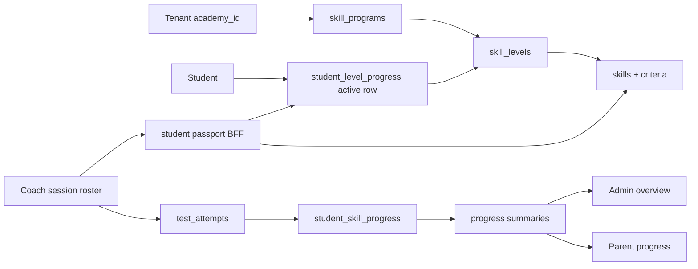

# Canonical Skill Pathway Architecture Implementation Plan

> **For Claude:** REQUIRED SUB-SKILL: Use superpowers:executing-plans to implement this plan task-by-task.

**Goal:** Make the tenant skill pathway the only curriculum/progression level system, so coaches work from tenant curriculum, every student is mapped to pathway placement, and progress is maintained through skills/tests.

**Architecture:** The `curriculum` context owns tenant programs, levels, skills, criteria, and references. The `student_progress` context owns student placement, skill progress, test attempts, recommendations, certificates, and progress summaries. The old `students.level` field is deprecated as a compatibility artifact and must not drive coach/admin pathway workflows.

**Tech Stack:** FastAPI v2 BFF, DDD contexts under `backend/v2/contexts`, Mongo repositories with tenant scope, Next.js App Router frontend, TanStack Query, mongomock/interface tests.

---

## Architectural Decision

For each tenant, curriculum progression is:

```txt
tenant -> active program -> pathway levels -> skills -> student placement -> skill progress/tests
```

The canonical student level is the active `student_level_progress` row joined to `skill_levels.sequence/name`. Session roster level, student Training tab, coach passport, parent progress, and admin progress must all read from this source.

Do not maintain a separate roster level system. During migration, `students.level` can exist for old records, but only as a backfill input or compatibility display fallback.



## Current State

Already good:

- `curriculum` context owns `skill_programs`, `skill_levels`, `skills`, criteria, and references.
- `student_progress` context owns `student_level_progress`, `student_skill_progress`, `test_attempts`, recommendations, certificates.
- `PlaceStudentInLevel` creates active level placement and initializes `NOT_STARTED` skill progress rows for level skills.
- `GetStudentPassport` reads active placement, then returns level skills plus student progress.
- Coach routes already use assigned-coach guards and student progress use cases.

Gaps:

- Session roster still reads `students.level` from enrollment/admin directory composition.
- Session roster level dropdown still patches `students.level`.
- Coach and admin screens still pass `program_id`/`level_id` around explicitly instead of resolving tenant curriculum.
- Seed creates generic 6-level badminton pathway, while BLNO operations expect Level 1-10.
- Existing seeded students are not automatically placed into pathway levels.
- Student Training tab still shows old `student.level` as a training detail.

## Target Rules

1. `skill_levels.sequence` is the user-facing level number.
2. Active student level is derived from `student_level_progress(status="active")`.
3. A student has at most one active placement per program.
4. Coach session roster must display pathway level, not `students.level`.
5. Changing a student level must call `PlaceStudentInLevel` or a purpose-built pathway placement use case.
6. Skill status is updated only through coach/student passport flows.
7. Passing required skills can make a level complete; level-up is recommendation/approval driven.
8. `students.level` becomes deprecated and should not be written by new UI flows.

---

### Task 1: Decide and Seed Tenant Pathway Level Count

**Files:**
- Modify: `backend/v2/contexts/curriculum/application/use_cases/seed_curriculum.py`
- Modify: `backend/v2/tests/seed/test_badminton_seed.py`
- Modify: `scripts/dev/seed_badminton_pathway.py` if seed options are needed

**Steps:**
1. Confirm BLNO needs 10 pathway levels.
2. Replace or extend `_LEVELS` to 10 tenant levels.
3. Keep BWF references metadata-only.
4. Update seed tests from expected 6 levels to expected 10 levels.
5. Run:
   ```bash
   cd backend
   /Users/ramc/Documents/Code/academy-manager/backend/.venv/bin/pytest v2/tests/seed/test_badminton_seed.py -q
   /Users/ramc/Documents/Code/academy-manager/backend/.venv/bin/ruff check v2
   /Users/ramc/Documents/Code/academy-manager/backend/.venv/bin/ruff format --check v2
   ```
6. Commit: `Update BLNO pathway seed to ten levels`.

### Task 2: Add Tenant Curriculum Resolution

**Files:**
- Modify: `backend/v2/contexts/curriculum/application/use_cases/manage_program.py`
- Modify: `backend/v2/composition/pathway.py`
- Test: `backend/v2/tests/contexts/curriculum/test_program_resolution.py` or adjacent existing test

**Goal:** Persona BFF routes should not require UI callers to know raw `program_id` when tenant has one active pathway.

**Steps:**
1. Add/use a query that returns the tenant's default active program.
2. If multiple active programs exist, route may require explicit `program_id`.
3. Keep route-level 422/409 behavior explicit.
4. Test single active program resolves automatically.
5. Test multiple active programs require selection.
6. Commit: `Resolve default tenant pathway program`.

### Task 3: Add Canonical Student Pathway Placement Read Model

**Files:**
- Create or modify use case under `backend/v2/contexts/student_progress/application/use_cases/`
- Modify ports if needed: `backend/v2/contexts/student_progress/application/ports.py`
- Test: `backend/v2/tests/contexts/student_progress/test_student_pathway_placement.py`

**Goal:** One read model returns a student's current pathway level with level id, sequence, name, program id, and placement status.

**Steps:**
1. Define `StudentPathwayPlacement` read model.
2. Read active `student_level_progress`.
3. Join through `SkillLookup.get_level(active.level_id)`.
4. Return `None` or `next_action=place_in_level` when no active placement exists.
5. Unit test placed and unplaced students.
6. Commit: `Add student pathway placement read model`.

### Task 4: Replace Session Roster Level Source

**Files:**
- Modify backend session roster composition/query:
  - `backend/v2/composition/admin.py`
  - related admin session route/test files
- Modify frontend types:
  - `frontend/lib/api/admin.ts`
- Modify UI:
  - `frontend/app/(admin)/admin/sessions/[id]/page.tsx`

**Goal:** Session roster rows show pathway level from `student_level_progress + skill_levels`, not `students.level`.

**Steps:**
1. Extend roster row DTO with:
   - `pathway_program_id`
   - `pathway_level_id`
   - `pathway_level_sequence`
   - `pathway_level_name`
   - `pathway_placement_status`
2. Keep old `level` only as deprecated fallback until removed.
3. Update session roster metric to derive min/max from `pathway_level_sequence`.
4. Update UI column to `Pathway Level`.
5. Add interface test proving roster level comes from pathway placement.
6. Commit: `Use pathway placement in admin session roster`.

### Task 5: Replace Roster Level Dropdown Write Path

**Files:**
- Modify: `backend/v2/interfaces/admin/progress_routes.py` or add a focused BFF route
- Modify: `frontend/lib/api/curriculum.ts` or `frontend/lib/api/admin.ts`
- Modify: `frontend/app/(admin)/admin/sessions/[id]/page.tsx`
- Tests: admin interface tests

**Goal:** Changing level in session roster places the student in a pathway level.

**Recommended route:**

```txt
POST /api/v2/admin/students/{student_id}/pathway-placement
body: { program_id?: string, level_id: string }
```

**Behavior:**
- Resolve default program if omitted.
- Validate level belongs to program and tenant.
- Call `PlaceStudentInLevel`.
- Return current placement DTO.
- Do not patch `students.level`.

**Steps:**
1. Write failing interface test for session-level update hitting pathway placement.
2. Implement route.
3. Update frontend dropdown to list `skill_levels`.
4. On change, call pathway placement route.
5. Invalidate session enrollments and student progress queries.
6. Commit: `Place students through pathway roster dropdown`.

### Task 6: Update Student Detail Training Tab

**Files:**
- Modify: `frontend/app/(admin)/admin/students/[studentId]/page.tsx`
- Possibly modify backend student detail BFF if embedding placement:
  - `backend/v2/interfaces/admin/directory_routes.py`
  - `backend/v2/contexts/enrollment/application/use_cases/admin_directory.py`

**Goal:** Training tab shows canonical pathway placement, not old student level.

**Steps:**
1. Add student placement summary to admin student detail BFF, or fetch progress summary client-side.
2. Display `Pathway Level <sequence>: <name>`.
3. Keep "Manage skill progress" link.
4. Remove old editable `level` field from training edit form.
5. Test typecheck/lint.
6. Commit: `Show canonical pathway level on student detail`.

### Task 7: Backfill Seeded Students Into Pathway

**Files:**
- Modify: `backend/scripts/seed_local.py` or add local seed step in `scripts/local_test_stack.sh`
- Possibly create: `scripts/dev/backfill_student_pathway_placements.py`

**Goal:** Local seeded students are placed into pathway levels so coach/admin screens are immediately meaningful.

**Mapping:**
- If legacy numeric `students.level` exists, map to `skill_levels.sequence`.
- If not, place new seeded students at Level 1 or use seed templates.

**Steps:**
1. Add idempotent local-only backfill script.
2. For each active student, find default active program and matching `skill_levels.sequence`.
3. Call/use placement repository/use case to create active placement and initial skill progress.
4. Verify seeded local DB has `student_level_progress` for roster students.
5. Commit: `Backfill local students into pathway levels`.

### Task 8: Coach Workflow Cleanup

**Files:**
- Modify: `backend/v2/interfaces/coach/skill_routes.py`
- Modify: `frontend/app/(coach)/coach/sessions/[id]/progress/page.tsx`
- Modify: `frontend/app/(coach)/coach/students/[studentId]/passport/page.tsx`

**Goal:** Coach workflow should not require raw program/level IDs from the URL when tenant has a default pathway.

**Steps:**
1. Coach session progress endpoint resolves default program when `program_id` omitted.
2. Passport endpoint can resolve default program when omitted.
3. Passport update/test route should derive active level from placement where possible, instead of trusting client-supplied `level_id`.
4. Add coach interface tests.
5. Commit: `Resolve coach pathway context server-side`.

### Task 9: Deprecate Legacy Student Level Writes

**Files:**
- Modify: `backend/v2/interfaces/admin/views.py`
- Modify: `backend/v2/contexts/enrollment/application/use_cases/admin_directory.py`
- Modify: `backend/v2/contexts/enrollment/infrastructure/mongo_student_repo.py`
- Modify frontend forms that expose `level`

**Goal:** Prevent new UI/API writes to `students.level`.

**Steps:**
1. Remove `level` from `UpdateAdminStudentRequest` once all frontend call sites are migrated.
2. Keep read fallback for old data during one release if needed.
3. Add regression test that session roster does not patch `students.level`.
4. Commit: `Deprecate legacy student level writes`.

## Verification

Backend:

```bash
cd backend
/Users/ramc/Documents/Code/academy-manager/backend/.venv/bin/pytest v2/tests -q
/Users/ramc/Documents/Code/academy-manager/backend/.venv/bin/ruff check v2
/Users/ramc/Documents/Code/academy-manager/backend/.venv/bin/ruff format --check v2
```

Frontend:

```bash
cd frontend
pnpm typecheck
pnpm lint
```

Manual smoke:

1. `scripts/local_test_stack.sh fresh`
2. Login admin at `http://blno.localhost:3001`.
3. Open session roster; pathway levels are populated from curriculum.
4. Change a student's pathway level.
5. Open that student's progress page; placement matches.
6. Login coach; coach sees roster progress and passport for assigned students.
7. Record test/status; progress summary updates.
8. Login parent; parent sees only owned child progress.

## Open Decisions

1. BLNO exact 10-level names and skill groups.
2. Whether multiple programs per tenant are needed now or later.
3. Whether admin can manually jump a student ahead, or must use level-up approval only after initial placement.
4. Whether moving down a level should preserve prior skill progress or create a new active placement history row.
