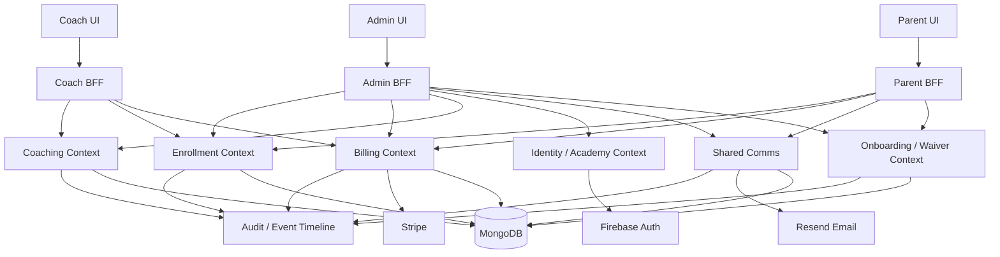
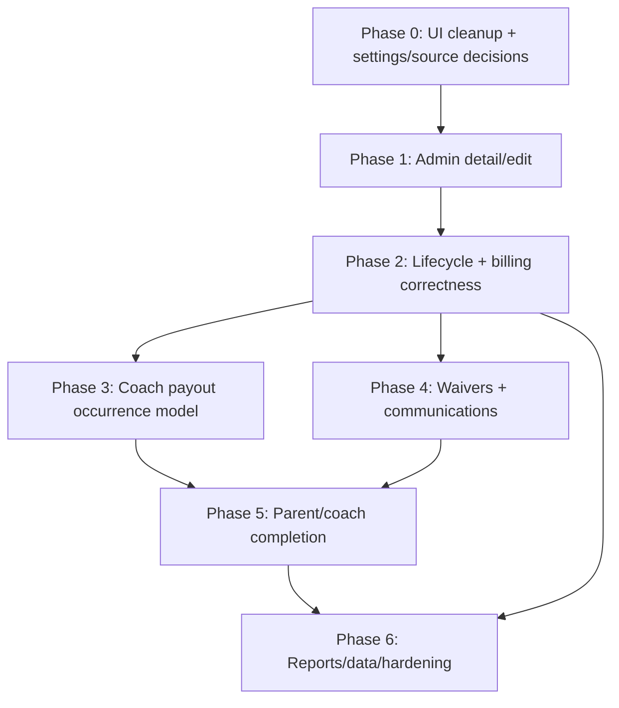

# Academy Manager Prioritized Roadmap

**Date:** 2026-05-21
**Sources:**

- [`2026-05-21-academy-manager-requirements.md`](./2026-05-21-academy-manager-requirements.md)
- [`2026-05-21-completion-diff.md`](./2026-05-21-completion-diff.md)
- [`2026-05-21-admin-product-validation-report.md`](./2026-05-21-admin-product-validation-report.md)

**Purpose:** One implementation roadmap that reconciles the ideal product spec, the current code gap analysis, and the real admin/operator feedback.

---

## SaaS Amendment

Decision date: 2026-05-21

This roadmap is amended by the SaaS architecture decision in [`2026-05-21-saas-data-model-architecture-assessment.md`](./2026-05-21-saas-data-model-architecture-assessment.md).

SaaS mode is **v2-only**:

- Legacy `/api/*` routes are not part of SaaS mode.
- New tenants must not call legacy routes.
- New SaaS workflows must not depend on legacy behavior.
- Do not patch legacy routes for SaaS readiness.
- There is no production SaaS data to migrate, so build clean.
- `default_academy_id` must not be used in SaaS request paths.
- Any exception requires architecture approval.

This means the older strangler/cutover language in this roadmap only applies to the existing local/legacy application while it is still present. It is not the SaaS launch strategy.

SaaS Phase 0 is now:

1. V2-only route enforcement.
2. Membership-based identity.
3. Explicit tenant resolution.
4. Clean tenant bootstrap.
5. Tenant isolation tests.
6. Audit logging.
7. Billing idempotency.
8. Data governance.

## Executive Direction

The app is not starting from scratch. The design system, route groups, Firebase auth, many v2 BFF routes, coach offline attendance, parent payments, and admin shells already exist. The next work should not be a rewrite.

The priority is to make the product operationally correct for academy owners:

1. Remove technical leakage from admin UI.
2. Add detail/edit workflows for real objects.
3. Make enrollment lifecycle and billing decisions explicit and auditable.
4. Fix payments, invoices, credits, dues, and Stripe operational visibility.
5. Model coach payouts from actual attended sessions.
6. Complete waivers and messaging so they are usable records, not just status tables.
7. Finish parent/coach UX gaps after the domain foundations exist.

The roadmap below intentionally puts admin correctness and money correctness ahead of cosmetic spec parity.

---

## Architecture Principles

### SaaS Is v2-Only

- SaaS traffic uses v2 BFF + DDD boundaries only.
- Legacy `/api/*` remains an existing-app concern, not a SaaS path.
- New or corrected SaaS workflows land in v2 only.
- Do not migrate old single-tenant patterns forward.

### Use Persona BFFs

- Admin BFF returns owner/operator views.
- Coach BFF returns court-side workflow views.
- Parent BFF returns family-safe views.
- Avoid generic CRUD endpoints for user-facing pages; use workflow-shaped endpoints.

### Settings Becomes Product Configuration

Settings should drive visible product behavior:

- academy display name
- timezone
- currency/locale
- session pricing
- pause/move/withdraw policies
- payment methods
- email templates
- Stripe health
- branding
- reports/data exports

### Audit First For Money And Enrollment

Any action that affects billing, seat availability, legal records, coach pay, or parent communication must create a durable event or audit record.

### Hide Internal IDs

IDs remain in API responses and support/audit tools, but not in normal admin tables.

---

## Legacy v2 Cutover Policy

This section applies only to the existing legacy/local application while it still exists. It is **not** the SaaS strategy.

The SaaS strategy is v2-only. Legacy routes are not exposed to new tenants.

For any remaining non-SaaS legacy usage, the strangler pattern needs explicit retirement gates. Otherwise the codebase carries two of everything indefinitely. Every legacy route follows one of four states:

| State | Definition | Caller experience |
|---|---|---|
| **Active** | Default. Equal partner to v2 (or sole implementation). | 200 OK, no warnings. |
| **Frozen** | No new feature work; still served for legacy clients. | 200 OK + `Deprecation: true` + `Sunset: <date>` response headers. |
| **Retired** | Returns `410 Gone` or 301-redirects to v2 equivalent. | Old clients fail with a link to migration notes. |
| **Removed** | Code deleted. | Route returns 404 like any other unknown path. |

Retirement (Frozen → Retired) requires all three of:

1. v2 equivalent in production for **≥ 2 weeks**.
2. Zero traffic on the legacy route for **≥ 7 days** (verified via access logs).
3. ADR-recorded retirement entry (see § Key ADRs).

The per-phase **v2 Cutover Gate** sub-sections name what transitions Active → Frozen (or Frozen → Retired) at the end of each phase. Code removal is opportunistic — typically one or two phases after retirement, when no caller has reported breakage.

Default `Sunset` window for a newly-frozen route: 90 days. Override per case if a known external integration needs longer.

---

## Audit Event Catalog

Every action that affects money, seat availability, legal records, coach pay, or parent communication writes a durable `AuditEvent`. The catalog below names each event, the phase that introduces it, and the required fields. The storage model is decided in ADR #2 (Enrollment Lifecycle Event Model) — append-only event log with subject-based projections is the recommended approach.

### Master event list

| Event | Phase | Actor | Subject | Required fields | Notes |
|---|---|---|---|---|---|
| `setting.changed` | 0 | admin/owner | academy | `key`, `from`, `to` | Scaffolding event; proves the audit infra works end-to-end. |
| `student.edited` | 1 | admin | student | `student_id`, `changed_keys`, `from`, `to` | |
| `user.edited` | 1 | admin | user | `user_id`, `changed_keys`, `from`, `to` | |
| `user.role_changed` | 1 | admin/owner | user | `user_id`, `from_role`, `to_role`, `reason?` | Requires explicit confirm in UI. |
| `session.created` | 1 | admin | session | `session_id`, `name`, `coach_id`, `capacity`, `fee` | |
| `session.edited` | 1 | admin | session | `session_id`, `changed_keys`, `from`, `to` | |
| `session.cancelled` | 1 | admin | session | `session_id`, `reason`, `effective_date` | Formalizes the existing cancel action. |
| `expense.created` | 1 | admin | expense | `expense_id`, `category`, `amount`, `vendor` | |
| `expense.edited` | 1 | admin | expense | `expense_id`, `changed_keys`, `from`, `to` | New this phase. |
| `expense.deleted` | 1 | admin | expense | `expense_id`, `reason?` | Soft delete. |
| `enrollment.paused` | 2 | admin | enrollment | `enrollment_id`, `pause_effective_date`, `reason`, `billing_policy` | Default policy: release seat → waitlist. |
| `enrollment.resumed` | 2 | admin | enrollment | `enrollment_id`, `resume_effective_date`, `seat_outcome` | |
| `enrollment.moved` | 2 | admin | enrollment | `enrollment_id`, `from_session_id`, `to_session_id`, `effective_date`, `proration_amount` | |
| `enrollment.withdrawn` | 2 | admin | enrollment | `enrollment_id`, `withdrawal_effective_date`, `outcome ∈ {credit,refund,adjustment}`, `amount` | |
| `enrollment.removed` | 2 | admin | enrollment | `enrollment_id`, `reason`, `actor_id` | Rare; requires confirm + reason. |
| `payment.manual_recorded` | 2 | admin | payment | `payment_id`, `amount_received`, `method`, `reference?`, `received_at` | |
| `payment.discounted` | 2 | admin | payment | `payment_id`, `discount_amount`, `reason` | |
| `payment.refunded` | 2 | admin | payment | `payment_id`, `refund_amount`, `provider_ref?`, `reason` | |
| `credit.applied` | 2 | system/admin | parent | `parent_id`, `credit_id`, `applied_to_payment_id`, `amount` | |
| `invoice.sent` | 2 | admin/system | invoice | `invoice_id`, `parent_id`, `channel`, `template_id` | |
| `dues.reminder_sent` | 2 | admin | dues | `dues_id[]`, `template_id`, `channel`, `recipient_count` | Selective; one event per batch. |
| `coach.assignment_changed` | 3 | admin | session_occurrence | `occurrence_id`, `from_coach_id`, `to_coach_id`, `reason` | |
| `coach.substituted` | 3 | admin | session_occurrence | `occurrence_id`, `original_coach_id`, `substitute_coach_id`, `reason` | |
| `payout.approved` | 3 | admin/owner | payout | `payout_id`, `coach_id`, `period`, `amount`, `formula_snapshot` | Formula snapshot is canonical for disputes. |
| `payout.paid` | 3 | admin/owner | payout | `payout_id`, `method`, `reference?`, `paid_at` | |
| `payout.undone` | 3 | admin/owner | payout | `payout_id`, `from_state`, `reason` | |
| `waiver.template_versioned` | 4 | admin/owner | waiver_template | `waiver_id`, `version`, `content_hash`, `effective_date` | Immutable. |
| `waiver.signed` | 4 | parent | waiver_signature | `signature_id`, `student_id`, `waiver_version`, `content_hash`, `ip?`, `ua?` | Immutable snapshot. |
| `waiver.reminded` | 4 | admin | waiver_signature | `signature_id[]`, `template_id` | |
| `message.broadcast_sent` | 4 | admin | announcement | `announcement_id`, `scope_type`, `scope_ids`, `recipient_count`, `delivery_status` | |
| `message.dm_sent` | 4 | admin/coach/parent | thread | `thread_id`, `from_user_id`, `to_user_id` | |

### Common fields on every event

`event_id` (ulid) · `event_type` · `event_phase` (catalog phase) · `actor_id` · `actor_role` · `subject_id` · `subject_type` · `created_at` · `correlation_id?` (groups events from one transaction) · `ip?` · `ua?`.

### Read paths

Timeline views on student detail (Phase 1), enrollment detail (Phase 2), coach payout detail (Phase 3), and waiver detail (Phase 4) all consume this single event stream filtered by `subject_id` or `subject_type`. Reports in Phase 6 also consume it. **The event log is the canonical source for "what happened"; transactional rows are the canonical source for "current state".**

---

## Target Architecture



---

## Roadmap Overview

| Phase | Theme | Outcome |
|---|---|---|
| 0 | Guardrails and UI professionalism | Admin stops exposing implementation details; settings/branding begins acting as source of truth. |
| 1 | Admin object control | Students, users, sessions, enrollments, expenses, and invoices become editable/drillable. |
| 2 | Enrollment lifecycle and billing correctness | Pause, move, withdraw, dues, invoice, credit, and Stripe behavior become auditable and predictable. |
| 3 | Coach payout and session occurrence model | Coach pay is based on actual attended sessions, with substitute support. |
| 4 | Waivers and communications | Per-student waivers become signed records; messages/reminders target real audiences. |
| 5 | Parent and coach experience completion | Parent home/inbox, registration polish, coach payout, and coach attendance UX reach spec intent. |
| 6 | Reporting, data, and operational hardening | Owner finance/daily ops dashboards, exports, global search, retention, and production checks mature. |

---

## Phase 0 - Guardrails And Professional UI Cleanup

**Goal:** Remove low-trust UI issues and establish the architectural decisions needed for later phases.

### Scope

- Hide visible internal IDs from:
  - students
  - users
  - payments
  - dues
  - payouts
  - messages
- Replace admin-unfriendly copy:
  - `BFF`
  - `Mongo ID`
  - `monthly cents`
  - `deferred`
  - `loaded students`
  - backend context/workstream wording
- Wire academy display name into admin shell instead of hard-coded `Rally Academy`.
- Add a single debug/support affordance for IDs where needed, hidden from normal workflows.
- Decide canonical Stripe webhook path and update deployment docs.
- Create a small route-compatibility policy:
  - `/coach` redirects to the actual coach home route.
  - `/parent` redirects to parent dashboard/home.
  - `/parent/pay` redirects to payments, or rename intentionally.

### Backend / Architecture

- Document that v2 `academies` is the future settings source.
- Add compatibility notes for legacy `academy_settings`.
- Add a short ADR for:
  - v2 settings source of truth
  - canonical Stripe webhook endpoint
  - internal IDs hidden from normal admin UI

### Acceptance

- Admin can navigate all current admin pages without seeing Mongo/user/student/payment IDs in normal tables.
- No admin page shows `BFF`, `Mongo`, `cents`, or `deferred` as user-facing copy.
- Admin shell brand reads from academy settings.
- `DEPLOYMENT.md` states the canonical Stripe webhook endpoint.

### Audit Events Shipping

| Event | Why this phase |
|---|---|
| `setting.changed` | The setting-source ADR ships this phase; first event proves the audit infra works end-to-end. |

The `AuditEvent` storage model and write path are built this phase (per ADR #2). Most concrete events fire in later phases; Phase 0 establishes the contract.

### Risks

- **Hidden IDs break support workflows.** Mitigation: ship a support-only debug drawer (admin keystroke `?`) that surfaces IDs and lets support copy them. Land the drawer in the same PR as the hide.
- **Empty academy settings render a blank shell.** Mitigation: hardcoded fallback ("Academy Manager") until the settings record is created on academy provision.
- **Stripe webhook path change drops payment events silently in production.** Mitigation: ship both legacy and v2 endpoints accepting events for one full month; alarm on payment lag > 2 minutes; flip the canonical endpoint together with secret rotation.
- **ADRs become a 6-week stall.** Mitigation: timebox each ADR to 2 days; ship a "v0.1" decision per topic and iterate.
- **Route redirects (`/coach` → `/coach/dashboard`) break in-app deep links.** Mitigation: ship redirects as 307 first (preserve method); flip to 301 only after Phase 5 commits to final route names.

### v2 Cutover Gate

No route retirements this phase. Outputs that gate Phase 1 entry:

- ADR #1 (settings source of truth) decided.
- ADR #7 (canonical Stripe webhook path) decided and reflected in `DEPLOYMENT.md`.
- ID-exposure policy adopted (see Architecture Principles).
- `AuditEvent` table + write path live in v2 and consumed by at least one Phase 0 action (`setting.changed`).
- Admin shell brand reads from `Academy.name`; the hardcoded `Rally Academy` constant is removed.

### Priority

P0. This is trust-building and reduces confusion before deeper work.

---

## Phase 1 - Admin Object Control Plane

**Goal:** Turn read-only tables into professional operational tools.

### Scope

- Add student detail/edit:
  - profile
  - parent contact, including phone
  - sessions/enrollments
  - payment status
  - attendance summary
  - waiver status
  - lifecycle timeline
- Add user detail/edit:
  - parent/coach/admin profile
  - phone/email/status
  - linked students
  - coach assigned sessions
  - role changes with confirmation and audit
- Add session edit:
  - name/title
  - coach
  - location
  - start/end
  - capacity
  - fee
  - status
- Add expense edit/delete in v2.
- Add invoice/payment detail page.
- Add admin selection components:
  - student picker
  - parent picker
  - coach picker
  - session picker
  - invoice picker
- Add dedicated `/admin/enrollments` only if it can use the same pickers and lifecycle model; otherwise queue it for Phase 2.

### Backend / Architecture

- Add v2 use cases/routes:
  - `EditSession`
  - `EditStudent`
  - `EditUser`
  - `UpdateExpense`
  - `DeleteExpense`
  - invoice/payment detail query
- Preserve legacy behavior while v2 BFF grows.
- Normalize legacy `name` vs v2 `title` for sessions.

### Acceptance

- Admin can edit a student, user, session, and expense without using IDs.
- Admin can open a student and see parent phone, sessions, payment state, and waiver state.
- Admin can open payment/invoice detail and see line items, timeline, method, status, and actions.
- Role changes are audited and confirmed.

### Audit Events Shipping

| Event | Source action |
|---|---|
| `student.edited` | Student profile save |
| `user.edited` | User profile save |
| `user.role_changed` | Role dropdown change (requires confirm dialog) |
| `session.created` | New session form (formalized) |
| `session.edited` | Session edit form (new this phase) |
| `session.cancelled` | Cancel session action (formalized) |
| `expense.created` | Add expense (formalized) |
| `expense.edited` | Edit expense (new this phase) |
| `expense.deleted` | Soft-delete expense (new this phase) |

Timeline views (`AuditEvent` filtered by subject) ship on student detail and session detail this phase.

### Risks

- **v2 edit endpoints diverge in field shape from legacy** — legacy uses `session.name`, v2 uses `session.title`. Mitigation: contract test pinning both names; pick one canonical admin-facing term in ADR; bridge in the BFF layer.
- **Picker components become an afterthought and each page rolls its own.** Mitigation: build student/parent/coach/session pickers as the first work item of Phase 1; require at least 3 page usages before phase exit.
- **Role-change confirms get skipped.** Mitigation: backend rejects role mutations without `confirmed=true`; UI ships the confirm dialog.
- **Soft-delete vs hard-delete confusion for expenses.** Mitigation: ADR-level decision; default soft for audit reasons; hard-delete only via support tool.
- **No usable enrollments page this phase.** Mitigation: explicit communication that enrollment **approval** lives in Phase 2 alongside lifecycle; Phase 1 ships only the detail/edit primitives.
- **Audit-event write path is best-effort and silently drops on errors.** Mitigation: synchronous write inside the transaction; failures surface to admin; retry queue for system-emitted events.

### v2 Cutover Gate

At Phase 1 exit, the following move from **Active → Frozen** (still served, but no new features; v2 is canonical):

| Legacy route | v2 canonical |
|---|---|
| `PATCH /api/students/{sid}` | `PATCH /api/v2/admin/students/{id}` |
| `DELETE /api/students/{sid}` | `DELETE /api/v2/admin/students/{id}` |
| `PATCH /api/sessions/{sid}` | `PATCH /api/v2/admin/sessions/{id}` |
| `PATCH /api/users/{user_id}` | `PATCH /api/v2/admin/users/{id}` |
| `DELETE /api/users/{user_id}` | `DELETE /api/v2/admin/users/{id}` |
| `PATCH /api/expenses/{eid}` | `PATCH /api/v2/admin/finance/expenses/{id}` |
| `DELETE /api/expenses/{eid}` | `DELETE /api/v2/admin/finance/expenses/{id}` |

Each frozen route ships `Sunset` headers pointing 90 days out.

### Priority

P0. This is the foundation for day-to-day admin use.

---

## Phase 2 - Enrollment Lifecycle And Billing Correctness

**Goal:** Make money-affecting enrollment operations explicit, dated, prorated, and auditable.

### Product Decisions

- Pause default: release seat, move student to waitlist, stop future billing while paused, and open the seat for another student.
- Other pause options should exist in settings:
  - hold seat
  - keep billing
  - skip billing
  - admin decides per pause
- Moves require move date/effective date and prorated billing.
- Withdrawals are admin-selected outcome, defaulting to account credit.
- Overpayments automatically become account credits and apply next month.
- Invoice PDFs generate when requested or when sending a reminder email.
- Manual payment methods: cash, check, Zelle, Venmo, bank transfer, other.

### Scope

- Add enrollment lifecycle event history:
  - pause
  - resume
  - move
  - withdraw
  - remove/cancel
- Add policy-driven pause handling.
- Add move proration.
- Add withdrawal outcome flow:
  - credit
  - refund
  - admin adjustment
- Add manual partial/over-payment model:
  - amount received
  - remaining balance
  - account credit
  - reference number
  - notes
  - received date
- Add invoice detail and PDF generation.
- Add selective dues reminders:
  - row selection
  - preview
  - send
  - audit result
- Add dues resolve flow:
  - record payment and close dues atomically
- Add Stripe health panel:
  - connected/not connected
  - test/live mode
  - webhook last success/failure
  - last event received

### Backend / Architecture

- Add a billing ledger or payment-events model if current payment rows cannot safely express partial/over-payment.
- Add account credit application rules in Billing.
- Add invoice artifact storage strategy.
- Add reminder send audit.
- Add compatibility tests for legacy Mongo `_id` payment rows and v2 payment IDs.
- Keep frontend presentation-focused; all billing truth stays backend-side.

### Acceptance

- Admin can pause, move, withdraw, and remove with effective dates and visible history.
- Billing changes from those actions are explainable in invoice/payment detail.
- Partial payment and overpayment behave correctly.
- Account credit applies to next month automatically.
- Admin can send reminder emails to selected parents only.
- Stripe webhook status is visible in settings.

### Audit Events Shipping

| Event | Source action |
|---|---|
| `enrollment.paused` | Pause action + pause-policy lookup |
| `enrollment.resumed` | Resume action |
| `enrollment.moved` | Move action with effective date + proration |
| `enrollment.withdrawn` | Withdraw with outcome ∈ {credit, refund, adjustment} |
| `enrollment.removed` | Hard remove (rare; confirm + reason required) |
| `payment.manual_recorded` | Manual partial/full/over-payment intake |
| `payment.discounted` | Discount applied |
| `payment.refunded` | Refund issued (Stripe or manual) |
| `credit.applied` | Account credit consumed against an invoice |
| `invoice.sent` | Invoice/receipt email sent |
| `dues.reminder_sent` | Selective dues reminder batch |

Timeline views ship on enrollment detail and invoice/payment detail.

### Risks

- **Payment-model rewrite breaks in-flight Stripe subscriptions.** Mitigation: payment-events ledger is **additive**; existing `Payment` rows untouched; new ledger projects to the same row shape until cutover.
- **Move proration math drifts from owner expectations.** Mitigation: dry-run calculation visible in admin before commit; one ADR-pinned formula; acceptance scenarios covering month-boundary moves and partial-week sessions.
- **Withdrawal credit policy is ambiguous during paused state.** Mitigation: ADR + acceptance scenarios for `paused + withdraw`, `paused + move`, `paused + resume mid-cycle`.
- **Account credit not surfacing in parent UI causes refund-request escalations.** Mitigation: Phase 2 ships a small parent-side credit balance display in payments (richer parent UX deferred to Phase 5; just the balance line in 2).
- **Selective reminders fire the wrong template.** Mitigation: preview-before-send modal; template version captured on the `dues.reminder_sent` event.
- **Legacy `_id` payment rows fail in v2 manual ops.** Mitigation: compatibility test in CI before Phase 2 ships covering both legacy `_id` (string + ObjectId) and v2 ULID lookups.
- **Stripe API version drift while the health panel ships.** Mitigation: pin Stripe SDK version; document upgrade procedure as a one-pager.
- **Manual cash/check payments make reconciliation harder, not easier.** Mitigation: every manual payment requires `method` + `reference?` + `actor`; soft-required note for cash > ₹5,000 / $100.

### v2 Cutover Gate

At Phase 2 exit:

**Active → Frozen:**

| Legacy route | v2 canonical |
|---|---|
| `POST /api/payments/{pid}/mark-paid` | `POST /api/v2/admin/payments/{id}/mark-paid` |
| `PATCH /api/payments/{pid}/apply-discount` | `POST /api/v2/admin/payments/{id}/discount` |
| `POST /api/payments/{pid}/undo-paid` | `POST /api/v2/admin/payments/{id}/undo-paid` |
| `POST /api/payments/{pid}/refund` | `POST /api/v2/admin/payments/refund` |
| `POST /api/admin/payments/{payment_id}/refund` | `POST /api/v2/admin/payments/refund` |
| `POST /api/payments/generate-monthly` | `POST /api/v2/admin/payments/generate-monthly` |
| `POST /api/email/send-dues-reminders` (system-wide) | `POST /api/v2/admin/dues/bulk-remind` (selective) |
| `POST /api/pause-requests` / `.../approve` / `.../decline` | `POST /api/v2/admin/pause-requests/*` + v2 enrollment lifecycle |
| `POST /api/enrollments/{eid}/pause-month` / `.../resume-month` | `POST /api/v2/admin/enrollments/{id}/pause` / `.../resume` |
| `POST /api/enrollments/{eid}/transfer` | `POST /api/v2/admin/enrollments/{id}/transfer` |

**Frozen → Retired:** Phase 0 had no freezes, so nothing yet. Phase 1's freezes are still inside their 90-day sunset.

### Priority

P0. This is where business correctness lives.

---

## Phase 3 - Coach Payout And Session Occurrence Model

**Goal:** Pay coaches based on actual attended/coached sessions, not assigned sessions.

### Product Decisions

- Assigned sessions do not create payout.
- Absent sessions are not payable.
- Attended sessions are payable.
- Substitute coaches are paid for sessions they actually attend/coach.

Default formula:

```text
gross_revenue = sum(session_student_count * session_fee)
net_after_rent = gross_revenue - total_rent - total_misc
coach_pool = net_after_rent * coach_pool_percent
revenue_share = coach_pool * coach_attended_sessions / total_attended_coach_sessions

if total_attended_coach_sessions == 0:
    revenue_share = 0

base_payout = max(session_floor * coach_attended_sessions, revenue_share)
```

Remaining config:

- default `coach_pool_percent`
- default `session_floor`
- whether rent/misc are academy-wide monthly expenses or allocated by session/program

### Scope

- Add session occurrence model:
  - scheduled coach
  - actual coach
  - substitute coach
  - occurrence date/time
  - attendance marked by
  - admin override reason
  - payout eligibility
- Add substitute assignment.
- Add admin payout calculation/approval/pay workflow in v2.
- Add coach-facing payout screen and `GET /api/v2/coach/payout`.
- Add payslip detail/export.
- Hide payout IDs and coach IDs from normal UI.

### Backend / Architecture

- Decide whether session occurrence belongs in Enrollment or Coaching context.
  - Recommendation: occurrence ownership belongs in Coaching, because actual attendance/coach presence is a coaching fact.
  - Billing consumes occurrence summaries for payout calculation.
- Add a BFF view for admin payout and coach payout.
- Ensure no payout calculation reads directly from frontend assumptions.

### Acceptance

- Coach assigned to 5 sessions but attending 3 is paid for 3.
- Substitute coach is paid for substituted sessions.
- Admin can see payout formula inputs and override with audit.
- Coach can see current payout summary.

### Audit Events Shipping

| Event | Source action |
|---|---|
| `coach.assignment_changed` | Per-occurrence coach swap |
| `coach.substituted` | Substitute coach recorded for an occurrence |
| `payout.approved` | Admin approves period payout (with formula snapshot) |
| `payout.paid` | Admin marks payout paid |
| `payout.undone` | Admin undoes approve or paid state |

Timeline view ships on coach payout detail.

### Risks

- **`coach_pool_percent` / `session_floor` undecided blocks the whole phase.** Mitigation: business owner sets values before kickoff; if not set, ship with explicit fallback defaults (e.g. 50% pool, 0 floor) and surface a banner in admin UI that defaults are in use.
- **Substitute coach UX confuses admins.** Mitigation: design review before build; substitute is recorded retroactively after attendance, not pre-scheduled (matches real coach behavior).
- **Rent/misc allocation rule undecided.** Mitigation: phase ships with academy-wide monthly default; per-session/program allocation moved to Phase 6.
- **Coach disputes when historical attendance changes affect already-approved payouts.** Mitigation: payout calculation freezes attendance + occurrence data at approval time; the `formula_snapshot` on `payout.approved` is canonical for disputes.
- **Existing payouts in legacy can't reconcile with the new occurrence model.** Mitigation: cutover only future periods (≥ first full month after Phase 3 ships); legacy periods stay in legacy view; no recompute.
- **Phase 3 reveals attendance gaps from before the occurrence model existed.** Mitigation: backfill `session_occurrence` from existing `Attendance` on deploy; surface gaps to admin via a one-time reconciliation report.
- **Background-job failures during monthly payout calculation go silent.** Mitigation: job status table; alerting on > 0 failures per period; admin sees recent failures in payouts UI.

### v2 Cutover Gate

At Phase 3 exit:

**Active → Frozen:**

| Legacy route | v2 canonical |
|---|---|
| `GET /api/coach-payouts` | `GET /api/v2/admin/finance/payouts` |
| `POST /api/coach-payouts/{pid}/approve` | `POST /api/v2/admin/payouts/{id}/approve` |
| `POST /api/coach-payouts/{pid}/mark-paid` | `POST /api/v2/admin/payouts/{id}/mark-paid` |
| `POST /api/coach-payouts/{pid}/undo-paid` | `POST /api/v2/admin/payouts/{id}/undo-paid` |
| `POST /api/coach-payouts/{pid}/undo-approve` | `POST /api/v2/admin/payouts/{id}/undo-approve` |
| `POST /api/coach-payouts/calculate` | `POST /api/v2/admin/payouts/calculate` |
| `GET /api/payout-rules` / `POST /api/payout-rules` | `GET/PATCH /api/v2/admin/payout-rules` |
| `GET /api/coach-payouts/{coach_id}/payslip` | `GET /api/v2/coach/payout/{period}/payslip.pdf` (coach-scoped) + admin equivalent |

**Frozen → Retired:** None this phase. Phase 1's freezes may meet criteria for retirement by Phase 4 — track in the cutover ADR.

### Priority

P0/P1. It affects payroll and should not be delayed once billing is stable.

---

## Phase 4 - Waivers And Communications

**Goal:** Turn waivers and messages into reliable operational records.

### Scope - Waivers

- Per-student waiver compliance.
- Admin can view current waiver template.
- Admin can publish new waiver version.
- Admin can view signed snapshot.
- Admin can download/share signed waiver PDF.
- Admin can remind pending signers.
- Store immutable signed snapshot:
  - student ID
  - signer identity at signing time
  - waiver version
  - full text snapshot or durable document reference
  - content hash
  - accepted timestamp
  - consent language shown
  - optional IP/user agent metadata

### Scope - Communications

- Add recipient picker.
- Add broadcast audience:
  - all parents
  - all coaches
  - parents in selected session
  - selected parents/students
  - selected coach group
- Add parent inbox.
- Add parent/coach contact validation rules.
- Add message templates:
  - payment reminder
  - welcome
  - class cancellation
  - waitlist offer
  - waiver reminder
- Scheduled send and open-rate analytics are later unless needed immediately.

### Backend / Architecture

- Add target scope to announcements:
  - scope type
  - scope IDs
  - resolved recipient count
  - delivery status
- Add signed waiver artifact storage.
- Keep legal language reviewed outside implementation.

### Acceptance

- Admin can answer: "what waiver did this student sign?"
- Admin can download/share a signed waiver.
- Admin can send messages/reminders without typing user IDs.
- Broadcasts are targeted and previewed before sending.
- Parent has an inbox for academy/coach/payment messages.

### Audit Events Shipping

| Event | Source action |
|---|---|
| `waiver.template_versioned` | Admin publishes new waiver version |
| `waiver.signed` | Parent acceptance during registration or via re-sign link |
| `waiver.reminded` | Admin sends signature reminder (per-row or bulk) |
| `message.broadcast_sent` | Admin sends targeted broadcast |
| `message.dm_sent` | Any DM between admin / coach / parent |

Timeline views ship on waiver detail and message thread.

### Risks

- **Legal counsel sign-off blocks waiver template versioning.** Mitigation: start counsel review at Phase 3 kickoff (one phase before this one); ship v0 template with current language and version it normally once counsel returns.
- **Signed waiver PDFs in MongoDB grow large.** Mitigation: signed snapshots in object storage (S3 / R2); Mongo holds the reference + content hash + metadata only.
- **Broadcast recipient resolution scales poorly past ~500 parents.** Mitigation: paginate scope resolution; queue per-recipient delivery via the existing email worker; expose progress in admin UI.
- **Parent inbox needs persona-scoped thread endpoints not yet present.** Mitigation: ship `/api/v2/parent/threads*` endpoints first as Phase 4 backend work; UI follows.
- **Template variable injection (XSS) in emails or in-app messages.** Mitigation: server-side render only; whitelist template variables; integration test with hostile inputs.
- **Re-sign flow surprises parents on a Tuesday morning.** Mitigation: feature flag the re-sign trigger; staged rollout per cohort; explicit "what changed" copy in the re-sign request.
- **Audience picker reveals other parents' names.** Mitigation: typeahead returns only names the admin is scoped to see; coach picker filters to coaches the admin manages.

### v2 Cutover Gate

At Phase 4 exit:

**Active → Frozen:**

| Legacy route | v2 canonical |
|---|---|
| `GET /api/waiver/current` | `GET /api/v2/parent/waiver/current` + admin via `GET /api/v2/admin/waivers/{id}` |
| `POST /api/messages` | `POST /api/v2/admin/messages/dm` / `POST /api/v2/parent/threads/{id}/messages` |
| `GET /api/messages/threads` | `GET /api/v2/admin/threads` / `GET /api/v2/parent/threads` |
| `GET /api/messages/thread/{other_user_id}` | `GET /api/v2/admin/threads/{id}` / `GET /api/v2/parent/threads/{id}` |
| `GET /api/messages/contacts` | replaced by v2 picker endpoints |

**Frozen → Retired:** Phase 1's frozen routes (`PATCH /api/students/{sid}`, etc.) become retirement candidates — apply the 3-criterion gate from the v2 Cutover Policy. Routes that pass move to 410 Gone or 301 redirect; the rest stay frozen for another sunset window.

### Priority

P1, with waiver signed-record access elevated to P0 if waivers are used as legal/compliance records immediately.

---

## Phase 5 - Parent And Coach Experience Completion

**Goal:** Bring mobile experiences closer to the product spec after the domain is correct.

### Parent Scope

- Parent home consolidation endpoint and richer home page:
  - child selector
  - next session
  - action banner
  - recent activity
  - attendance/progress summary
- Parent inbox from Phase 4.
- Invoice PDF download.
- Registration flow from 5-step to 7-step:
  - welcome
  - parent
  - child
  - session
  - waiver
  - pay
  - done
- Server-side enrollment quote before checkout.
- Success/done page with calendar/coach/payment information.

### Coach Scope

- Coach route alignment:
  - `/coach` home route
  - decide whether roster deserves its own tab
- Swipe-to-mark attendance if it improves court-side speed.
- Attendance counter strip and sticky save status.
- Coach payout screen from Phase 3.
- Progress/lesson/private note UX if still needed.

### Acceptance

- Parent home gives a daily snapshot without jumping through payments/children/progress pages.
- Parent can open inbox and invoice PDFs.
- Registration has clear welcome and done states.
- Coach can complete attendance quickly on mobile, including offline.
- Coach can see payout.

### Audit Events Shipping

Phase 5 introduces no new domain events. UI consumes events produced by Phases 1–4.

### Risks

- **Parent home consolidation endpoint becomes a god-endpoint.** Mitigation: server-side composer wraps 4 narrow endpoints; narrow endpoints remain callable independently for partial refresh.
- **Swipe-to-mark gesture conflicts with browser/iOS scroll.** Mitigation: feature flag + per-coach opt-in; A/B test for tap-only vs swipe; `touch-action: pan-y` enforced.
- **7-step registration adds drop-off vs 5-step.** Mitigation: ship behind a flag; measure step-by-step drop-off; revert to 5-step if conversion drops > 5 points.
- **Coach payout screen consumed before Phase 3 has produced data.** Mitigation: hard dependency — coach payout view ships only after Phase 3 has run one full month in production.
- **Route renames (`/coach/dashboard` → `/coach`, etc.) break parent emails and external bookmarks.** Mitigation: permanent 301 redirects; sweep historical emails / templates / external integrations for old paths before flipping defaults.
- **Quote endpoint diverges from actual checkout total.** Mitigation: same backend function powers both quote and final invoice; contract test prevents drift.
- **Invoice PDF rendering is slow on first request.** Mitigation: render on payment receipt and cache; admin-initiated renders use a job queue with a "ready in ~30s" indicator.

### v2 Cutover Gate

At Phase 5 exit — major retirement wave because the parent flows are end-to-end on v2:

**Frozen → Retired (via 410 Gone or 301 redirect):**

| Legacy route | v2 canonical |
|---|---|
| `POST /api/start` | `POST /api/v2/parent/onboarding/start` |
| `PATCH /api/{app_id}` | `PATCH /api/v2/parent/onboarding/{application_id}` |
| `GET /api/{app_id}/status` | `GET /api/v2/parent/onboarding/{application_id}/status` |
| `POST /api/{app_id}/checkout` | `POST /api/v2/parent/checkout/start` |
| `POST /api/billing/checkout-session` | `POST /api/v2/parent/checkout/start` |
| `POST /api/billing/subscription-checkout` | `POST /api/v2/parent/autopay/start` |
| `POST /api/billing/customer-portal` | `POST /api/v2/parent/billing/portal` |
| `GET /api/billing/checkout-status/{session_id}` | `GET /api/v2/parent/checkout/status/{session_id}` |
| `POST /api/webhook/stripe` | canonical v2 webhook path per Phase 0 ADR #7 |

**Active → Frozen:**

| Legacy route | v2 canonical |
|---|---|
| `GET /api/today` | `GET /api/v2/coach/today` |
| `GET /api/dashboard/coach` | `GET /api/v2/coach/dashboard` |
| `GET /api/dashboard/parent` | consolidated `GET /api/v2/parent/home` |

Route renames are committed and documented in `DEPLOYMENT.md` (or explicitly NOT done, with the decision recorded).

### Priority

P1. Important for external product quality, but should follow billing, lifecycle, and payout correctness.

---

## Phase 6 - Reporting, Data, And Operational Hardening

**Goal:** Make the product usable as an owner dashboard and production system.

### Scope

- In-app owner finance dashboards:
  - revenue
  - expenses
  - rent/misc
  - net profit
  - coach pool
  - payout totals
- Daily operations dashboards:
  - dues
  - roster movement
  - attendance
  - session fill
  - waitlist
  - coach attendance
- Export remains secondary:
  - CSV
  - later XLSX/PDF if needed
- Global admin search.
- Nav counts endpoint.
- Data retention and export settings.
- Branding tokens:
  - logo URL/upload
  - accent color
  - email/invoice branding
- Backups/retention visibility.
- Production smoke checks for:
  - Stripe webhook
  - email delivery
  - Firebase auth
  - scheduled billing

### Acceptance

- Owner can answer finance and operations questions inside the app.
- Reports are useful without CSV export.
- Settings/data governance is explicit.
- Production health for payments/email/auth is visible.

### Audit Events Shipping

Phase 6 introduces no new domain events. Dashboards and reports **consume** the full event stream produced by Phases 1–4. A `data.exported` event is added if GDPR-style export auditing is required.

### Risks

- **In-app dashboards rebuild aggregates that already exist in the audit ledger.** Mitigation: dashboards consume the `AuditEvent` stream and finance projections directly; one source of truth.
- **Branding tokens require an existing CSS rewrite.** Mitigation: extract incrementally; new components use tokens; legacy components migrate as touched (no big-bang rewrite). Phase 6 ships the token system and migrates the admin shell + 3 highest-traffic pages; rest follows opportunistically.
- **Production smoke checks need monitoring infrastructure.** Mitigation: monitoring tool chosen in a Phase 6 kickoff ADR (or earlier); smoke check is a 10-line Python health script in CI.
- **Search performance degrades without a dedicated index.** Mitigation: Mongo text indexes on `Student.name`, `Parent.email`, `Session.name`, `Payment.invoiceId`; consider Atlas Search if scale demands it.
- **Data retention deletion accidentally cascades through audit events.** Mitigation: retention applies to PII fields only; audit events are pseudonymised (replace `actor_id` / `subject_id` with hashes) rather than deleted.
- **Reports lag behind real-time admin actions because they read from a derived store.** Mitigation: dashboards read live transactional store for active periods; pre-aggregation is used only for closed periods.
- **Owner finance dashboards expose numbers inconsistent with month-end accounting.** Mitigation: explicit "as of" timestamp on every dashboard; explicit close-of-month policy.

### v2 Cutover Gate

At Phase 6 exit:

**Active → Frozen:**

| Legacy route | v2 canonical |
|---|---|
| `GET /api/reports/revenue.csv` + 5 other report CSVs | `GET /api/v2/admin/reports/{name}.csv` |
| `GET /api/dashboard/admin` | `GET /api/v2/admin/dashboard` (consolidated) |
| `GET /api/dashboard/coach` | covered by Phase 5 |
| `GET /api/dashboard/parent` | covered by Phase 5 |
| `GET /api/audit-logs` | `GET /api/v2/admin/audit-logs` |
| `GET /api/settings` / `PATCH /api/settings` | `GET/PATCH /api/v2/admin/academy*` |

**Frozen → Retired:** any route frozen in Phase 2 or Phase 3 that meets the 3-criterion gate (≥ 2 weeks v2 in prod · ≥ 7 days zero legacy traffic · ADR recorded).

**Removed (code deletion):** any route retired before Phase 4 (i.e. retired for ≥ 2 phases / ~1 quarter).

Phase 6 closes the strangler arc — the residual set of Active legacy routes after this phase should be ≤ 5 and each should have an open ticket tracking its retirement.

### Priority

P1/P2. This is high-value after operational correctness.

---

## Explicit Deferrals

These should not block the first production-quality admin workflow:

- SMS provider integration.
- Message open-rate analytics.
- Scheduled message send.
- Multi-academy users.
- Background-check status.
- Full multi-currency support beyond academy-level currency/locale.
- Native mobile apps.
- Custom report builder.
- Marketing showcase page.

---

## Dependency Map



---

## Recommended First Milestone

The first milestone should be narrow and should not try to satisfy the entire design package.

### Milestone 1: Professional Admin And Correct Lifecycle Foundation

Includes:

1. Phase 0 complete.
2. Student detail/edit.
3. User detail/edit.
4. Session edit.
5. Enrollment lifecycle event history for pause/move/withdraw/remove.
6. Settings policies for pause/move/withdraw.
7. Payment detail with partial/over-payment and credit support.
8. Selective dues reminders.

Exit gate:

- Admin can run a realistic academy week without seeing technical IDs, editing database rows manually, or guessing how billing changes are calculated.

---

## Acceptance Gates By Persona

### Admin

- Can edit core records.
- Can see audit history for money/enrollment actions.
- Can manage payments, dues, credits, expenses, sessions, students, parents, and coaches without IDs.
- Can understand owner finance and daily operations in dashboards.

### Coach

- Can mark attendance quickly, including offline.
- Can see assigned sessions and actual payout.
- Does not see admin-only financial detail.

### Parent

- Can see child status, payments, invoices, messages, waivers, and registration status.
- Can request pause/withdrawal where product policy allows.
- Does not see other families.

---

## Key ADRs To Write

1. **Settings source of truth:** v2 `academies` vs legacy `academy_settings`.
2. **Enrollment lifecycle event model:** append-only events vs embedded history arrays.
3. **Billing ledger model:** current payment rows vs payment event ledger for partial/over-payment.
4. **Session occurrence ownership:** Coaching context ownership with Billing read model.
5. **Waiver signed artifact storage:** embedded snapshot vs object storage reference.
6. **Comms targeting model:** broadcast as global announcement vs scoped audience delivery.
7. **Canonical Stripe webhook path:** legacy route, v2 route, or edge alias.

---

## Remaining Product Values To Set

- `coach_pool_percent`
- `session_floor`
- rent/misc allocation: academy-wide monthly or allocated by session/program
- credit expiration policy
- final route names for parent/coach home and payment pages
- role taxonomy beyond admin/coach/parent

---

## Risk Register

The per-phase **Risks** sub-sections name local hazards. This section consolidates the cross-cutting ones that span multiple phases, plus a severity rubric for triage at kickoff.

### Cross-cutting risks

| # | Risk | Phases affected | Mitigation |
|---|---|---|---|
| R1 | Stripe API version drift | 0, 2, 5 | Pin SDK version; webhook secret rotation playbook; documented upgrade procedure. |
| R2 | Two-of-everything (legacy + v2 in parallel) sticks indefinitely | 1–6 | v2 Cutover Policy enforces freeze + retire gates; per-phase cutover tables are non-optional. |
| R3 | Audit-event write path is best-effort and silently drops on errors | 1–6 | Synchronous writes inside the transaction; failures surface to admin; retry queue for system-emitted events. |
| R4 | Multi-currency assumption regresses (single-currency code creeps back in) | 1–6 | Currency carried on every monetary record; INR + USD covered by tests; locale-aware formatting at the rendering edge only. |
| R5 | Legal/compliance review for waivers blocks production use | 4 | Counsel review starts at Phase 3 kickoff (one phase early); v0 template ships normally. |
| R6 | Mongo data growth (signed PDFs, audit events) | 4, 6 | Object storage for blobs; archival policy for events older than 7 years; field-level TTL where appropriate. |
| R7 | Settings drift between v2 `academies` and legacy `academy_settings` | 0, 6 | One-way migration during Phase 0; ADR-pinned source of truth; legacy collection becomes read-only at Phase 1. |
| R8 | Performance: list endpoints return too much data for admin tables | 1, 6 | Cursor pagination + projection; reject unbounded queries at the route layer. |
| R9 | Permission scoping incorrect after persona BFF split | 1, 4 | Role × resource matrix test; admin endpoints assert admin role; coach/parent endpoints assert subject ownership. |
| R10 | Background-job failures (invoice generation, reminders, payouts) go silent | 2, 3, 4 | Job status table; admin sees recent failures; alerting on > N failures per hour. |
| R11 | ADR backlog grows faster than decisions land | 0–6 | Each ADR timeboxed to 2 days; ship "v0.1" decision and iterate; weekly ADR sync. |
| R12 | Feature flags accumulate and are never cleaned up | 1, 4, 5 | Every flag has an owner and an expiry date; flag removal is in the same phase as feature retirement. |

### Severity rubric

- **High** (red): blocks a phase from shipping or materially affects money / legal records / parent trust.
- **Medium** (amber): degrades UX or causes operational toil; phase can still ship.
- **Low** (green): cosmetic or future-only.

### High-severity items per phase (for engineering-manager kickoff)

| Phase | High-severity items |
|---|---|
| 0 | R1 Stripe webhook path change. |
| 1 | Picker components shipped first; role-change confirms mandatory. |
| 2 | Payment-model rewrite vs in-flight subscriptions; legacy `_id` lookup; move proration drift. |
| 3 | Undecided `coach_pool_percent` / `session_floor`; backfill of `session_occurrence`. |
| 4 | R5 Legal counsel timeline; R9 broadcast scoping. |
| 5 | Route renames breaking external bookmarks; quote-vs-checkout drift. |
| 6 | R6 Data retention interacting with audit events. |

---

## Architect Recommendation

Do not start with `/parent/inbox`, `/coach/payout`, or registration polish just because they are obvious missing pages in the completion diff. Start with the admin and billing foundations that those pages depend on.

The correct order is:

1. Professional admin cleanup.
2. Admin detail/edit workflows.
3. Enrollment lifecycle and billing correctness.
4. Coach payout occurrence model.
5. Waivers and communications.
6. Parent/coach UX completion.
7. Reporting/data hardening.

This keeps the v2 migration incremental, protects legacy behavior, and moves the product toward real academy operations instead of only matching static screens.
