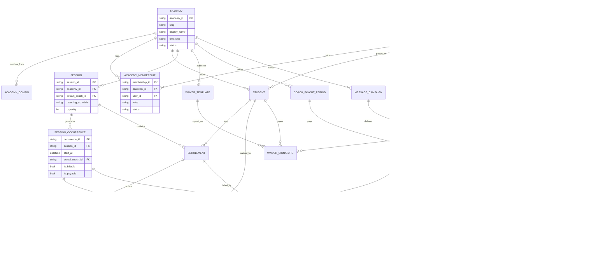

# Unified SaaS Data Architecture Report

Date: 2026-05-21

Scope:

- Current academy-manager data model and v2 tenancy architecture.
- Whether the product can become a SaaS product where each academy is a tenant.
- Required data model changes before scaling beyond one academy.

Current data-model readiness: **64/100 — C+**

Target after fixes: **85/100 — B+/A-**

Current report quality after review: **90/100**

SaaS architecture direction after v2-only decision: **91/100**

Coder readiness before added gates: **84/100**

Expected coder readiness after bootstrap, test, audit, idempotency, and governance additions: **92/100**

Related documents:

- `docs/requirements/2026-05-21-admin-product-validation-report.md`
- `docs/requirements/2026-05-21-prioritized-roadmap.md`
- `docs/adr/0006-tenant-ready-single-tenant-shipped.md`
- `docs/data-ownership.md`

## Executive Summary

The current data model is **tenant-aware, not SaaS-complete**.

That is an important distinction. v2 made a good architectural move by adding `academy_id`, `TenantScopedRepository`, tenant indexes, and a request-scoped tenant context. This means the codebase is not starting from zero. The tenant boundary exists in many of the right places, and the foundation is not broken.

But the product should **not onboard a second academy onto the same shared backend yet**. Not safely. The current model is still transitional.

Two product decisions reduce migration risk significantly:

1. There is no production data yet.
2. Legacy `/api/*` routes will not be used for SaaS.

That changes the architecture stance from "migrate carefully" to "build clean." Do not migrate old data. Do not support legacy paths. Make SaaS v2-only from the start.

However, turning this into a real SaaS product still requires data model work. The biggest missing pieces are:

1. A real academy membership model.
2. Tenant resolution that does not rely on one `academy_id` per user or `default_academy_id`.
3. A recurring-session versus actual-session-occurrence model.
4. Enrollment lifecycle events for pause, move, withdrawal, waitlist, credits, and billing impact.
5. A billing ledger that supports invoices, manual payments, partial payments, overpayments, credits, Stripe events, and PDF generation.
6. Coach payout records based on actual attended/coached occurrences, not assigned sessions.
7. Strict v2-only SaaS route enforcement.

Verdict:

> The current model is a solid single-tenant-to-tenant-aware transition model. It is not yet the final SaaS model.

Updated architecture decision:

- The SaaS product is v2-only.
- Legacy `/api/*` routes are not part of SaaS mode.
- Legacy routes are not exposed to new tenants.
- Legacy routes do not support new workflows.
- Legacy routes are not patched for SaaS readiness.
- Any exception requires architecture approval.
- All SaaS traffic uses v2 routes, request-scoped tenant context, `TenantScopedRepository`, `academy_memberships`, explicit tenant resolution, and tenant isolation tests.

## Current Strengths

### 1. v2 Has A Tenant Boundary

`backend/v2/shared/tenancy/repository.py` injects `academy_id` into repository reads, writes, updates, deletes, and inserts.

That is the right basic shape for shared-database multi-tenancy.

Good:

- Tenant context exists.
- Missing tenant context raises.
- Most v2 indexes lead with `academy_id`.
- Many v2 repositories extend the tenant-scoped base repository.
- ADR-0006 explicitly documents the tenant-ready strategy.

Risk:

- Some composition and read-helper code still uses `settings.default_academy_id` directly.
- Some raw Mongo reads in BFF composition bypass the repository abstraction.
- Legacy `/api/*` routes are not tenant-safe and must not be part of SaaS mode.

### 2. Domain Ownership Is Documented

`docs/data-ownership.md` defines write ownership by context:

- Identity owns users.
- Enrollment owns sessions, students, enrollments, waitlist.
- Coaching owns attendance and coaching notes.
- Billing owns payments and subscriptions.
- Finance is currently inside Billing but marked for future promotion.
- Onboarding owns waiver/application flows.

This is a good foundation for DDD. The map should continue to be treated as authoritative.

### 3. Billing Has Useful Early Building Blocks

The billing model already has:

- Payments.
- Subscriptions.
- Calculation snapshots.
- Proration policy.
- Account credit ledger.
- Stripe idempotency/event handling patterns.

This is better than a simple CRUD payment table.

But it still needs to become a full ledger if admin billing is expected to be trustworthy.

### 4. Proration Concepts Already Exist

The code has `ClassOccurrence` and billing snapshots for first-month proration.

That means the product is already thinking in terms of class occurrences. The missing step is to promote occurrence from a billing helper concept into a durable operational model used by attendance, coach payout, cancellation, makeups, and billing.

## Two Hard SaaS Blockers

### Blocker 1: Identity Is Single-Tenant Shaped

Current shape:

```text
users.academy_id
users.roles
```

This breaks SaaS because role is not global. It is role-within-academy. A parent, coach, owner, or support user may need access to more than one academy with different roles.

Required model:

```text
users
academy_memberships
platform_roles
```

Grade: **D**

### Blocker 2: Legacy Routes Are Unsafe For Shared SaaS

Legacy `/api/*` routes are the biggest current data-leak risk because many raw Mongo reads and writes do not include `academy_id`.

Recommended decision:

```text
New SaaS tenants use v2 only.
Legacy routes stay single-tenant only.
Block legacy routes in SaaS mode.
```

Grade: **F for SaaS**

## Main Structural Gaps

| Gap | Current problem | Required fix | Priority |
| --- | --- | --- | --- |
| Identity | One user maps to one academy | Add memberships | P0 |
| Tenant resolution | Uses default academy | Resolve by domain/subdomain | P0 |
| Legacy routes | No tenant safety | Disable for SaaS | P0 |
| Attendance | Session-level uniqueness | Use occurrence-level attendance | P1 |
| Enrollment | Status without history | Add lifecycle events | P1 |
| Billing | Payments do too much | Add invoices and allocations | P2 |
| Coach payout | Assignment-based | Use coached occurrences | P3 |
| Waivers | Signature not durable enough | Add templates, signatures, artifacts | P4 |
| Messaging | Broadcast is ambiguous | Add campaigns and deliveries | P4 |
| Reporting | Reads raw domain data | Add read models | P4 |

## Current Weaknesses

### 1. Identity Is Not SaaS-Ready

Current shape:

- `users` includes `academy_id`.
- Auth resolves a user by email.
- The resulting claims contain one `academy_id`.
- Roles are attached directly to the user record.

This is enough for one academy. It breaks down for SaaS.

Examples:

- A parent may have children in two academies.
- A coach may work for multiple academies.
- One owner may manage multiple academy tenants.
- A platform support admin may need cross-tenant access.
- A user role is not global. It is role-within-academy.

Required change:

Split global identity from academy membership.

Recommended model:

```text
users
- user_id
- firebase_uid
- email
- normalized_email
- display_name
- phone
- global_status
- created_at
- updated_at

academy_memberships
- membership_id
- academy_id
- user_id
- roles
- status
- invited_by
- invited_at
- accepted_at
- created_at
- updated_at

platform_roles
- platform_role_id
- user_id
- role
- status
- granted_by
- granted_at
```

Indexes:

```text
users:
- unique(firebase_uid)
- unique(normalized_email)

academy_memberships:
- unique(academy_id, user_id)
- index(user_id, status)
- index(academy_id, roles, status)
```

Auth claims should become:

```text
user_id
academy_id
membership_id
roles_for_this_academy
platform_roles
```

The selected academy should come from tenant resolution plus membership validation, not from a single field on `users`.

### 2. Tenant Resolution Is Still Single-Tenant Shaped

Current shape:

- `V2_DEFAULT_ACADEMY_ID` exists.
- Admin, parent, and coach composition roots use `settings.default_academy_id`.
- ADR-0006 says this is acceptable while shipping one tenant.

For SaaS, tenant resolution must become explicit.

Recommended tenant resolution order:

1. Resolve academy from subdomain.
2. Resolve academy from custom domain.
3. Resolve academy from an explicit internal header only for approved internal jobs and platform-admin tools.
4. Validate authenticated user has active membership in that academy.
5. Set tenant context from the resolved academy.
6. Reject requests where membership is missing.

No request should infer tenant from user alone. `default_academy_id` must not appear in SaaS request paths.

Examples:

```text
courtmastr.example.com -> academy_id=courtmastr
abc-tennis.example.com -> academy_id=abc-tennis
customdomain.com -> academy_id=customdomain-owner
```

Recommended collections:

```text
academies
- academy_id
- slug
- display_name
- timezone
- contact_email
- contact_phone
- address
- status
- owner_user_id
- branding
- billing_policy
- feature_flags
- created_at
- updated_at

academy_domains
- domain
- academy_id
- type
- status
- verified_at
```

Indexes:

```text
academies:
- unique(slug)
- index(status)

academy_domains:
- unique(domain)
- index(academy_id, status)
```

### 3. Legacy Routes Are Not Safe For Shared SaaS

Legacy routers perform many raw Mongo queries without `academy_id`.

Examples include users, sessions, students, enrollments, payments, expenses, messages, dashboards, onboarding, and reports.

This is not a criticism of the legacy app. It was built as single-tenant. But the SaaS architecture decision is now strict:

> Legacy routes are not part of SaaS mode.

Required behavior:

- Legacy routes are disabled for SaaS tenants.
- No new frontend code calls legacy routes.
- No SaaS workflow depends on legacy behavior.
- No single-tenant legacy write path is allowed in SaaS mode.
- Any exception requires architecture approval.

Recommended:

Build SaaS v2-only. Do not retrofit legacy routes for SaaS readiness.

### 4. Session Model Needs Recurring Template And Occurrence Separation

Current shape:

- `sessions` mixes recurring class information and scheduled class information.
- Billing can derive `ClassOccurrence` from session date/time rules.
- Attendance is keyed by `academy_id`, `session_id`, `student_id`.

Problem:

That uniqueness allows only one attendance record per student per session, which is wrong for recurring sessions. A student attending the same Monday class every week needs one attendance record per occurrence.

It also blocks the coach payout rule:

- Assigned sessions do not create payout.
- Actual attended/coached sessions create payout.
- Substitute coaches must be paid for the occurrences they coached.

Required change:

Introduce durable session occurrences.

Recommended model:

```text
sessions
- session_id
- academy_id
- name
- program_id
- default_coach_id
- location_id
- capacity
- recurring_schedule
- status
- created_at
- updated_at

session_occurrences
- occurrence_id
- academy_id
- session_id
- start_at
- end_at
- status
- scheduled_coach_id
- actual_coach_id
- substitute_coach_id
- is_billable
- is_payable
- cancellation_reason
- created_at
- updated_at
```

Attendance should change to:

```text
attendance
- attendance_id
- academy_id
- occurrence_id
- session_id
- student_id
- marked_by
- status
- marked_at
- notes
```

Indexes:

```text
session_occurrences:
- unique(academy_id, session_id, start_at)
- index(academy_id, actual_coach_id, start_at)
- index(academy_id, status, start_at)

attendance:
- unique(academy_id, occurrence_id, student_id)
- index(academy_id, student_id, marked_at)
- index(academy_id, marked_by, marked_at)
```

### 5. Enrollment Needs A Lifecycle Event Model

Current shape:

- Enrollment has `active`, `paused`, `cancelled`, `withdrawn`.
- Some pause/move concepts exist in legacy.
- Admin asked for exact dates and billing impact.

Problem:

Status alone is not enough. The business needs a durable history:

- When was the student paused?
- Who paused them?
- Did pause release the seat?
- Did pause move them to waitlist?
- When did a move happen?
- What was prorated?
- Did withdrawal create credit, refund, both, or no adjustment?

Required model:

```text
enrollment_events
- event_id
- academy_id
- enrollment_id
- student_id
- from_session_id
- to_session_id
- event_type
- effective_at
- requested_at
- actor_user_id
- actor_role
- reason
- billing_policy
- billing_result
- credit_id
- refund_id
- created_at
```

Event types:

```text
ENROLLED
PAUSED
RESUMED
MOVED
WITHDRAWN
WAITLISTED
PROMOTED_FROM_WAITLIST
CANCELLED_BY_ADMIN
```

Business defaults from product decisions:

- Pause default: move student to waitlist and release the seat.
- Move: capture move date and prorate accordingly.
- Withdrawal: admin selects credit/refund outcome, default to credit.
- Overpayment: automatically becomes account credit for next month.

### 6. Billing Needs Ledger Semantics

Current shape:

- `payments` is doing too much.
- There are payment records, snapshots, Stripe identifiers, discounts, and manual mark-paid behavior.
- Account credits exist, which is good.

Problem:

Admin billing needs to answer:

- What was invoiced?
- What was paid?
- How was payment allocated?
- Was it Stripe, cash, check, Zelle, Venmo, bank transfer, or other?
- Was it partial?
- Was it overpaid?
- Did the overpayment become credit?
- Which invoice PDF/reminder was generated?
- Which enrollment event changed billing?

Recommended model:

```text
invoices
- invoice_id
- academy_id
- parent_id
- student_id
- enrollment_id
- period
- status
- subtotal_cents
- discount_cents
- total_cents
- balance_due_cents
- currency
- due_date
- pdf_artifact_id
- created_at
- updated_at

invoice_lines
- line_id
- academy_id
- invoice_id
- line_type
- description
- quantity
- unit_amount_cents
- amount_cents
- source_type
- source_id

payments
- payment_id
- academy_id
- parent_id
- amount_cents
- unapplied_amount_cents
- payment_method
- stripe_payment_intent_id
- status
- paid_at
- recorded_by
- notes

payment_allocations
- allocation_id
- academy_id
- payment_id
- invoice_id
- amount_cents
- created_at

account_credit_ledger
- credit_id
- academy_id
- parent_id
- student_id
- source_type
- source_id
- amount_cents
- remaining_amount_cents
- status
- expires_at
- created_at
```

This separates invoice truth from payment truth. It also supports partial payments and overpayments cleanly.

Invoice PDFs:

- Generate on request.
- Generate when sending a reminder email.
- Store generated artifact metadata, not just an invoice number.

### 7. Coach Payout Needs Its Own Finance Model

Current shape:

- Finance lives inside Billing as a subset.
- Payout is thin: coach, amount, period, paid_at.
- Legacy payout is closer to assigned session based logic.

Problem:

The business rule is occurrence based:

```text
gross_revenue = sum(session_student_count * session_fee)
net_after_rent = gross_revenue - total_rent - total_misc
coach_pool = net_after_rent * coach_pool_percent
revenue_share = coach_pool * coach_attended_sessions / total_attended_coach_sessions

if total_attended_coach_sessions == 0:
    revenue_share = 0

base_payout = max(session_floor * coach_attended_sessions, revenue_share)
```

Required model:

```text
coach_payout_periods
- payout_period_id
- academy_id
- period
- gross_revenue_cents
- rent_cents
- misc_expense_cents
- coach_pool_percent
- coach_pool_cents
- total_attended_coach_sessions
- status
- calculated_at
- approved_at
- paid_at

coach_payouts
- payout_id
- academy_id
- payout_period_id
- coach_id
- attended_session_count
- session_floor_cents
- revenue_share_cents
- base_payout_cents
- final_payout_cents
- status
- approved_by
- paid_at

coach_payout_occurrences
- academy_id
- payout_id
- occurrence_id
- coach_id
- role
- payable
- reason
```

Finance should likely become its own bounded context once this work starts.

### 8. Waivers Need Template, Signature, And Artifact Separation

Current shape:

- Waiver template text exists.
- Application has waiver acceptance with version/hash.
- Admin sees signed/not signed.

Problem:

Admin needs to know:

- What exact waiver did this student sign?
- Can it be shared later?
- Can multiple waivers apply to one student?
- Does the waiver expire?
- What if the template changes?

Recommended model:

```text
waiver_templates
- waiver_template_id
- academy_id
- name
- version
- content_hash
- body
- effective_from
- expires_at
- status

waiver_signatures
- waiver_signature_id
- academy_id
- waiver_template_id
- student_id
- parent_user_id
- signed_at
- signer_name
- signer_email
- ip_address
- user_agent
- artifact_id
- expires_at
```

Waivers should be per student, based on the product decision.

### 9. Messaging Needs Audience And Delivery Records

Current shape:

- Message can be direct or announcement.
- Announcement has `recipient_id = None`.

Problem:

Broadcast is ambiguous. Admin needs targeting:

- Whole academy.
- Specific session.
- Parents in a session.
- Coaches.
- Selected people.
- Payment-risk families.

Recommended model:

```text
message_campaigns
- campaign_id
- academy_id
- sender_id
- channel
- audience_type
- audience_filter
- subject
- body
- status
- created_at
- sent_at

message_deliveries
- delivery_id
- academy_id
- campaign_id
- recipient_user_id
- recipient_email
- status
- provider_message_id
- sent_at
- opened_at
- failed_reason
```

Direct message UX should search users by name/email. Admins should never need to type a user ID.

## SaaS Target Bounded Contexts

Recommended target contexts:

| Context | Owns |
| --- | --- |
| Platform | SaaS plans, platform subscriptions, tenant lifecycle, tenant domains |
| Identity and Access | Users, academy memberships, roles, invites, impersonation |
| Academy Settings | Academy profile, branding, timezone, billing defaults, notification defaults |
| Enrollment | Students, sessions, session occurrences, enrollments, waitlist, lifecycle events |
| Coaching | Attendance, lesson plans, progress notes, coach occurrence participation |
| Billing | Invoices, invoice lines, payments, payment allocations, credits, Stripe parent tuition integration |
| Finance | Expenses, rent/misc categorization, coach payout periods, coach payouts |
| Waivers | Waiver templates, signatures, artifacts |
| Communications | Campaigns, deliveries, direct messages, reminder templates |
| Reporting | Read models and dashboards built from domain-owned facts |

## Target SaaS Data Model Picture



## Readiness Scorecard

| Area | Grade | Score | Comment |
| --- | ---: | ---: | --- |
| v2 tenant scoping | B | 80 | Good repository pattern and indexes. |
| DDD ownership | B+ | 85 | Strong documentation in `docs/data-ownership.md`. |
| SaaS identity | D | 45 | Needs memberships and platform roles. |
| Tenant resolution | C- | 55 | Too much `default_academy_id` usage for SaaS. |
| Legacy safety | F | 20 | Must block or isolate for SaaS. |
| Session model | C- | 58 | Needs durable occurrences. |
| Attendance model | C- | 55 | Current uniqueness is wrong for recurring sessions. |
| Enrollment lifecycle | C | 62 | Needs event trail. |
| Billing model | B- | 72 | Good base with snapshots and credits. |
| Billing ledger | C | 60 | Needs invoice truth and payment allocations. |
| Coach payout | C- | 55 | Needs occurrence-based finance model. |
| Waivers | C | 62 | Needs artifacts and per-student signatures. |
| Messaging | C | 60 | Needs targeting and delivery tracking. |
| Reporting | C | 60 | Needs read models. |
| SaaS operations | D+ | 50 | Needs tenant lifecycle, plans, limits, export, and support audit. |

## Prioritized Data Model Roadmap

### Phase 0: SaaS Bootstrap And Guardrails

Goal:

Start clean with a v2-only SaaS tenant and prove the app cannot leak data across academies before any second tenant is created.

Tasks:

- Add SaaS bootstrap flow to create:
  - academy tenant
  - owner user
  - owner `academy_membership`
  - default academy settings
  - default billing policy
  - default waiver template
  - default roles
  - default feature flags
  - tenant indexes
- Audit all v2 repositories for `TenantScopedRepository`.
- Remove raw `default_academy_id` use from composition helpers where request claims can provide tenant.
- Block legacy routes in SaaS mode.
- Enforce no new frontend calls to legacy routes.
- Add tenant-isolation tests for every tenant-owned repository.
- Add a static check that flags raw Mongo access to tenant-owned collections outside infrastructure.
- Enforce no old single-tenant writes.

Exit criteria:

- No v2 tenant-owned read/write can run without tenant context.
- All tenant-owned v2 collections have `academy_id` indexes.
- Legacy routes are unavailable in SaaS mode.
- `default_academy_id` is not used in SaaS request paths.

### Phase 1: Identity And Tenant Membership

Goal:

Make one user able to belong to one or more academies.

Tasks:

- Add `academy_memberships`.
- Move tenant roles from `users` to memberships.
- Add tenant resolution by subdomain/domain/header.
- Validate membership before setting tenant context.
- Add academy switcher support for users with multiple memberships.
- Add platform admin role separately from academy roles.

Exit criteria:

- One email can belong to multiple academies with different roles.
- Auth claims contain selected academy membership, not a single hardcoded academy.

### Phase 2: Operational Domain Foundation

Goal:

Make admin-visible actions durable, auditable, and billable.

Tasks:

- Add `session_occurrences`.
- Change attendance uniqueness to `(academy_id, occurrence_id, student_id)`.
- Add `enrollment_events`.
- Add effective dates and billing results to pause, move, and withdrawal.
- Add per-session fee rules.
- Add waitlist release behavior for pause by default.

Exit criteria:

- Admin can answer when pause/move/withdrawal happened and what billing result it caused.
- Attendance and coach participation are occurrence-based.

### Phase 3: Billing Ledger

Goal:

Make parent billing trustworthy and explainable.

Tasks:

- Add invoices and invoice lines.
- Add payment allocations.
- Separate invoice balance from payment amount.
- Support manual payment amount entry.
- Convert overpayment to account credit automatically.
- Generate invoice PDFs on request or reminder email.
- Keep Stripe parent tuition integration tenant scoped.

Exit criteria:

- Partial payment, overpayment, discount, refund, credit, and reminder flows can be explained from ledger records.

### Phase 4: Finance And Coach Payout

Goal:

Pay coaches from actual attended/coached occurrences.

Tasks:

- Promote Finance out of Billing if payout logic grows as expected.
- Add payout periods.
- Add payout occurrence links.
- Implement coach payout formula.
- Add rent/misc expense categorization.
- Add approval and paid workflows.
- Add coach-facing payout view.

Exit criteria:

- Assigned sessions alone do not create payout.
- Actual coached occurrences drive payout.
- Substitute coaches are paid correctly.

### Phase 5: Waivers, Communications, And Reports

Goal:

Make compliance, messaging, and owner dashboards product-grade.

Tasks:

- Add waiver signatures per student.
- Add waiver artifacts.
- Add message campaigns and delivery records.
- Add targeted broadcast audiences.
- Build reporting read models for owner finance and daily operations.
- Move data exports to Settings/Data Export.

Exit criteria:

- Admin can inspect/share what each student signed.
- Admin can target reminders/messages without IDs.
- Reports are visible dashboards first, exports second.

### Phase 6: SaaS Platform Operations

Goal:

Operate the product as a SaaS business.

Tasks:

- Academy onboarding workflow.
- Tenant plan and limits.
- Platform subscription billing.
- Tenant suspension/cancellation.
- Tenant data export.
- Tenant-level observability.
- Platform support impersonation with audit.

Exit criteria:

- A new academy can be created, configured, billed, operated, suspended, exported, and supported without code changes.

## SaaS Bootstrap Plan

Because there is no production data, do not design a heavy migration path. Start with a clean SaaS bootstrap.

Bootstrap must create:

- Academy tenant.
- Owner user.
- Owner `academy_membership`.
- Default academy settings.
- Default billing policy.
- Default waiver template.
- Default roles.
- Default feature flags.
- Tenant indexes.

Bootstrap must enforce:

- No old single-tenant writes.
- No legacy SaaS route usage.
- No `default_academy_id` in SaaS request paths.

Reduced or removed migration concerns:

- No production backfill planning.
- No historical payment conversion.
- No attendance remapping.
- No live rollback strategy for customer data.
- No customer data reconciliation.

## Required SaaS Tests

Tenant isolation tests are not optional. They are SaaS launch blockers.

Required tests:

- Cross-tenant read rejection.
- Cross-tenant write rejection.
- Missing tenant context rejection.
- Invalid membership rejection.
- Domain and subdomain resolution tests.
- Role-per-academy tests.
- v2-only route enforcement tests.
- Session occurrence attendance tests.
- Billing ledger reconciliation tests.
- Coach payout calculation tests.
- Stripe webhook idempotency tests.

## Audit Logging

Audit logging must be first-class for SaaS operations.

Required audit fields:

```text
actor_user_id
actor_membership_id
academy_id
action
entity_type
entity_id
before_snapshot
after_snapshot
request_id
ip_address
created_at
```

Audit is required for:

- Billing changes.
- Payment changes.
- Enrollment changes.
- Coach payout approval.
- Waiver updates.
- Platform admin access.
- Support impersonation.

## Billing Idempotency

Billing must be retry-safe. Every ledger write must be safe to retry.

Add idempotency for:

- Invoice generation.
- Stripe webhook processing.
- Payment allocation.
- Overpayment credit creation.
- Refund recording.
- Reminder email generation.

## Data Governance

Even early SaaS needs data governance. This should be designed now without overbuilding it.

Add policies for:

- Tenant export.
- Tenant deletion.
- Soft delete.
- Retention period.
- PII handling.
- Student data deletion.
- Support access.

## Recommended Architecture Decision

Write a new ADR:

`ADR-0007: SaaS Tenant Model And Membership-Based Auth`

Proposed decision:

- Keep shared Mongo database for now.
- Keep `academy_id` on every tenant-owned collection.
- Convert `users` into global identity.
- Add `academy_memberships` as the source of academy roles and tenant access.
- Resolve tenant from domain/subdomain plus authenticated membership.
- Validate membership before setting tenant context.
- Keep platform billing separate from parent tuition billing.
- Keep SaaS v2-only.
- Do not expose legacy routes to SaaS tenants.
- Require architecture approval for any legacy exception.

## Minimum SaaS Launch Gate

Do not launch multi-tenant SaaS until these are true:

```text
1. V2-only route enforcement exists.
2. Membership auth is implemented.
3. Tenant resolution is explicit.
4. default_academy_id is removed from SaaS paths.
5. Session occurrences are durable.
6. Attendance is occurrence-based.
7. Enrollment events exist.
8. Billing ledger exists.
9. Coach payout is occurrence-based.
10. Tenant isolation tests pass for every tenant-owned repository.
11. Audit logging exists.
12. Billing idempotency exists.
```

## Bottom Line

Do **not** launch multi-tenant SaaS yet.

The current data model is good enough to proceed with v2-only SaaS implementation. It is not good enough to simply "turn on SaaS" or onboard a second academy onto shared infrastructure.

The right path is:

1. Preserve the v2 tenant-scoped repository pattern.
2. Add membership-based identity.
3. Promote session occurrence into a durable model.
4. Add enrollment lifecycle events.
5. Add billing ledger records.
6. Build coach payout on actual occurrences.
7. Lock legacy routes out of SaaS mode.
8. Add bootstrap, tests, audit, idempotency, and governance before launch.

This keeps the product pragmatic: no database-per-tenant complexity yet, but a real tenant boundary strong enough to sell to multiple academies.
