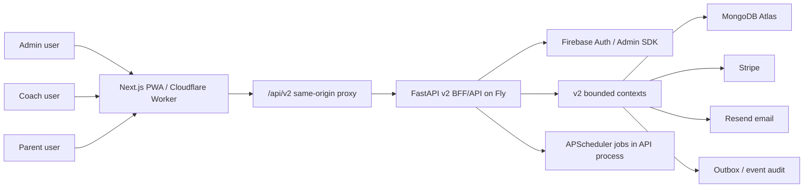
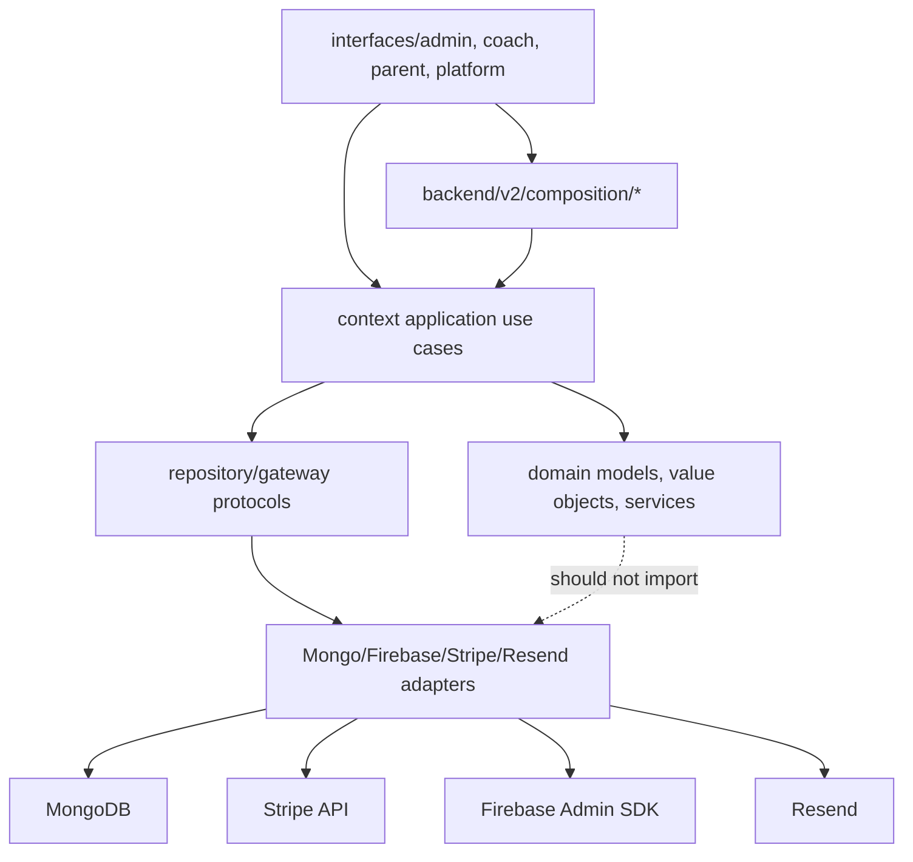
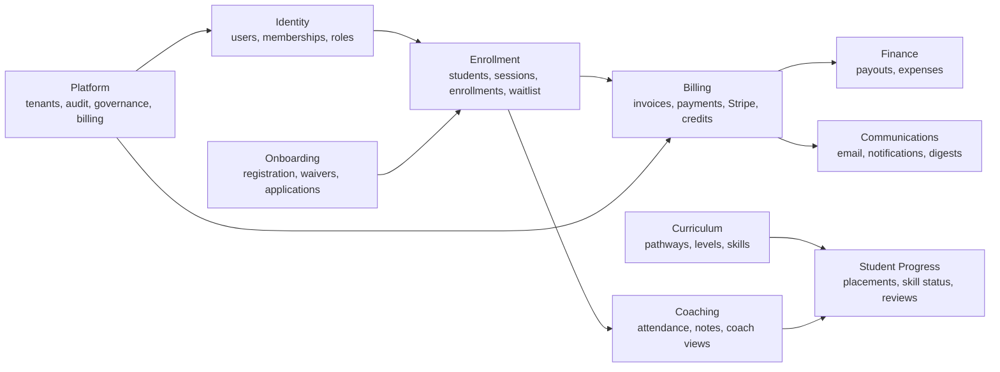

# Application Architecture & SaaS Readiness Review

Date: 2026-06-23

Scope: read-only review of the current repository as application, data, domain, SaaS, BFF/frontend, security/compliance, QA/testing, and product architecture. No application code was changed.

Evidence standard: major claims cite repository files or docs. Items marked as "architect opinion" are conclusions drawn from cited facts.

## 1. Executive Verdict

Facts:

- The app is a v2 FastAPI + Next.js application with Firebase Auth, MongoDB, Stripe, Resend, and in-process scheduled jobs. Evidence: `README.md:70`, `backend/v2/main.py:452`, `frontend/app/api/v2/[...path]/route.ts:13`, `backend/fly.toml:25`.
- Current Fly production config is single-academy, not SaaS mode. Evidence: `backend/fly.toml:17`, `backend/fly.toml:23`, `DEPLOYMENT.md:107`.
- SaaS readiness docs still show tenant routing, billing smoke, governance/export smoke, backup/restore, and full SaaS HTTP smoke as pending or partial. Evidence: `docs/requirements/2026-05-22-saas-production-readiness.md:48`.
- Security review found launch-blocking payment issues in parent-supplied Stripe redirect URLs and invoice checkout webhook validation. Evidence: `backend/v2/composition/parent.py:781`, `backend/v2/composition/parent.py:987`, `backend/v2/contexts/billing/application/use_cases/handle_webhook_event.py:356`.

Direct verdict:

- Ship now? **No, not without fixing the P0 payment/security items.**
- Launch single academy now? **Close, but fix P0s first, then run the standard launch/smoke gates.**
- Advertise as SaaS now? **No.**
- Sell to another academy now? **No, not until SaaS-mode smoke, tenant operations, onboarding, support/export, and production host/header controls are proven.**
- Main blockers: Stripe redirect allowlist, invoice checkout webhook validation order, payment failure visibility for balance checkout, public FastAPI docs/protection decision, SaaS prod-like smoke, tenant onboarding/support/export/offboarding operations, and transitional composition code that still uses raw Mongo or captured academy IDs.

| Area | Score / 10 | Verdict |
| --- | ---: | --- |
| Application Architecture | 7 | Strong v2 shape and boundaries; composition layer and in-process jobs are scale risks. |
| DDD Quality | 6 | Real DDD in billing/identity and useful boundaries elsewhere; several contexts remain transaction-script/anemic. |
| BFF Quality | 7 | Persona BFF shape is clean; contracts are hand-maintained and frontend guards are client UX only. |
| Data Architecture | 7 | Tenant scoping, indexes, validators, and migrations are strong; raw composition reads and billing duality remain. |
| SaaS Readiness | 5 | Foundations exist; production config, smoke, tenant ops, platform ops, and offboarding are not sales-ready. |
| Security | 6 | Good auth/tenant/Stripe controls, but P0 payment redirect/webhook gaps and host/header hardening remain. |
| Testing | 7 | Broad backend and E2E coverage; real Mongo, OpenAPI drift, skipped E2E, and advisory mypy reduce confidence. |
| Product Completeness | 6 | Good single-academy admin/coach/parent MVP; SaaS platform features are incomplete. |
| Documentation | 8 | Strong ADRs/plans/generated architecture docs; some deployment docs are stale against v2 migrations. |
| Operations | 5 | CI and deploy docs exist; full SaaS smoke, alerting, restore proof, and scheduler architecture need work. |

## 2. How The Application Is Built

Backend structure:

- Runtime entrypoint is `backend.v2.main:app`. Evidence: `backend/Dockerfile:14`, `backend/v2/main.py:452`.
- `backend/v2/main.py` acts as the composition root: it wires settings, Mongo, Firebase auth, tenancy, Stripe, email, outbox, schedulers, and persona routers. Evidence: `backend/v2/main.py:117`, `backend/v2/main.py:141`, `backend/v2/main.py:225`, `backend/v2/main.py:245`, `backend/v2/main.py:469`.
- Bounded contexts live under `backend/v2/contexts/`: `billing`, `coaching`, `communications`, `curriculum`, `enrollment`, `finance`, `identity`, `onboarding`, `platform`, and `student_progress`.
- Persona interfaces live under `backend/v2/interfaces/`: `admin`, `coach`, `parent`, `platform`, `me`, and `registration`.
- Import-linter contracts enforce domain/application/interface dependency rules. Evidence: `backend/pyproject.toml:56`.

Frontend structure:

- Frontend is the canonical Next.js 15 App Router app under `frontend/`. Evidence: `README.md:70`, `frontend/package.json:21`.
- App route groups include admin, coach, parent, and shared routes under `frontend/app/`.
- The frontend uses a same-origin `/api/v2/*` proxy to the FastAPI backend. Evidence: `frontend/app/api/v2/[...path]/route.ts:13`.
- API client code attaches Firebase bearer tokens and same-origin bridge headers. Evidence: `frontend/lib/api/client.ts:69`, `frontend/lib/api/proxy-headers.ts:16`.
- PWA/service worker support is present through Serwist. Evidence: `frontend/next.config.ts:6`, `frontend/app/sw.ts:34`.

API structure:

- Backend mounts v2 routers only in the v2 runtime. Evidence: `backend/v2/main.py:469`.
- Wrong-persona access intentionally returns 404 rather than 403. Evidence: `backend/v2/shared/http/persona.py:1`.
- Platform routes are conditional. Evidence: `backend/v2/main.py:473`, `backend/fly.toml:20`.

Data structure:

- MongoDB is a shared database with tenant-owned collections generally scoped by `academy_id`. Evidence: `backend/v2/shared/tenancy/repository.py:37`, `docs/architecture/application-data-model.md:79`.
- Versioned migrations live under `backend/v2/migrations/`, with a runner that records applied migrations in `v2_migrations`. Evidence: `backend/v2/migrations/runner.py:21`.
- Validators and indexes exist for billing, identity, attendance, enrollment, curriculum, platform, and outbox collections. Evidence: `backend/v2/migrations/0132_launch_indexes_and_validators.py:27`, `backend/v2/migrations/0133_broader_validators_and_outbox_retry_lock.py:31`.

Auth structure:

- Production auth is Firebase token verification plus membership-backed claims. Evidence: `DEPLOYMENT.md:151`, `backend/v2/contexts/identity/application/use_cases/load_auth_claims.py:49`.
- SaaS tenant is resolved before auth claims are loaded. Evidence: `backend/v2/shared/auth/middleware.py:92`.
- SaaS resolver order is subdomain, custom domain, approved internal header; it does not use `default_academy_id`. Evidence: `backend/v2/shared/tenancy/resolver.py:1`, `backend/v2/shared/tenancy/resolver.py:119`.

Billing structure:

- The billing architecture treats the app ledger as invoice truth and Stripe as collection. Evidence: `docs/adr/0012-ledger-invoice-as-source-of-truth.md:22`, `backend/v2/contexts/billing/domain/ledger.py:1`.
- Stripe webhook events are accepted, stored, claimed, hydrated, validated, dispatched, retried, or quarantined. Evidence: `backend/v2/contexts/billing/application/use_cases/handle_webhook_event.py:116`, `backend/v2/contexts/billing/infrastructure/mongo_stripe_dedup.py:107`.
- The Stripe adapter is isolated under billing infrastructure. Evidence: `backend/v2/contexts/billing/infrastructure/stripe_gateway.py:1`.

Deployment structure:

- Backend deploys to Fly.io app `courtmastr-academy-api`. Evidence: `DEPLOYMENT.md:186`, `backend/fly.toml:1`.
- Frontend deploys as Cloudflare Worker project `academy-next`. Evidence: `README.md:70`, `frontend/wrangler.jsonc:18`.
- Current Fly config is single-academy and runs migrations on boot. Evidence: `backend/fly.toml:17`, `backend/fly.toml:23`.

Test structure:

- Backend pytest is scoped to `backend/v2/tests`. Evidence: `backend/pyproject.toml:39`.
- CI runs dependency audit, compile, import-linter, v2 pytest, backend lint/format, frontend typecheck/lint/build, and Playwright. Evidence: `.github/workflows/production.yml:111`, `.github/workflows/production.yml:119`, `.github/workflows/production.yml:196`, `.github/workflows/production.yml:249`.
- Tenant isolation has backend static guards and frontend E2E request guards. Evidence: `backend/v2/tests/test_no_raw_tenant_mongo_access.py:1`, `frontend/e2e/fixtures/tenant-isolation.ts:1`.

## 3. Architecture Map

### System Context

### Backend Layering

### Main Domain Map

### Data Ownership Map

```mermaid
flowchart TB
  Identity["Identity"] --> Users["users"]
  Identity --> Memberships["academy_memberships"]
  Identity --> PlatformRoles["platform_roles"]
  Platform["Platform"] --> Academies["academies"]
  Platform --> Audit["platform_audit_events"]
  Platform --> Governance["tenant governance/export/offboarding collections"]
  Enrollment["Enrollment"] --> Students["students"]
  Enrollment --> Sessions["sessions/session_occurrences"]
  Enrollment --> Enrollments["enrollments/waitlist/enrollment_events"]
  Coaching["Coaching"] --> Attendance["attendance/coaching notes"]
  Curriculum["Curriculum"] --> Pathways["skill_pathways/levels/skills"]
  Progress["Student Progress"] --> SkillState["student_skill_status/tests/recommendations/certificates"]
  Billing["Billing"] --> Invoices["invoices/invoice_lines"]
  Billing --> LedgerPayments["ledger_payments/payment_allocations/payment_attempts"]
  Billing --> StripeState["stripe_webhook_events/subscriptions/customers"]
  Finance["Finance"] --> Payouts["payouts/payout audit/expenses"]
  Comms["Communications"] --> Notifications["notifications/email digests"]
  Shared["Shared Ops"] --> Outbox["outbox_events/event_audit/v2_migrations/idempotency"]
```

## 4. DDD Assessment

Architect opinion: this is **partial real DDD**, not folder-only DDD. Billing and identity are real DDD slices. Enrollment, coaching, and student progress are bounded and useful but still often use transaction-script application logic over anemic Pydantic records.

| Domain | Evidence | Strength | Weakness | Verdict |
| --- | --- | --- | --- | --- |
| Identity | `backend/v2/contexts/identity/domain/models.py:5`, `backend/v2/contexts/identity/application/use_cases/load_auth_claims.py:49` | Global user, membership, and platform role model supports SaaS direction. | Non-SaaS legacy adapter still exists in app composition. Evidence: `backend/v2/main.py:617`. | Strong foundation. |
| Billing | `backend/v2/contexts/billing/domain/ledger.py:21`, `backend/v2/contexts/billing/domain/ledger.py:107` | Explicit ledger entities, allocation rules, paid/partial states, idempotent payments. | Refund path still updates legacy `payments` only. Evidence: `backend/v2/contexts/billing/application/use_cases/handle_webhook_event.py:1042`. | Strongest DDD domain. |
| Enrollment | `backend/v2/contexts/enrollment/domain/models.py:19`, `backend/v2/contexts/enrollment/infrastructure/mongo_session_writer.py:81` | Clear ownership of sessions/students/enrollments and capacity behavior. | Capacity reservation lives in Mongo conditional update, not aggregate behavior. | Bounded, but transaction-script heavy. |
| Coaching / Attendance | `backend/v2/contexts/coaching/domain/models.py:19`, `backend/v2/contexts/coaching/application/use_cases/mark_attendance.py:94` | Good persona use cases and occurrence-aware attendance direction. | Attendance rules live mostly in use cases; offline write UI not fully wired. | Useful bounded context, domain still thin. |
| Curriculum | `backend/v2/contexts/curriculum/domain/models.py:22` | Owns pathway definitions separately from progress. | Mostly records with limited behavior. | Good ownership, modest domain depth. |
| Student Progress | `backend/v2/contexts/student_progress/domain/models.py:43`, `backend/v2/contexts/student_progress/domain/logic.py:6` | Skill status, recommendations, tests, certificates are separated from curriculum. | Rules are small pure functions and use-case orchestration, not rich aggregates. | Good boundary, partial DDD. |
| Platform | `backend/v2/interfaces/platform/governance_routes.py:20`, `backend/v2/contexts/platform/audit/application/use_cases.py:16` | Platform audit/governance concepts exist. | One route imports a domain model directly, conflicting with interface dependency intent. | Needs boundary cleanup before SaaS scale. |
| Finance | `backend/v2/contexts/billing/application/use_cases/finance.py:23`, `backend/v2/contexts/finance/infrastructure/mongo_payout_audit_log.py:1` | Payout audit exists and finance is emerging. | Mongo repositories live inside billing application use-case file. | Immature boundary. |

Aggregate quality:

- Billing invoice/payment/allocation behavior is the clearest aggregate-like model. Evidence: `backend/v2/contexts/billing/domain/ledger.py:107`.
- Enrollment and attendance rely more on persistence conditions and use-case checks than aggregate methods. Evidence: `backend/v2/contexts/enrollment/infrastructure/mongo_session_writer.py:81`, `backend/v2/contexts/coaching/application/use_cases/mark_attendance.py:94`.

Domain rule placement:

- Good: billing allocation, voiding, totals, and delivery state are in domain functions. Evidence: `backend/v2/contexts/billing/domain/ledger.py:189`, `backend/v2/contexts/billing/domain/ledger.py:248`.
- Weak: domain errors import shared HTTP-flavored error classes, and `shared/http/errors.py` imports FastAPI. Evidence: `backend/v2/shared/http/errors.py:5`, `backend/v2/contexts/enrollment/domain/errors.py:5`, `backend/v2/contexts/billing/domain/errors.py:5`.

Repository design:

- Good: `TenantScopedRepository` centralizes tenant filtering. Evidence: `backend/v2/shared/tenancy/repository.py:37`.
- Weak: static guard explicitly exempts transitional raw Mongo access in composition files. Evidence: `backend/v2/tests/test_no_raw_tenant_mongo_access.py:81`.

Use case design:

- Good: use cases orchestrate workflows and adapters, especially billing webhooks and identity claim loading. Evidence: `backend/v2/contexts/billing/application/use_cases/handle_webhook_event.py:116`, `backend/v2/contexts/identity/application/use_cases/load_auth_claims.py:49`.
- Weak: some infrastructure code imports application DTOs, coupling persistence to use-case shapes. Evidence: `backend/v2/contexts/enrollment/infrastructure/mongo_student_repo.py:11`, `backend/v2/contexts/billing/infrastructure/mongo_payment_repo.py:14`.

Infrastructure leakage:

- `billing/application/use_cases/finance.py` defines Mongo repositories in application code. Evidence: `backend/v2/contexts/billing/application/use_cases/finance.py:23`.
- Large composition modules perform direct Mongo reads. Evidence: `backend/v2/tests/test_no_raw_tenant_mongo_access.py:81`, `backend/v2/composition/parent.py:944`.

Tenant boundary quality:

- Strong in SaaS middleware/resolver/repository paths. Evidence: `backend/v2/shared/tenancy/resolver.py:1`, `backend/v2/shared/auth/middleware.py:92`, `backend/v2/shared/tenancy/repository.py:37`.
- Weaker in transitional composition code that captures or uses one `academy_id`. Evidence: `backend/v2/composition/parent.py:944`, `backend/v2/tests/test_no_raw_tenant_mongo_access.py:81`.

## 5. BFF / Frontend Assessment

Architect opinion: the BFF is directionally clean because it is persona-shaped and backend-enforced. Frontend flows are usable for a controlled single-academy launch, but not yet polished enough for broad SaaS sales.

| Flow | Status | Evidence | Gap | Priority |
| --- | --- | --- | --- | --- |
| Admin dashboard | Mostly ready | `frontend/app/(admin)/admin/page.tsx:71`, `backend/v2/interfaces/admin/router.py:29` | Broad composition layer and direct raw read models; contract types hand-maintained. | P1 |
| Admin billing/reconciliation | Strong but risky | `frontend/app/(admin)/admin/payments/page.tsx:330`, `backend/v2/composition/admin.py:1339` | Reads ledger plus legacy payments; operationally useful but not fully converged. | P0/P1 |
| Coach today | Good mobile-first MVP | `frontend/app/(coach)/coach/today/page.tsx:24`, `frontend/app/(coach)/coach/today/page.tsx:43` | Offline write queue exists but attendance UI disables offline writes. | P2 |
| Coach attendance/session detail | Partial | `frontend/app/(coach)/coach/sessions/[id]/page.tsx:94`, `frontend/app/(coach)/coach/sessions/[id]/page.tsx:200` | Network-only attendance writes; skipped offline tests. | P2 |
| Parent dashboard | Good MVP | `frontend/app/(parent)/parent/dashboard/page.tsx:47`, `frontend/app/(parent)/parent/dashboard/page.tsx:112` | Skill pathway preview depends on feature state and broad query fan-out. | P2 |
| Parent onboarding/checkout | Functional but P0 security gap | `backend/v2/composition/parent.py:886`, `backend/v2/composition/parent.py:917` | Parent-supplied Stripe redirect URLs are not visibly allowlisted. | P0 |
| Parent billing/autopay | Functional | `backend/v2/composition/parent.py:781`, `backend/v2/composition/parent.py:987` | Return URLs need server-side allowlist; failure recording gap for balance checkout. | P0 |
| Persona route guarding | Backend-safe, UX-only frontend | `frontend/lib/auth/use-persona-auth.ts:19`, `backend/v2/shared/http/persona.py:27` | No `frontend/middleware.ts`; client route guards are not the security boundary. | P2 |
| API contracts | Incomplete | `frontend/lib/api/README.md:7`, `frontend/lib/api/generated/.gitkeep:1`, `.github/workflows/production.yml:222` | Generated type snapshot missing; OpenAPI drift check skips. | P1 |
| Mobile/PWA | Partial | `frontend/next.config.ts:6`, `frontend/app/sw.ts:34`, `frontend/lib/query/persistence.ts:27` | Offline reads exist; offline writes and accessibility need follow-through. | P2 |
| Accessibility | Mixed | `frontend/app/(coach)/coach/today/page.tsx:43`, `frontend/app/(parent)/layout.tsx:111` | Alerts and retry states exist, but bottom nav and some errors lack semantics. | P2 |

API contract quality:

- Same-origin proxy is simple and useful. Evidence: `frontend/app/api/v2/[...path]/route.ts:13`.
- Proxy header logic forwards tenant/auth context and strips bridge headers before upstream response. Evidence: `frontend/lib/api/proxy-headers.ts:16`, `frontend/lib/api/proxy-headers.ts:44`.
- Contract generation is not complete. Evidence: `frontend/lib/api/generated/.gitkeep:1`, `.github/workflows/production.yml:222`.

Role-specific UX:

- Admin, coach, and parent layouts are separated and use persona auth hooks. Evidence: `frontend/app/(admin)/layout.tsx:36`, `frontend/app/(coach)/layout.tsx:19`, `frontend/app/(parent)/layout.tsx:16`.
- Backend remains the security boundary. Evidence: `backend/v2/shared/http/persona.py:27`.

## 6. Data Architecture Assessment

| Data Area | Status | Risk | Evidence | Recommendation |
| --- | --- | --- | --- | --- |
| Tenant scoping | Strong where repositories are used | Raw composition reads can drift | `backend/v2/shared/tenancy/repository.py:37`, `backend/v2/tests/test_no_raw_tenant_mongo_access.py:81` | Move composition read models behind tenant-scoped query services. |
| Tenant resolution | Good SaaS design | Host/header authenticity depends on deployment controls | `backend/v2/shared/tenancy/resolver.py:119`, `backend/v2/shared/tenancy/resolver.py:141` | Add trusted host/proxy enforcement and edge header stripping. |
| Identity data | Strong direction | Non-SaaS fallback must not leak into SaaS | `backend/v2/contexts/identity/application/use_cases/load_auth_claims.py:49`, `backend/v2/main.py:617` | Keep SaaS membership path mandatory in SaaS mode. |
| Billing ledger | Strong | Legacy `payments` projection still coexists | `backend/v2/migrations/0128_ledger_payments_storage.py:1`, `backend/v2/contexts/billing/application/use_cases/handle_webhook_event.py:926` | Finish ledger-only convergence and retirement plan. |
| Payment attempts | Partial | Balance checkout failures may not be visible | `backend/v2/contexts/billing/application/use_cases/handle_webhook_event.py:790`, `backend/v2/composition/parent.py:852` | Record attempts for both `invoice_id` and `invoice_ids`. |
| Refunds | Weak | Refunds update legacy payment only | `backend/v2/contexts/billing/application/use_cases/handle_webhook_event.py:1042` | Add ledger refund/credit projection path. |
| Indexes | Strong | Need real Mongo validation lane | `backend/v2/migrations/0091_billing_ledger_indexes.py:7`, `backend/v2/migrations/0132_launch_indexes_and_validators.py:27` | Add real Mongo integration tests for critical migrations. |
| Validators | Strong | Production rollout must handle validator failures carefully | `backend/v2/migrations/0132_launch_indexes_and_validators.py:27`, `backend/v2/migrations/0133_broader_validators_and_outbox_retry_lock.py:31` | Keep validator migrations reversible and preflighted. |
| Migrations | Good | Deployment doc stale | `backend/v2/migrations/runner.py:21`, `DEPLOYMENT.md:298` | Update deployment docs to match v2 versioned migrations. |
| Auditability | Mixed | Some audit emit failures are logged, not blocking | `backend/v2/contexts/platform/audit/application/use_cases.py:16`, `backend/v2/main.py:210` | Define which lifecycle changes must fail closed on audit failure. |
| Reporting | Partial | Dashboards read operational collections and legacy payments | `backend/v2/migrations/0104_reporting_snapshot_indexes.py:21`, `backend/v2/composition/admin.py:1339` | Build read models for SaaS operational reporting. |
| Backup/recovery | Partial | Managed production restore proof not complete | `DEPLOYMENT.md:280`, `docs/runbooks/blno-launch-ops-proof-2026-06-17.md:20` | Run and document a prod-like restore drill. |

Facts:

- The repository has a data ownership document and generated data architecture docs. Evidence: `docs/architecture/application-data-model.md:79`, `docs/architecture/generated/06-data-architecture.md:96`.
- Previous data architecture report called the model tenant-aware but not SaaS-complete. Evidence: `docs/requirements/2026-05-21-saas-data-model-architecture-assessment.md:32`, `docs/requirements/2026-05-21-saas-data-model-architecture-assessment.md:36`.

Architect opinion: data architecture is one of the better parts of the system, but SaaS-grade data safety requires removing the remaining raw composition exceptions and proving migrations/validators against real Mongo.

## 7. SaaS Readiness Assessment

| SaaS Capability | Current State | Needed For SaaS | Priority |
| --- | --- | --- | --- |
| Tenant onboarding | Bootstrap concepts exist | Self-serve or operator-safe tenant bootstrap with domain, owner, settings, billing policy | P1 |
| Tenant isolation | Strong backend primitives | Remove raw composition exceptions; prod-like cross-tenant smoke | P1 |
| Tenant settings | Exists in pieces | Admin UX and operational runbook for tenant lifecycle | P1 |
| Branding | Partial tenant/domain support | Tenant logo/theme/email sender/custom domain workflow | P2 |
| Plans/pricing | Platform billing context exists | Plan catalog, subscription lifecycle, trial conversion, support visibility | P1 |
| SaaS billing | Backend/platform billing partly verified | Full Stripe runbook, smoke, plan provisioning, dunning policy | P1 |
| Admin provisioning | Membership model exists | Invite/provisioning flow for academy owner and staff | P1 |
| Feature flags | Present in config/docs | Tenant-level feature gates and admin controls | P2 |
| Support tooling | Partial platform routes/audit | Cross-tenant support access, impersonation policy, audit, break-glass controls | P1 |
| Trial/demo mode | Not sales-ready | Seeded demo tenant, reset process, no real payment/email side effects | P1 |
| Data export | Governance path exists | Export artifact/storage runbook proof | P1 |
| Offboarding | Governance direction exists | Tenant deletion/suspension/offboarding workflow and retention policy | P1 |
| Observability | Partial | Alerts for failed webhooks, payment lag, dead letters, auth spikes, tenant status failures | P1 |
| Backup/recovery | Documented | Restore drill evidence and RPO/RTO ownership | P1 |
| White-label support | Domain resolver supports custom domains | Tenant domain onboarding, auth proxy setup, sender/domain verification | P2 |

Facts:

- SaaS mode is explicitly v2-only and must not use legacy `/api/*`. Evidence: `AGENTS.md`, `docs/plans/2026-05-21-saas-v2-parallel-execution-plan.md:5`, `docs/plans/2026-05-21-saas-v2-parallel-execution-plan.md:7`.
- Deployment docs state not to enable SaaS mode until readiness gates are clear. Evidence: `DEPLOYMENT.md:107`, `DEPLOYMENT.md:122`.
- Current production config is single-academy with platform routes disabled. Evidence: `backend/fly.toml:17`, `backend/fly.toml:20`.
- Readiness docs list TODO/partial gates for tenant routing, observability, backup/recovery, CI/smoke, and HTTP smoke. Evidence: `docs/requirements/2026-05-22-saas-production-readiness.md:52`, `docs/requirements/2026-05-22-saas-production-readiness.md:56`, `docs/requirements/2026-05-22-saas-production-readiness.md:58`, `docs/requirements/2026-05-22-saas-production-readiness.md:59`.

Architect opinion:

- This can support the current single academy after P0 fixes and standard verification.
- It cannot yet be advertised or sold as a general SaaS product.
- The next SaaS milestone should be one beta tenant in a prod-like SaaS environment, not public marketing.

## 8. Security Assessment

### Launch blockers

| Risk | Severity | Evidence | Fix |
| --- | --- | --- | --- |
| Parent-supplied Stripe redirect URLs can become open redirects | High | `backend/v2/composition/parent.py:781`, `backend/v2/composition/parent.py:987`, `backend/v2/interfaces/parent/views.py:88` | Derive success/cancel/return URLs server-side from approved tenant/frontend origins; reject external origins. |
| Invoice checkout webhook records ledger payment before full invoice validation | High | `backend/v2/contexts/billing/application/use_cases/handle_webhook_event.py:356`, `backend/v2/contexts/billing/domain/ledger.py:107` | Load invoice first; validate academy, parent, currency, and amount before `record_payment`; quarantine mismatches. |
| Balance checkout failures may not record admin-visible payment attempts | High | `backend/v2/contexts/billing/application/use_cases/handle_webhook_event.py:790`, `backend/v2/composition/parent.py:852` | Support `invoice_ids` metadata in failed payment handling and record attempts per affected invoice. |
| Public FastAPI docs/OpenAPI appear enabled by default | Medium | `backend/v2/main.py:452` | Disable or protect `/docs`, `/redoc`, and `/openapi.json` in production. |

### SaaS blockers

| Risk | Severity | Evidence | Fix |
| --- | --- | --- | --- |
| Internal tenant header accepts configured header value if enabled | High | `backend/v2/shared/tenancy/resolver.py:141`, `backend/v2/shared/config/settings.py:61`, `DEPLOYMENT.md:113` | Strip tenant headers at the edge by default; require service-authenticated internal callers. |
| Tenant resolution trusts `x-forwarded-host` without visible app-level trusted host enforcement | High | `backend/v2/main.py:576`, `frontend/lib/api/proxy-headers.ts:20` | Add TrustedHost/proxy validation and document Cloudflare/Fly host controls before wildcard tenants. |
| Composition captures runtime academy IDs in some workflows | Medium | `backend/v2/main.py:233`, `backend/v2/composition/parent.py:944`, `backend/v2/tests/test_no_raw_tenant_mongo_access.py:81` | Make SaaS composition request-scoped or move all tenant filters behind tenant context/query services. |
| JS-readable Firebase bridge cookie increases XSS blast radius | Medium | `frontend/lib/api/auth-bridge-cookie.ts:3`, `frontend/lib/api/client.ts:69` | Prefer HttpOnly server session cookie or remove cookie bridge where possible; add CSP. |

### Later hardening

| Risk | Severity | Evidence | Fix |
| --- | --- | --- | --- |
| Rate limiting is narrow and in-memory | Medium | `backend/v2/shared/http/rate_limit.py:15` | Add edge/distributed rate limits for auth, checkout, webhooks, and admin writes. |
| Frontend has no CSP in visible headers | Medium | `frontend/next.config.ts:28` | Add CSP with Firebase/Stripe/Cloudflare allowances and report-only rollout. |
| Audit emission can fail without blocking lifecycle state changes | Medium | `backend/v2/main.py:210` | Fail closed for platform lifecycle actions that require audit durability. |
| LocalStorage query persistence can retain sensitive coach data | Low/Medium | `frontend/lib/query/persistence.ts:27` | Keep persisted data low sensitivity or move to safer bounded persistence. |

Positive controls:

- Stripe webhook signature verification uses raw body and Stripe verifier. Evidence: `backend/v2/interfaces/parent/webhook_routes.py:16`, `backend/v2/contexts/billing/infrastructure/stripe_gateway.py:192`.
- Durable webhook dedupe, retry, and quarantine exist. Evidence: `backend/v2/contexts/billing/infrastructure/mongo_stripe_dedup.py:107`.
- CORS rejects wildcard origins with credentials. Evidence: `backend/v2/main.py:515`.
- Firebase token verification and email verification are enforced server-side. Evidence: `DEPLOYMENT.md:151`, `DEPLOYMENT.md:154`.

## 9. Testing Assessment

| Test Area | Current Coverage | Missing Coverage | Recommendation |
| --- | --- | --- | --- |
| Backend unit/application | Large v2 pytest suite | Some domains still thin | Keep focused use-case/domain tests for each new rule. |
| DDD/layering | Import-linter and structural tests | Platform direct import gap | Extend structural checks to cover platform routes and domain HTTP coupling. |
| Tenant isolation | Static raw Mongo guard, resolver tests, frontend E2E fixture | Transitional composition exceptions | Add tests that fail on new composition raw reads and shrink allowlist. |
| Billing ledger | Strong idempotency and ledger tests | Refund ledger projection, balance failure attempts | Add tests for refund ledger state and `invoice_ids` failures. |
| Stripe webhooks | Dedupe, retry, fixture replay, invalid signature smoke | More production-captured fixture replay | Add Stripe CLI captured payload fixtures. |
| Real Mongo behavior | Limited | Many tests use `mongomock-motor` | Add real Mongo/testcontainer lane for migrations, validators, indexes, transactions. |
| Frontend unit | Inconsistent | CI lacks full unit script | Add `pnpm test:unit` and run all API/auth unit tests in CI. |
| E2E | Mobile Chromium/WebKit in CI | Skipped offline/skill board specs | Unskip, fix, or delete stale skipped specs. |
| Contract drift | Intended OpenAPI check | Snapshot missing, check skips | Commit generated OpenAPI snapshot and fail drift. |
| Type checking | Frontend enforced; backend mypy advisory | Backend mypy continues on error | Make mypy blocking once duplicate module issue is fixed. |
| Smoke | Production smoke scripts exist | Full SaaS HTTP smoke blocked locally | Run prod-like SaaS smoke before beta tenant. |

Weak tests:

- Contract tests often use `mongomock-motor`, leaving real Mongo behavior under-tested. Evidence: `backend/v2/tests/contract/conftest.py:1`.
- CI OpenAPI drift check skips because `frontend/lib/api/openapi.snapshot.json` is absent. Evidence: `.github/workflows/production.yml:222`.
- Mypy is advisory in CI. Evidence: `.github/workflows/production.yml:163`.

Duplicate/unwanted tests:

- No clear unwanted test suite was found, but stale skipped E2E tests create false confidence. Evidence: `frontend/e2e/specs/skill-board.spec.ts:1`, `frontend/e2e/specs/coach-offline-writes.spec.ts:19`.

Critical missing tests:

- Payment redirect allowlist tests.
- Invoice checkout webhook validation-before-payment tests.
- Balance checkout failed payment attempt tests.
- Ledger refund projection tests.
- Real Mongo migration/index/validator tests.
- Trusted host/internal tenant header SaaS tests.

## 10. Feature Gap Assessment

### Admin

| Feature | Exists? | Quality | SaaS Need | Priority |
| --- | --- | --- | --- | --- |
| Admin dashboard | Yes | Good MVP | Tenant-specific ops dashboard | P1 |
| Student management | Yes | Good MVP | Multi-tenant safe and searchable | P1 |
| Class/session management | Yes | Good MVP | Occurrence lifecycle and reporting | P1 |
| Billing operations | Yes | Strong but complex | Ledger-only, reconciliation, failure visibility | P0/P1 |
| Support/recovery tools | Partial | Early | Platform support console with audit | P1 |

### Coach

| Feature | Exists? | Quality | SaaS Need | Priority |
| --- | --- | --- | --- | --- |
| Coach today | Yes | Good mobile MVP | Reliable across devices | P2 |
| Attendance | Yes | Functional | Offline-safe attendance | P2 |
| Teaching plan | Yes | Partial/good | Consistent skill pathway integration | P2 |
| Offline writes | Partial | Not wired into UI | Useful for gym environments | P2 |

### Parent

| Feature | Exists? | Quality | SaaS Need | Priority |
| --- | --- | --- | --- | --- |
| Parent portal | Yes | Good MVP | Tenant-branded polished flow | P2 |
| Student registration | Yes | Functional | Demo/sales polish and clear error states | P1 |
| Checkout | Yes | Security gap | Safe, tenant-origin redirects | P0 |
| Payment history | Yes | Functional | Ledger-only trust and refunds | P1 |
| Autopay | Yes | Functional | Strong failure/dunning visibility | P1 |

### Billing

| Feature | Exists? | Quality | SaaS Need | Priority |
| --- | --- | --- | --- | --- |
| Invoicing | Yes | Strong ledger foundation | Required | P0 |
| Payment collection | Yes | Strong Stripe integration | Required | P0 |
| Webhook replay/idempotency | Yes | Strong | Required | P0 |
| Refund handling | Partial | Legacy-focused | Ledger refund/credit correctness | P1 |
| Coach payout | Partial | Emerging | Needed for mature academy ops | P2 |

### Reporting

| Feature | Exists? | Quality | SaaS Need | Priority |
| --- | --- | --- | --- | --- |
| Admin revenue metrics | Yes | Useful but raw | Read-model backed SaaS reporting | P2 |
| Attendance reporting | Partial | Operational | Tenant dashboards | P2 |
| Skill progress reporting | Partial | Feature-flagged | Sales/demo value | P2 |
| Platform metrics | Partial | Early | Multi-tenant operations | P1 |

### Notifications

| Feature | Exists? | Quality | SaaS Need | Priority |
| --- | --- | --- | --- | --- |
| Email delivery | Yes | Config-gated | Tenant sender/domain policy | P1 |
| Dues/reminders | Partial | Needs smoke | Required for billing operations | P1 |
| SMS | No/hidden | Not applicable now | Can postpone | P3 |
| Coach digest | Yes | Scheduled | Needs scheduler reliability | P2 |

### Operations

| Feature | Exists? | Quality | SaaS Need | Priority |
| --- | --- | --- | --- | --- |
| CI | Yes | Good but gaps | Required | P1 |
| Smoke scripts | Yes | Good static, HTTP pending | Required | P1 |
| Backups | Documented | Restore proof incomplete | Required | P1 |
| Alerts | Partial docs | Not proven | Required | P1 |
| Scheduler | In process | Scale risk | Externalize or leader-lock | P1 |

### SaaS Platform

| Feature | Exists? | Quality | SaaS Need | Priority |
| --- | --- | --- | --- | --- |
| Tenant domains | Partial | Resolver exists | Full onboarding needed | P1 |
| Tenant lifecycle | Partial | Early governance | Required | P1 |
| Plans/pricing | Partial | Platform billing exists | Required before advertising | P1 |
| Trial/demo tenant | No clear production workflow | Weak | Needed for sales | P1 |
| Data export/offboarding | Partial | Governance path | Required | P1 |
| White-label | Partial | Domain support only | Useful for sales | P2 |

## 11. Documentation Assessment

| Document Area | Status | Gap | Recommendation |
| --- | --- | --- | --- |
| README | Good | High-level, not a runbook | Keep current; link launch status clearly. |
| Deployment docs | Mixed | Stale migration statement | Update `DEPLOYMENT.md:298` to reflect v2 migrations. |
| ADRs | Strong | Need continued enforcement | Keep ADRs authoritative for SaaS and billing. |
| Plans | Strong | Some plans reflect completed waves, others are historical | Add current status summary per plan. |
| Test docs | Strong process | Active ledgers can be noisy | Keep active ledgers task-scoped and close stale ones. |
| Architecture docs | Strong | Generated docs can drift | Regenerate after major architecture changes. |
| API docs | Weak | Generated frontend contracts missing | Generate and commit OpenAPI snapshot/types. |
| Runbooks | Partial | Restore and SaaS smoke proof incomplete | Add restore drill, Stripe recovery, tenant offboarding runbooks. |
| Security docs | Good matrix | Need app-level host/header hardening docs | Add trusted proxy/host and internal header policy. |

Evidence:

- Generated architecture docs exist and document current stack/style/gaps. Evidence: `docs/architecture/generated/README.md:1`.
- Deployment SaaS section explicitly gates SaaS mode. Evidence: `DEPLOYMENT.md:107`.
- Deployment doc still references old migration/index behavior. Evidence: `DEPLOYMENT.md:298`.
- SaaS readiness report tracks pending launch gates. Evidence: `docs/requirements/2026-05-22-saas-production-readiness.md:46`.

## 12. High Areas

1. Tenant-aware v2 foundation

- What is good: SaaS resolver, auth middleware, and tenant-scoped repository create a real shared-database tenant boundary.
- Why it matters: this is the hardest foundation for SaaS data safety.
- Evidence: `backend/v2/shared/tenancy/resolver.py:1`, `backend/v2/shared/auth/middleware.py:92`, `backend/v2/shared/tenancy/repository.py:37`.

2. Billing ledger and Stripe event pipeline

- What is good: ledger entities, idempotent allocations, webhook dedupe, retries, quarantine, and Stripe anti-corruption layer exist.
- Why it matters: payment correctness is critical for launch trust.
- Evidence: `backend/v2/contexts/billing/domain/ledger.py:107`, `backend/v2/contexts/billing/application/use_cases/handle_webhook_event.py:116`, `backend/v2/contexts/billing/infrastructure/mongo_stripe_dedup.py:107`, `backend/v2/contexts/billing/infrastructure/stripe_gateway.py:1`.

3. Architecture intent is documented and enforced

- What is good: clean-architecture-lite, DDD context boundaries, import-linter, and structural tests are present.
- Why it matters: the codebase can evolve incrementally without a rewrite.
- Evidence: `docs/adr/0005-clean-architecture-lite-monolith.md:16`, `backend/pyproject.toml:56`, `backend/v2/tests/structural/test_layering.py:27`.

4. Persona-shaped BFFs

- What is good: admin, coach, and parent APIs are separated by persona and route-level persona checks exist.
- Why it matters: BFFs are easier to secure and optimize around real workflows than generic CRUD.
- Evidence: `backend/v2/interfaces/admin/router.py:29`, `backend/v2/interfaces/coach/router.py:19`, `backend/v2/interfaces/parent/router.py:20`, `backend/v2/shared/http/persona.py:27`.

5. Testing breadth

- What is good: backend v2 tests, tenant static guards, billing idempotency tests, frontend Playwright, and CI are meaningful.
- Why it matters: the repo already has a test culture that can support incremental hardening.
- Evidence: `backend/v2/tests/contract/test_billing_idempotency.py:36`, `backend/v2/tests/test_no_raw_tenant_mongo_access.py:1`, `.github/workflows/production.yml:119`, `.github/workflows/production.yml:249`.

## 13. Low Areas

1. P0 payment/security issues remain

- What is weak: redirect URLs are accepted from parent flows, invoice checkout records payment before complete validation, and balance checkout failures may not be visible.
- Why it matters: money flows are launch-critical and user-trust-critical.
- Risk if ignored: open redirects, incorrect ledger records, invisible failed payment attempts.
- Evidence: `backend/v2/composition/parent.py:781`, `backend/v2/composition/parent.py:987`, `backend/v2/contexts/billing/application/use_cases/handle_webhook_event.py:356`, `backend/v2/contexts/billing/application/use_cases/handle_webhook_event.py:790`.

2. SaaS production mode is not proven

- What is weak: production config is single-academy; full SaaS HTTP smoke is pending or blocked in docs.
- Why it matters: a second academy needs proof that tenant routing, auth, billing, email, governance, and support flows work under SaaS settings.
- Risk if ignored: cross-tenant bugs, broken onboarding, failed billing, and unsupported customers.
- Evidence: `backend/fly.toml:17`, `docs/requirements/2026-05-22-saas-production-readiness.md:52`, `docs/requirements/2026-05-22-saas-production-readiness.md:77`.

3. Transitional composition files are too powerful

- What is weak: raw Mongo access exceptions exist in large composition modules.
- Why it matters: tenant isolation and domain ownership can erode there.
- Risk if ignored: subtle cross-tenant data leaks or inconsistent business rules.
- Evidence: `backend/v2/tests/test_no_raw_tenant_mongo_access.py:81`, `backend/v2/composition/parent.py:944`, `backend/v2/composition/admin.py:1339`.

4. Operations architecture is not yet SaaS-grade

- What is weak: scheduled jobs run inside API process; current Fly config has one minimum machine; restore/alerts are not fully proven.
- Why it matters: SaaS needs reliable background processing, recovery, and incident visibility.
- Risk if ignored: missed jobs on single instance failure or duplicate jobs after scaling.
- Evidence: `backend/v2/main.py:245`, `backend/v2/main.py:379`, `backend/fly.toml:28`, `docs/requirements/2026-05-22-saas-production-readiness.md:56`.

5. Frontend/API contracts are hand-maintained

- What is weak: generated API types/snapshots are missing or skipped.
- Why it matters: BFF/frontend drift becomes likely as workflows grow.
- Risk if ignored: broken UI flows despite backend tests.
- Evidence: `frontend/lib/api/generated/.gitkeep:1`, `frontend/lib/api/README.md:7`, `.github/workflows/production.yml:222`.

## 14. Priority Roadmap

### P0 - Must Fix Before Production Launch

| Priority | Item | Business Problem | Technical Change | Evidence |
| --- | --- | --- | --- | --- |
| P0 | Stripe redirect allowlist | Prevent open redirects and tenant-domain spoofing | Derive/validate success, cancel, return URLs server-side | `backend/v2/composition/parent.py:781`, `backend/v2/composition/parent.py:987` |
| P0 | Invoice checkout validation order | Prevent incorrect ledger payments | Validate invoice academy/parent/currency/amount before `record_payment` | `backend/v2/contexts/billing/application/use_cases/handle_webhook_event.py:356` |
| P0 | Balance checkout failure attempts | Admin must see unrecovered failures | Handle `invoice_ids` metadata in failed payment path | `backend/v2/contexts/billing/application/use_cases/handle_webhook_event.py:790`, `backend/v2/composition/parent.py:852` |
| P0 | Public API docs decision | Reduce production attack surface | Disable/protect FastAPI docs/OpenAPI in prod | `backend/v2/main.py:452` |
| P0 | Focused verification | Do not ship unverified money/auth fixes | Add/run targeted tests for the above plus normal pre-push checks | `scripts/dev/pre-push-checks.sh:1` |

### P1 - Must Fix Before SaaS Advertising

| Priority | Item | Business Problem | Technical Change | Evidence |
| --- | --- | --- | --- | --- |
| P1 | Full SaaS prod-like smoke | Prove second-tenant safety | Run `scripts/smoke/saas_readiness_smoke.sh` against SaaS-mode env | `DEPLOYMENT.md:133`, `docs/requirements/2026-05-22-saas-production-readiness.md:77` |
| P1 | Trusted host/internal tenant header controls | Prevent tenant spoofing | Add trusted host/proxy validation and edge stripping/service auth for internal tenant header | `backend/v2/shared/tenancy/resolver.py:141`, `backend/v2/main.py:576` |
| P1 | Shrink raw composition tenant exceptions | Prevent data leaks | Move admin/coach/parent composition reads behind tenant-scoped query services | `backend/v2/tests/test_no_raw_tenant_mongo_access.py:81` |
| P1 | Tenant onboarding/provisioning | Sell to another academy | Build operator-safe tenant bootstrap, owner invite, settings, domain setup | `docs/plans/2026-05-21-saas-v2-parallel-execution-plan.md:242` |
| P1 | Platform support/export/offboarding | Operate SaaS customers | Finish governance/export/support access and audit runbooks | `DEPLOYMENT.md:124`, `docs/requirements/2026-05-22-saas-production-readiness.md:254` |
| P1 | Stripe SaaS runbook/smoke | Avoid billing incidents | Prove test/live webhook, platform billing, dunning, replay, recovery | `docs/requirements/2026-05-22-saas-production-readiness.md:54` |
| P1 | Observability/alerts | Detect customer-impacting failures | Alerts for failed webhooks, payment lag, dead letters, auth spikes, tenant status | `docs/requirements/2026-05-22-saas-production-readiness.md:232` |
| P1 | Backup/restore proof | Customer data recovery | Run managed-backup restore drill and document RPO/RTO | `DEPLOYMENT.md:280`, `docs/runbooks/blno-launch-ops-proof-2026-06-17.md:20` |
| P1 | API contract generation | Reduce frontend/backend drift | Generate OpenAPI snapshot/types and make drift check active | `frontend/lib/api/generated/.gitkeep:1`, `.github/workflows/production.yml:222` |

### P2 - Needed For Strong SaaS Product

| Priority | Item | Business Problem | Technical Change | Evidence |
| --- | --- | --- | --- | --- |
| P2 | Ledger-only billing convergence | Improve financial trust | Retire legacy payment projections after reconciliation/backfill | `backend/v2/migrations/0128_ledger_payments_storage.py:1`, `backend/v2/contexts/billing/application/use_cases/handle_webhook_event.py:926` |
| P2 | Ledger refund handling | Correct customer balances | Add refund/credit domain and projection path | `backend/v2/contexts/billing/application/use_cases/handle_webhook_event.py:1042` |
| P2 | Offline coach writes | Improve gym reliability | Wire offline queue/sync into attendance UI or remove stale claims | `frontend/lib/offline/sync.ts:127`, `frontend/app/(coach)/coach/sessions/[id]/page.tsx:200` |
| P2 | Real Mongo test lane | Catch production DB behavior | Add real Mongo migration/index/validator tests | `backend/v2/tests/contract/conftest.py:1` |
| P2 | Accessibility pass | Improve professional readiness | Fix nav active states, alert semantics, pressed-state controls | `frontend/app/(parent)/layout.tsx:111`, `frontend/app/(coach)/coach/sessions/[id]/page.tsx:301` |
| P2 | Scheduler hardening | Scale beyond one machine | Externalize jobs or add distributed leader/claim semantics | `backend/v2/main.py:245`, `backend/fly.toml:28` |
| P2 | Tenant branding | Improve SaaS sales demos | Add logo/theme/custom sender/domain workflows | `backend/v2/shared/tenancy/resolver.py:119` |

### P3 - Nice To Have

| Priority | Item | Business Problem | Technical Change | Evidence |
| --- | --- | --- | --- | --- |
| P3 | CSP report-only rollout | Defense in depth | Add CSP with Firebase/Stripe allowances | `frontend/next.config.ts:28` |
| P3 | Marketing/demo automation | Easier sales | Seed resettable demo tenant with fake data/payments | `scripts/local_test_stack.sh` |
| P3 | Broader reporting read models | Faster dashboards | Build durable SaaS dashboard snapshots | `backend/v2/migrations/0104_reporting_snapshot_indexes.py:21` |
| P3 | SMS provider | Optional comms | Add provider/policy after email is stable | `docs/requirements/2026-05-22-saas-production-readiness.md:216` |

## 15. Final Recommendation

Is this industry standard?

- Architect opinion: **parts of it are above average for an early SaaS product**. The v2 tenant boundary, billing ledger direction, Stripe webhook pipeline, import-linter rules, and documentation discipline are stronger than many early-stage systems.
- It is not yet fully industry-standard SaaS operations because prod-like SaaS smoke, restore proof, alerts, platform support tooling, and scheduler separation are incomplete.

Is this SaaS-ready?

- **No, not for public advertising or broad sales.**
- It is SaaS-foundation-ready: the codebase has the right direction, but the operational and product surface is not complete.

Is this launch-ready?

- **Not today with the P0 payment/security findings open.**
- After P0 fixes and focused verification, the current single-academy launch looks realistic.

Can this be advertised?

- **Not yet as SaaS.**
- It can be positioned internally or privately as a controlled beta after SaaS-mode smoke and tenant onboarding/support/export controls are proven.

What should be done next?

1. Fix the P0 payment/security items.
2. Add focused tests for those fixes.
3. Run the normal pre-push/release checks.
4. Run a single-academy launch smoke.
5. Then create a separate SaaS beta readiness milestone focused on prod-like SaaS smoke, tenant onboarding, host/header hardening, support/export/offboarding, observability, and restore proof.

