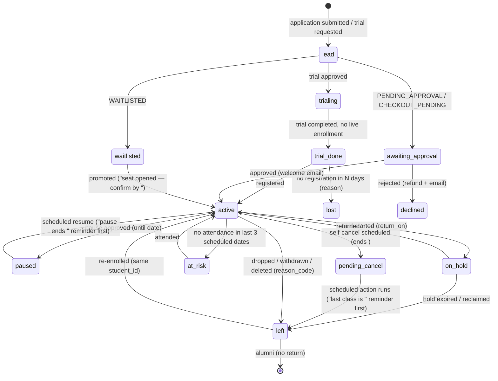

# Lifecycle, CRM and Communications Audit — academy-manager (BLNO)

Synthesis of the lifecycle, communications and industry audits, corrected by two independent critics. Every theme below was **confirmed or weakened (not refuted) by both critics**; critic corrections are applied and the recommendations are the *minimal* versions. Repo paths are relative to `/Users/ramc/Documents/Code/academy-manager`.

---

## 1. Executive summary

- **There is no lifecycle.** `students.status` is a free-text field whose only writer is the admin edit form (`backend/v2/contexts/enrollment/infrastructure/mongo_student_repo.py:536-537`); Drop, Stop-all, Pause, Hold and hold-expiry never touch it. `/admin/students` therefore shows ACTIVE for every child ever registered, the Paused tile counts nobody, parents see a dead status chip and paused enrollments are silently dropped from `/parent/children` (`frontend/lib/format/hold-copy.ts:28-35`), and coaches render none of the `enrollment_status` / `pending_cancellation_at` they already receive. Deriving one lifecycle from enrollments and rendering it on all three personas is the single most consequential change (T1).
- **Dropped is a dead end.** Terminal enrollments are excluded from every parent read (`backend/v2/composition/parent.py:1305-1311`); the family logs in to an empty child card with no "left <date>", no history and no way back (the register hero only renders when `children.length === 0`). Admin has a leaving report (#698) and per-student past enrollments (#674) but no Left tab, no Re-enroll action and a free-text drop reason (T2).
- **Money talks to nobody automatically.** Settings > Notify "Dues reminders" and "Attendance alerts" are persisted and read by nothing; the 13-job scheduler has no past-due reminder; only autopay charges get a receipt while Billing rules displays "Receipt after a successful charge: On" as fact; the owner is never told when autopay fails or dunning exhausts (T6).
- **Lifecycle comms are uneven and, since PR #767, duplicated.** Admin Drop now sends the parent two different emails ("Enrollment withdrawn" via `roster_notifications.py:286` and "<student> has been dropped" via `hold_notifications.py:154`). Waitlisted and declined registrations (which refund money) send nothing; the owner is not alerted when a registration arrives; session time/venue edits and coach changes are silent to families (T3).
- **A bounced parent is invoiced, dunned and dropped in silence.** `GatedEmailSendPort` blocks TRANSACTIONAL mail on hard bounce (correct) but the only suppression list/release route is platform-scoped with no frontend, and every sender swallows the failure with a log line (T4).
- **Eight approval queues, zero counts.** Admissions (3 tabs) and Requests (5 tabs) carry no pending counts; the dashboard surfaces only dues, pause requests and stuck jobs; the only "daily digest" goes to an engineering ops address, not the owner (T8).
- **Same human, four lists.** Students, Users?role=parent, Families and Parents are four people directories with three unrelated status fields; leads live in three disconnected stores. The owner cannot answer "who is a customer, who left, who is in the pipeline" (T5).
- **Coach app cannot say "am I done marking".** `today_routes.py` already returns per-student `attendance_status` but Today and the session header show only a student count; cancelled classes vanish; the calendar link is broken; a billing proration drawer sits on every court roster row (T9).

---

## 2. Per-persona "what the screen should be"

### Parent

| Screen | Leads with | Remove / merge | Backend needed |
|---|---|---|---|
| **Home** (`frontend/app/(parent)/parent/dashboard/page.tsx`) | Next class per child with lifecycle line ("Paused until Oct 3", "On hold until…", "Cancellation scheduled Oct 31", "Awaiting approval"); one money banner with three explicit states (Processing / Card declined on X — retry Y — **Update card** / Overdue since X — Pay now); last 3 family lifecycle events | Synthetic `RecentActivityCard` (6 extra fetches); RegistrationHero gating on `children.length === 0` | `get_parent_home children[]` carries derived lifecycle + date; balance carries dunning `attempt_no`, `next_retry_at`, `last_failure_reason`, processing bucket (#635) |
| **Children** (`parent/children/page.tsx`) | Per child: current classes (incl. paused rows) with state + date; **Past classes** (dates, outcome); "Enroll <child> in a class" on any child with no live enrollment; "Pause a class" on the enrollment row (hidden for paused/held) | `child.status` chip (students.status); `partitionByHold` dropping paused rows; Pause form on Payments; `/parent/attendance` and `/parent/calendar` fold in here | Parent enrollment read widened with `past=true` (ended_at, reason); frontend client for existing `POST /parent/billing-enrollments` or onboarding `StartApplication` with `student_id` |
| **Payments** (`parent/payments/page.tsx`) | You owe $X (same CHARGEABLE set as Home); Next charge per child (amount, date, •••last4, one action); Invoices with child + class + month; History (amount/date/status) | Stripe `in_`/`pi_` ids, raw `last_failure_code`, per-enrollment autopay console, unconditional Pause button, `currentBalance` computed from drafts | `ParentInvoice`/`ParentPayment` gain `student_name`, `session_title`, `next_charge_on`; failure codes mapped server-side |
| **Requests** (`parent/requests/page.tsx`) | Four types (Absence, Makeup, Pause, Trial), each row: child + class + date + status + next step; bottom-nav tab | Pause requests collapsible on Payments; raw `a.session_id`; "Existing child" label | `AbsenceNoticeView`/`MakeupRequestView` gain student_name, session_title, occurrence date; `TrialRequestView.student_name` |
| **Profile** | Login + one Notifications card (class-day digest, roster & class notices, academy news) | — | None: `GET/PUT /parent/email-preferences` exists (`backend/v2/interfaces/parent/email_preference_routes.py:41,58`); needs a frontend client |

### Coach

| Screen | Leads with | Remove / merge | Backend needed |
|---|---|---|---|
| **Today** (`frontend/app/(coach)/coach/today/page.tsx`) | Date strip; session cards with **n/N marked** + Needs-marks badge; chips "2 new", "1 absence notice", "covering for <coach>"; cancelled classes struck-through with reason; "Recent — not fully marked" (48h); one Plan link per session; This-week section below | `/coach/dashboard` (hardcoded-zero tiles, empty for a covering owner); `/coach/sessions` list; Home tab | `ListCoachOccurrencesForDate` includes cancelled (relax `mongo_occurrence_repo.py:71`, add status/reason to `CoachSession`); `list_for_coach_recent`; absence/new counts in `today_routes.py` |
| **Session roster** (`coach/sessions/[id]/page.tsx`) | Header "n/N marked"; per row at most one lifecycle chip: NEW / ON HOLD until <date> / ENDS <date> / MAKE-UP / TRIAL / ABSENCE NOTICE; expected-absence rows sorted last; Present / Absent / Late | Billing button + `billing-preview-drawer.tsx`; coach billing routes; `/skills` and `/progress` tabs fold into the teaching plan | `CoachRosterEntry` passes `hold_return_on` through and adds first-session flag; widen `enrollment_status` Literal to include `reclaim_pending` (latent #732-class failure) |
| **Week / Calendar** | Secondary view; links carry `occurrence_id` + `?date=` | — | None (`calendar/page.tsx:34` link fix) |
| **Inbox** | Admin DMs/broadcasts **and** staff alerts (roster change, absence notice, cancellation, coverage) for lead and assistant coaches; header badge | `AssistantCoachDeniedNotice` | Persist staff alerts as `Message` rows when `roster_notifications`/`absence_notifications` send; open inbox route to assistants (phase 2) |
| **Profile** | Pay card from `GET /coach/dashboard.expected_cut_cents` | Placeholder pay card | None |

### Admin / owner

| Screen | Leads with | Remove / merge | Backend needed |
|---|---|---|---|
| **Home** (`frontend/app/(admin)/admin/page.tsx`) | Count tiles, each a link to a filtered list: New enrollments (7d), Drops (7d, top reason), Approvals waiting (per queue), Payments failed / overdue, Waivers missing, Undeliverable emails; then the attention lane (de-duplicated); revenue below the fold | Two tiles linking to the same page | `GET /admin/inbox/counts`; weekly enrollment/drop counts from `enrollment_events`; suppression count |
| **Inbox** (merge `admin/registrations` + `admin/requests`) | Tabs with pending counts, default to first non-empty; "Family notified" state after Approve/Waitlist/Decline | Two separate pages; uncounted labels | `GET /admin/inbox/counts` (each list use case exists); fix #747 in the same pass |
| **People** (`admin/students/page.tsx` becomes the directory) | Tabs Active / On hold & Paused / At risk / Left / Never enrolled; row = student with parent inline, lifecycle since + reason, classes, dues, last attended, email-undeliverable chip; Left tab: left on, last class, reason, parent, **Re-enroll** | STATUS chip + `STATUS_FILTERS`; Status `<select>` on `StudentEditForm.tsx:194-204`; `/admin/parents`, `/admin/coaches`, `/admin/users/new`; Parents chip on `AdminUsersDirectory.tsx:26-32` | `list_admin_students` derives lifecycle **before** pagination and returns counts; `lifecycle=` replaces `status=`; delete `UpdateAdminStudentCommand.status`; Left tab built on `GetLeavingReport` (fix #744) |
| **Student detail** (`admin/students/[studentId]/page.tsx`) | Header with derived state; **Timeline** tab (application decisions, enrolled/moved/paused/held/returned/dropped/deleted, requests, "Notified <date>"); Sessions tab with Re-enroll on Past rows | Duplicate `EngagementPanel` (rendered at `:177`, defined `:430`); overwrite-in-place notes | `GET /admin/students/{id}/timeline?cursor=` with `list_for_student` + index `enrollment_events(academy_id, student_id, occurred_at desc)` |
| **Family** (`admin/families/[parentId]`) | Money setup for families with ≥1 live child (default); "Email undeliverable since <date> — <reason>" banner with Release / update email; Login & access card | Families as a nav entry under Money; departed families inflating "Missing a card" | `list_parents` classifies active/left from T1 lifecycle; `email_suppressed` + reason on family header read model; admin-scoped suppression list/release |
| **Sessions** (`admin/sessions/page.tsx`) | One row per session: Next date + time, Coach, Seats, health chips (n paused · n held · n ending · n overdue), **Last date attendance: Marked / NOT MARKED**, Waitlist n; window Upcoming / Past 30d / Cancelled | Per-row Edit and `confirm()`-guarded series Cancel; `first_per_template` collapse | `AdminSessionView` gains `next_occurrence_at`, `last_occurrence_attendance_marked`, lifecycle counts; `window=past|cancelled` |
| **Payments > Collections** | "Owed this month" + "Owed (all months)"; every owing row shows total open balance "+ $X from <month>"; `last_reminded_at` / attempts remaining | Duplicate Collections-risk aging on Month close | Parent set in `MongoCollectionsReadModel.build` widened to prior-period-open parents; tile totals include leftover |
| **Month close** (`admin/reports/page.tsx`) | Month tiles + Autopay run + Anything odd + one P&L with a single stated cash definition + close checklist (invoices sent, autopay run, past-due reminded, payroll paid, rent entered) | Collections-risk, Expenses, Payroll, Empty-states blocks; Payslips tab (deprecated model) | `month_close.checklist`; delete `GET /admin/finance/payouts` once no UI calls it |
| **Settings > Notify** | Real switches: overdue reminder cadence (due+3/+7/+14), receipt after every payment, Owner daily brief; Undeliverable addresses list | Dead "Dues reminders", "Attendance alerts"; misleading "Daily admin digest" (it only CCs admins on the coach digest, `main.py:1109`) | Past-due reminder job; receipt handler; owner brief job |

---

## 3. Lifecycle + CRM model

### Proposed person lifecycle (derived, never hand-edited)

Derivation rules (one place, `list_admin_students` enrollments pass, reused by parent and coach reads):

| State | Rule | Date shown | Source |
|---|---|---|---|
| `active` | any SEAT_HOLDING enrollment | — | `backend/v2/contexts/enrollment/domain/models.py:114-170` |
| `paused` / `on_hold` | newest live row is paused / held | `resume_on` / `hold_return_on` (parent read already exposes it at `parent.py:1341-1345`; coach view does not) | scheduled_actions, hold fields |
| `pending_cancel` | live row with `pending_cancellation_at` | ends date | #675 |
| `at_risk` (new) | active, no attendance in last 3 scheduled occurrences | last seen | `AdminStudentSummary.last_seen_at` / `attendance_rate` already exist (`mongo_student_repo.py:788-790`) |
| `left` | all rows terminal | newest terminal event `occurred_at` + `reason_code` | `enrollment_events` (fix #744: route writes `removed`, report counts `deleted`) |
| `never_enrolled` / lead states | no enrollment rows; state from applications / trial_requests / waitlist_entries | submitted at | onboarding + `trial_requests.py` |

### Holding area (CRM) for dropped people — minimal version

- **Left tab** on the People directory built on `GetLeavingReport` (`backend/v2/contexts/enrollment/application/use_cases/leaving_report.py`, already merged as #698) — not re-derived from `students.status`. Columns: Left on, Last class, Reason, Parent, Re-enroll.
- **Drop / Stop-all dialogs** capture `reason_code` from a fixed list (moved away, schedule conflict, cost, lost interest, injury/health, switched academy, other + text) stored on the lifecycle event. Replaces the free-text `WithdrawEnrollmentCommand.reason` (`admin_writes.py:1836-1843`).
- **Registration review** shows "Returning student — left <date>, <reason>". `approve()` already treats prior terminal rows as history and mints a new enrollment (`backend/v2/composition/admin_registration_review.py:299-306`); the reviewer is just never told.
- **Parent identity rule** (stated once so Users, invites and the parent shell agree): a parent with zero live enrollments is a *returning-customer login*, not an operational user. `users.status` stays untouched; the operational lists filter on child lifecycle instead.
- No win-back scheduler, follow-up dates or "We miss you" email in the minimal version (both critics: CRM automation a solo operator with 50-100 students does not need; he knows who left). Revisit after T1/T2 ship.

### Re-registration path

- **Parent:** "Enroll <child> in a class" on any child with no live enrollment. Two backends already exist: `POST /parent/billing-enrollments` (`backend/v2/interfaces/parent/enrollment_routes.py:28-60`, wraps `EnrollChildInSessionType`) and onboarding `StartApplication`. Caveat from the critics: the first takes a `session_type_id` (subscription billing model), the onboarding path enrolls into a `session_id` — pick one and expose a frontend client (`frontend/lib/api/parent.ts` has neither). Pre-bind `student_id` so the Child and Waiver steps are skipped.
- **Admin:** "Re-enroll" on Past rows of `admin/sessions/[id]/RosterPanel.tsx` and `admin/students/[studentId]/SessionsPanel.tsx` opens the existing Add-to-roster dialog pre-bound to the student.

### Duplicate-person risks

- Onboarding `ChildStep` (`frontend/app/(parent)/parent/onboarding/page.tsx:361`) is free text; `manage_application.py:243-253` binds the existing student only on exact `full_name + DOB` match and rejects with "already enrolled" only if that student has a live enrollment. **A non-matching name silently creates a second student.** Fix: "Which child?" picker before the free-text form.
- Candidate matching is scoped to `parent_id` (`mongo_student_repo.py:127-137`), so a spouse registering with a second email creates a second User and Student. `_assert_unambiguous_child` (`manage_application.py:238-243`) guards only within one parent. Minimal: flag probable duplicates (same normalized child name + DOB under different parents) on the People directory; defer the `MergeStudents` use case and `parent_id` alias backfill (`mongo_student_repo.py:664-670`).
- Prospective trial children exist only as name/DOB on `trial_requests` until registration; approve/complete never create a student. Minimal: a derived `trialing` / `trial_done, not registered` state on the same enum, not a pipeline.

---

## 4. Communications matrix

Legend: **YES** = wired and sends; **INERT** = code/toggle exists but nothing reads or fires it; **NO** = nothing.

| Event | Recipient | Channel | Exists today | Proposed |
|---|---|---|---|---|
| Registration received (public) | parent | email (verify) | YES `registration_routes.py:75` | keep |
| Registration received | **owner** | — | NO (`manage_application.py` has no notifier) | staff alert email + inbox count (T3) |
| Account welcome | parent | email | INERT — `on_welcome_email_requested` only logs (`event_handlers.py:268-275`) | wire the handler |
| Registration approved | parent / staff | email | YES (`admin_registration_review.py:418,422`) | keep; "Family notified" on queue row |
| Registration **waitlisted** | parent | — | NO (`:505-578`) | "You're on the waitlist — position, next step" |
| Registration **declined** (refund issued) | parent | — | NO (`:580-620`, refund at `:606`) | "We couldn't place <student> — refund issued" |
| Promoted from waitlist | parent | email | YES but wrong copy: routes through `ResumeEnrollment` (`promote_from_waitlist.py:48`) so family gets "resumed" | "A seat opened — confirm by <date>" |
| First class reminder | parent | — | NO (welcome email only; parent digest only if enabled) | phase 2 |
| Class date cancelled | parents / staff | email | YES (`roster_notifications.py:550`, #671) | keep; also inbox row for coach |
| Session time/venue edited | parents / coach | — | NO (`EditSession` `admin_writes.py:473-530` has no notifier) | "Schedule changed — old vs new" |
| Coach reassigned | parents / coach | — | NO (`composition/admin_session_staff.py`) | "New coach for <session>" |
| Pause requested | owner | email + dashboard | YES (#616/#767, ages and escalates `dashboard_routes.py:126-147`) | keep |
| Pause approved / declined / resumed | parent | email | YES | keep |
| Pause ends in N days | parent | — | NO (`main.py:1201` only mails on resume day) | phase 2 daily job |
| Hold started / reminder / reclaimed / returned | parent | email | YES (`hold_notifications.py:64-183`) | keep |
| Self-cancel scheduled → last class approaching | parent | — | NO (email fires only when the action runs) | "Your last class is <date> — changed your mind?" (retention touchpoint) |
| **Dropped / withdrawn** | parent | email ×2 | **DUPLICATE** since PR #767: `roster_notifications.py:286` "withdrawn" + `hold_notifications.py:154` "dropped" (`admin_writes.py:2063-2087`, wired `main.py:565`) | one notice; file as regression on #767 |
| Transfer / moved | staff only | email | family NOT told (`admin_writes.py:1466-1473`) | add `moved` to `_PARENT_STATUS_CHANGES` |
| Deleted from roster | parent | email | YES but leaving report undercounts (`sessions_routes.py:600` writes `removed`) | #744 |
| Absence recorded by parent | staff + parent | email | YES (`absence_notifications.py:208,257`) | also coach inbox row |
| Absence marked by coach | parent | — | NO | phase 2 |
| At-risk (not seen in 3 dates) | owner | — | NO | attention item + one-tap message |
| Level-up approved / certificate | parent | — | NO (`student_progress` has no notifier) | phase 2 |
| Invoice minted | parent | email | YES (`send_invoice.py:500`); autopay families get pre-charge notice | keep; #738 for manual-to-autopay |
| Invoice past due (non-autopay) | parent | email | MANUAL ONLY — "Send reminder" button (`dues_routes.py:27-35`); `dues_reminders` toggle INERT (`mongo_academy_repo.py:53-55`) | daily due+3/+7/+14 job, `last_reminded_at` on row |
| Invoice past due | owner | — | NO | attention item |
| Autopay failed / retry / exhausted | parent | email | YES (`process_dunning_retries.py`, dunning ladder `dunning.py`) | keep; add retry date + Update-card link |
| Autopay failed / exhausted | **owner** | — | NO | attention item with Record payment / Message |
| Payment received | parent | email receipt | autopay ONLY (`process_dunning_retries.py:303`); checkout / admin-recorded: NO; Billing rules shows "Receipt: On" as non-editable fact (`billing_rules.py:344-348`) | receipt on every `PaymentSucceeded` |
| Autopay enabled | parent | — | NO | confirmation with last4 + next charge date (last) |
| Payout approved / paid | coach | — | NO (`payout_period_routes.py:320-362`) | email with payslip link (last) |
| Admin broadcast / DM | parent | inbox only | `delivery_status` hard-coded `recorded` (`shared/comms/messages.py:288,331`) | fan out to email (NOTIFICATION), "Emailed to N" (#557) |
| Session announcement | parents | inbox; email only if urgent | by design (`session_announcements.py:200`) | keep design; persist `email_status` |
| Bounce / complaint | suppression | webhook | YES; blocks TRANSACTIONAL too; **no admin visibility** (`platform/suppression_routes.py:67`) | admin list + release; family/directory chip; `delivery_status='suppressed'` on invoices |
| Coach daily teaching plan | coach | email | YES if enabled | keep |
| Owner business brief | owner | — | NO — ops digest goes to `OPS_ALERT_EMAIL` (`digests.py:1041`); "Daily admin digest" = CC on coach digest | phase 2 owner brief |
| Parent notification preferences | parent | — | INERT — route exists, no page calls it | Profile card |

**Inert-but-built pieces:** `dues_reminders` / `attendance_alerts` toggles; `on_welcome_email_requested`; `charge_receipt` display row; `GET/PUT /parent/email-preferences`; `POST /parent/billing-enrollments`; `expected_cut_cents` on `GET /coach/dashboard`; `attendance_marked_count` / `attendance_last_marked_at` on `AdminSessionOccurrenceView`; `attendance_status` per row in `today_routes.py`; `enrollment_status` / `pending_cancellation_at` on `CoachRosterEntry`; `message_deliveries` rows never read back.

**Every new daily job proposed here inherits #751** (12 of 13 scheduler jobs have no Sentry Cron monitor) unless registered in `settings.sentry_cron_jobs`.

---

## 5. Ranked hard-hitters

Ordering: themes confirmed by both critics first (T1, T6, T8), then weakened themes in order of owner impact after trimming.

### 1. One derived lifecycle per person, rendered on every persona surface (T1) — confirmed ×2

- **Problem:** `students.status` has exactly one writer (`UpdateAdminStudentCommand.status` → `mongo_student_repo.py:536-537`); the directory filter compares `doc.get("status") or "active"` (`:712,722`) *before* pagination, and `SummaryCards` counts the loaded 25 rows (`students/page.tsx:99-125`). Parent: `partitionByHold` keeps only `active` + `held` so paused rows vanish; header chip prints `child.status` (`children/page.tsx:136-150`); `ParentHomeChildView` carries no status. Coach: `CoachRosterEntry` has `enrollment_status` / `pending_cancellation_at` but no `hold_return_on` (dropped at `today_routes.py`, not `GetSessionRoster`); zero renders in `frontend/app/(coach)` or `components/coach`; `RosterRow` (`coach/sessions/[id]/page.tsx:839-860`) shows only absence / make-up / trial / queued chips.
- **Recommendation (minimal):** compute lifecycle in one place and expose it on `AdminStudentSummary`, parent home `children[]`, children list and `CoachRosterEntry`. Directory defaults to active + on_hold + paused with backend counts; delete the Status select; Left/never-enrolled behind tabs. Parent renders state + date and includes paused rows. Coach: one chip per row (NEW / ON HOLD until X / ENDS X); regrouping into sections is polish — skip.
- **UI changes:** `admin/students/page.tsx` (`STATUS_FILTERS` L18-23, SummaryCards L99-125); `StudentEditForm.tsx` L21, L194-204; `parent/children/page.tsx` + `lib/format/hold-copy.ts`; `parent/dashboard/page.tsx` ChildCard; `coach/sessions/[id]/page.tsx` RosterRow.
- **Backend needed:** lifecycle derivation moved **before** the status filter/pagination in `list_admin_students` (`mongo_student_repo.py:772-830`), `lifecycle=` param + counts; delete `UpdateAdminStudentCommand.status` (`admin_directory.py:158`); `list_children_for_parent` / `get_parent_home` return derived value + `resume_on`; `CoachRosterEntry` (`coach/views.py:44-64`) passes `hold_return_on`, widens the `enrollment_status` Literal to include `reclaim_pending` (latent response-validation failure, same class as #732); add `at_risk` from existing `last_seen_at`.
- **Related issues:** #642, #651, #674, #694, #697, #699, #711, #714, #732, #735, #740 (closed ones fixed hold visibility but none retired `students.status`).
- **Impact / effort:** high / M.

### 2. Money lifecycle talks to nobody automatically (T6) — confirmed ×2

- **Problem:** dead toggles (`notify-panel.tsx:88,93`; read only by `get_academy_notifications_use_case.py:49-50`); no past-due job in the 13-job registry (`main.py:1201-1362`); reminders manual per family (`dues_routes.py:27-35`, `admin.py:4044`); receipts only in `process_dunning_retries._send_receipt` (`:303-323`) while `billing_rules.py:344-348` shows "Receipt: On" non-editable; no owner alert on dunning failure/exhaustion; `payout_period_routes.py:320-362` sends nothing. Parent `/parent/payments`: raw `last_failure_code` (`:135-136`), mono Stripe ids (`:863-867`), unconditional Pause button (`:688-706`), `currentBalance` from all non-void invoices (`:366`) vs Home's CHARGEABLE set (`parent.py:2471-2479`). Critic correction: `BalanceBanner` (`dashboard/page.tsx:227-262`) already branches on `payment_failed` — what is missing is decline date, retry date and an Update-card action, plus the #635 processing state.
- **Recommendation (sequenced):** (a) daily past-due reminder job at due+3/+7/+14 (academy tz, idempotent via `last_reminder_at` per invoice) reusing `DuesReminderEmailAdapter`; (b) owner attention item on autopay failure, dunning exhaustion and invoice past-due; (c) receipt on every `PaymentSucceeded`; (d) make the Notify toggles real (cadence + receipt) or delete them; (e) parent banner gains retry date / decline reason / Update card; `/parent/payments` restructured; last: autopay-enabled confirmation, coach payout email.
- **UI changes:** `notify-panel.tsx`; `payments/buckets/CollectionsTab.tsx` (`last_reminded_at`, attempts remaining); `admin/page.tsx` money attention items; `parent/dashboard/page.tsx` BalanceBanner; `parent/payments/page.tsx`; `parent/children/page.tsx` (Pause on enrollment row).
- **Backend needed:** `send_past_due_reminders` job (register in `sentry_cron_jobs`, #751); owner notifications into the admin inbox from `process_dunning_retries.py`; `PaymentSucceeded` receipt handler in `event_handlers.py:118` for non-autopay; parent balance exposes `attempt_no`, `next_retry_at`, `last_failure_reason`, processing bucket; `ParentInvoice` gains `student_name` + `session_title`.
- **Related issues:** #552 (late fees — out of scope), #557, #618, #635, #645, #659, #662, #686, #738, #751.
- **Impact / effort:** high / M.

### 3. Lifecycle notification gaps and the PR #767 double drop email (T3) — weakened → minimal

- **Problem:** verified end-to-end: `WithdrawEnrollment.execute` calls `_notify_roster_change(change="withdrawn")` (`admin_writes.py:2063-2069`; "withdrawn" ∈ `_PARENT_STATUS_CHANGES` `roster_notifications.py:286-288`) **and** `self._notifier.enrollment_dropped` (`:2071-2087`, added by #743/PR #767, attached at `main.py:565`). `waitlist()` and `reject()` send nothing (`admin_registration_review.py:505-620`); `on_welcome_email_requested` logs only; `EditSession` and `admin_session_staff.py` have no notifier; `SubmitApplication` has no staff alert. Waitlist promotion sends the "resumed" copy (`promote_from_waitlist.py:48`); scheduled cancellations get no pre-execution reminder.
- **Recommendation (minimal, four items):** (1) dedupe the drop pair — remove the parent copy from the roster "withdrawn" path or pass a flag so `enrollment_dropped` is the single family notice (**file as a regression on #767; no issue exists**); (2) email the family on declined (with refund note) and waitlisted (position, next step); (3) staff alert on registration submit; (4) "Schedule changed" on `EditSession`. Phase 2: coach changed, "seat opened — confirm by", "last class is <date>", pause-ending, level-up, first-class. Stamp `notification_sent_at` on the lifecycle event only once the Timeline (item 6) exists.
- **UI changes:** `components/admin/admissions/RegistrationsTab.tsx` "Family notified" state; `admin/waivers/page.tsx:285` inert "Blocks first session" copy → remind action (phase 2).
- **Backend needed:** two adapters over `EmailSendPort` (waitlisted, declined) reusing the `enrollment_welcome_email` shell and a `hold_notice_sends`-style claim; notifier port on onboarding submit and `EditSession`; wire `on_welcome_email_requested`; add `moved` to `_PARENT_STATUS_CHANGES`; #744 fix at `sessions_routes.py:600`.
- **Related issues:** #472, #537, #557, #673, #697, #743 (closed — introduced the duplicate), #744 (open), #751. #616 is merged; do not list pause-request silence as a gap.
- **Impact / effort:** high / S-M.

### 4. Dropped is a dead end: Left tab, structured reason, visible return path (T2) — weakened → minimal

- **Problem:** `parent.py:1305-1311` filters to active/paused/held; `RegistrationHero` only when `!hasChildren` (`dashboard/page.tsx:166,372-399`); `choosePrimaryAction` falls back to onboarding (`parent-home.ts:340-356`); `ChildStep` has no existing-child picker and a non-matching name silently creates a duplicate student; free-text reason (`admin_writes.py:1836-1842`, `stop_all_classes.py:42-52`); `RosterPanel.tsx:59-79` and `SessionsPanel.tsx:385` Past rows have no Re-enroll; `AdminRegistrationDetail` has no returning flag.
- **Recommendation (minimal):** Left tab on the People directory built on `GetLeavingReport` (#698) with Re-enroll opening the existing Add-to-roster dialog; `reason_code` enum on Drop / Stop-all; parent Children shows "Left <class> on <date>" + "Enroll in a class" with `student_id` pre-bound; one-line "Previously enrolled — left <date>" on registration review; "Which child?" picker in onboarding. **Drop** the win-back scheduler, follow-up dates and "We miss you" email.
- **UI changes:** `admin/students/page.tsx` Left tab; `RosterPanel.tsx` + `SessionsPanel.tsx` Past rows; Drop dialog (`departure-actions.logic.ts` consumers); `admin/registrations/[applicationId]/page.tsx`; `parent/children/page.tsx`; `parent/onboarding/page.tsx` ChildStep.
- **Backend needed:** parent enrollment read with `past=true` (ended_at, reason); frontend client for `POST /parent/billing-enrollments` **or** `StartApplication(student_id)` — resolve the `session_type_id` vs `session_id` mismatch first; `reason_code` on `WithdrawEnrollmentCommand` / `StopAllClassesCommand` stored on the event; returning flag on `AdminRegistrationDetail` via `past_enrollments`; #744 fix so Delete rows appear.
- **Related issues:** #651, #674, #698, #743, #744.
- **Impact / effort:** high / M.

### 5. Eight approval queues with no counts; no owner brief (T8) — confirmed ×2

- **Problem:** `registrations/page.tsx:12-16` and `requests/page.tsx:39-45` plain tab labels; `dashboard_routes.py:111-250` surfaces dues, pause requests, blocked resumes, failed actions only; leaving report linked only from `reports/page.tsx:67`; ops digest to `OPS_ALERT_EMAIL` (`digests.py:1041-1053`); `daily_digest_to_admin` = coach-digest CC (`main.py:1105-1112`).
- **Recommendation (minimal):** `GET /admin/inbox/counts`; counts on tab labels; one merged Inbox page defaulting to the first non-empty queue; admin home count tiles reuse the endpoint; fix #747 (Approve/Deny off-screen at 390px) in the same pass. Owner daily brief = phase 2 after item 3's registration alert. Keep "Record absence" where it is.
- **UI changes:** merge `admin/registrations/page.tsx` + `admin/requests/page.tsx`; `admin/page.tsx:60-100,121-237`; `notify-panel.tsx:98` (phase 2).
- **Backend needed:** counts endpoint (each list use case exists); `listAdminAttention` extended with pending approvals and departures-this-month (`GetLeavingReport`); weekly counts from `enrollment_events`.
- **Related issues:** #662, #744, #747, #748, #751.
- **Impact / effort:** high / S.

### 6. Undeliverable-email visibility + one student timeline (T4) — weakened → minimal

- **Problem:** family timeline comms lane records only invoice / autopay-notice / failure emails (`family_billing.py:457-470,552-563`); welcome, roster status, seat-opened, pause declined, cancellations persist no row; suppressions list/release only under `require_platform_operator` (`platform/suppression_routes.py:67-73`), no frontend reference; `send_invoice.py:490-510` logs suppression and continues; `FamilyHeader.tsx:40-52` shows only registration chip + invite; `/admin/audit-logs` prints raw ids (#468). Correction: `GatedEmailSendPort` lives at `backend/v2/contexts/communications/infrastructure/gated_send_port.py:33`; `digests.py:989-999` is the composition seam.
- **Recommendation (minimal):** (1) admin-scoped suppression list + release wrapping the existing platform use cases with tenant filter; "Email undeliverable since <date> — <reason>" chip on `FamilyHeader` and directory rows; `delivery_status='suppressed'` on invoices; (2) Timeline tab on the student page fed by `enrollment_events(student_id)`, reusing the family `TimelinePanel` renderer; (3) remove the `/admin/audit-logs` nav entry (`screen-meta.ts:63`) until it shows something meaningful. **Skip** the `outbound_messages` ledger, `person_notes` collection, Resend buttons and academy-wide Activity feed.
- **UI changes:** `families/[parentId]/FamilyHeader.tsx`; `admin/students/page.tsx` row chip; `admin/students/[studentId]/page.tsx` Timeline tab (replace `EngagementPanel` rendered at `:177`); `components/admin/settings/notify-panel.tsx` Undeliverable list.
- **Backend needed:** `GET /admin/communications/suppressions` + release; `email_suppressed` + reason on the family header read model; `GatedEmailSendPort` returns a distinguishable suppressed outcome; `GET /admin/students/{id}/timeline?cursor=` with `list_for_student` + index (also fixes the #748 503 pattern).
- **Related issues:** #468, #557, #659, #674, #692, #727, #748.
- **Impact / effort:** high / M.

### 7. Coach app: attendance completion state, cancelled classes, dead surfaces (T9) — weakened → minimal

- **Problem:** `get_day_hub` hardcodes `parent_message_count=0`, `absence_notice_count=0` and calls `list_today.execute(claims.user_id)` (`skill_routes.py:341-365`) so a covering owner sees nothing; `calendar/page.tsx:29-35` links omit `?date=`; `mongo_occurrence_repo.py:71` filters out cancelled; header shows "Attendance · N students" (`sessions/[id]/page.tsx:651`) though `today_routes.py:97-118` already hydrates per-student `attendance_status`; no "late"; Billing button on every row (`:957-972`); `messages_routes.py:28` denies assistants.
- **Recommendation (minimal):** "n/N marked" + Needs-marks badge on Today cards and the session header (**frontend-only for Today**); cancelled occurrences struck-through; fix the calendar link; delete `/coach/dashboard`; remove the Billing button + `billing-preview-drawer.tsx` and hide `billing_enrollment_routes.py` from the coach persona. Phase 2: staff alerts as inbox rows for assistants; skill-surface unification is its own project.
- **UI changes:** `coach/today/page.tsx:66-107`; `coach/sessions/[id]/page.tsx:645-676,957-972`; `coach/calendar/page.tsx:34`; `coach/layout.tsx:184-187` nav; delete `coach/dashboard/page.tsx`.
- **Backend needed:** `CoachSession` gains status + cancellation reason; relax the repo filter; `list_for_coach_recent` (48h unmarked).
- **Related issues:** #470, #554, #632, #645, #694, #745. No open issue covers the calendar `?date` bug or Home/Today duplication.
- **Impact / effort:** high / S-M.

### 8. One People directory; Users keeps staff only (T5) — weakened → minimal

- **Problem:** `/admin/parents` and `/admin/coaches` are redirects; `users/new` duplicates the dialog; `AdminUsersDirectory.tsx:26-32` Parents chip; `users/[userId]/page.tsx:85-104` no family link; `list_parents` (`admin.py:1863-1883`) walks every student with no status filter; Families under MONEY (`screen-meta.ts:63-67`); leads in three stores.
- **Recommendation (minimal):** `/admin/students` becomes the People directory with T1 tabs (no new `/admin/people` page, no Leads pipeline, no `follow_up_tasks`, no `MergeStudents`); delete the redirect pages and `users/new`; remove the Parents chip; Families defaults to families with ≥1 live child and shows login state on the header; family link on the parent user page. Leads stay in the counted Inbox (item 5). Flag probable duplicates only.
- **UI changes:** `AdminUsersDirectory.tsx:26-32,300-340`; delete `admin/parents/page.tsx`, `admin/coaches/page.tsx`, `admin/users/new/page.tsx` (update route manifest + the two route-count assertions); `admin/families/page.tsx` default filter; `users/[userId]/page.tsx`; `FamilyHeader.tsx`.
- **Backend needed:** `list_parents` classifies active/left from T1 lifecycle (data already flows through `ListAdminStudents`); duplicate-candidate query `(academy_id, full_name_key, date_of_birth)`.
- **Related issues:** #449, #537, #545, #611.
- **Impact / effort:** medium-high / M.

### 9. Broadcasts never reach email; paused families lose announcements (T10) — weakened → minimal

- **Problem:** `send_dm` / `send_broadcast` write Mongo only, `delivery_status="recorded"` (`shared/comms/messages.py:247-331`); `_visible_session_ids` filters `status: "active"` (`parent.py:2578-2586`); `AdminMessageView` has no recipient name (`admin/views.py:1402-1416`) so threads read "Direct conversation"; "Recipient picker unavailable" stub (`admin/messages/page.tsx:296-310`); no page calls email-preferences; request rows print raw `session_id` (`requests/page.tsx:344`); pause form lives on Payments (`:163-165`). Corrections: routine announcements are inbox-only **by design** (`session_announcements.py:200-204`); `/parent/requests` is already an allowed route (`layout.tsx:35`) — only the bottom tab is missing.
- **Recommendation (minimal):** fan out broadcast/DM to email via `EmailSendPort` + `MongoAudienceResolver`, persist counts, show "Emailed to N"; use LIVE statuses in `_visible_session_ids`; resolve recipient names; move the pause form to `/parent/requests` and add child + class to every row; Requests bottom tab; Notifications card on Profile (frontend-only). **Skip** the "system" message kind mirroring every lifecycle email; replace Home's `RecentActivityCard` with the last 3 `enrollment_events`.
- **UI changes:** `admin/messages/page.tsx:129-140,296`; `parent/requests/page.tsx`; `parent/payments/page.tsx` (remove pause form); `parent/layout.tsx:159-162`; `parent/profile/page.tsx:137`.
- **Backend needed:** `CommsService` email fan-out + counts on `Message`; `AdminMessageView.recipient_display_name`; `GET /admin/comms/recipients?q=`; `AbsenceNoticeView` / `MakeupRequestView` / `TrialRequestView` names.
- **Related issues:** #449, #451, #557, #616 (merged), #659.
- **Impact / effort:** medium-high / M.

### 10. "Who owes me" across months (T7) — weakened → minimal

- **Problem (corrected):** cross-period leftover **already exists** — `_leftover_by_parent` (`collections_read_model.py:424-447`) and rows show "N months owed" / "leftover $X" (`bucket-view.ts:274-276,305-308`). Residual gaps: (a) the parent set is seeded from this period's invoice parents + paused students (`:164-170`), so a family whose only open invoice is a prior month with no current invoice appears nowhere; (b) `_bucket_total` sums `balance_cents` only (`collections_buckets.py:429-434`), so tiles exclude leftover; (c) Month close aging is period-filtered (`admin_reports_read_model.py:554-590`) so 31-60/60+ are structurally near zero.
- **Recommendation (minimal):** widen the parent set to prior-period-open parents (one extra query; they land in `past_due`), include leftover in row total and the Owed tile, delete the duplicate Month-close aging block. No "Older balance" bucket.
- **UI changes:** `payments/buckets/CollectionsTab.tsx` (tile + row total); `admin/reports/page.tsx:540-600` remove.
- **Backend needed:** `MongoCollectionsReadModel.build` parent-set widening; `totals.owed_all_periods_cents`.
- **Related issues:** #552, #736.
- **Impact / effort:** high / S.

### 11. Sessions list: next date and "coach never marked <date>" (T11) — weakened → minimal

- **Problem:** `first_per_template=True` + `window='upcoming'` (`admin.py:2563-2597`) lose the next real date; `AdminSessionView` (`views.py:353-384`) has no attendance/lifecycle counts although `AdminSessionOccurrenceView:411-416` carries `attendance_marked_count` / `attendance_last_marked_at`; `ReplacementCoachTable` (`SessionEditing.tsx:104-111`) omits it; per-row `confirm('Cancel this session?')` (`sessions/page.tsx:156-172,238`). Attendance marks drive payroll (% of expected revenue) and absence handling.
- **Recommendation (minimal):** `next_occurrence_at` + `last_occurrence_attendance_marked` on the list view; Attendance column on `ReplacementCoachTable` (data already there); held/paused counts once T1 lands; remove series Cancel from list rows. Leave the detail-page card layout alone (#711 just shipped it).
- **UI changes:** `admin/sessions/page.tsx`; `admin/sessions/[id]/SessionEditing.tsx`.
- **Backend needed:** list-only fields on `AdminSessionView`; optional `window=past|cancelled`.
- **Related issues:** #471, #521, #697, #711, #748.
- **Impact / effort:** medium / S-M.

### 12. Payslips from a deprecated model; Month close is five pages (T12) — weakened → minimal

- **Problem:** `PayslipsPanel.tsx:17-40` → `listPayouts` → `GET /admin/finance/payouts`, annotated DEPRECATED "No UI surface should call this route" (`billing_routes.py:589-594`), derives payouts from every completed occurrence (`finance.py:210ff`) and takes `payouts.find(...)` per coach, so "Net Earnings" contradicts the Payroll tab one click away. `reports/page.tsx` (939 lines) renders 15 blocks incl. duplicate Collections-risk, Expenses and Payroll; rent renders `$0.00` when unentered (`:524`). `AllInvoicesTab` has global + per-row Sync Stripe and a webhook card duplicating Billing Health, and shows Amount due / Amount paid but no remaining Balance.
- **Recommendation (minimal):** remove `PayslipsPanel` + `/admin/coach-payslip` + the deprecated route; trim `/admin/reports` to month tiles + P&L with one stated cash definition + close checklist + links; add a Balance column to invoices. Skip redirect-file cleanup and the invoice-dialog Stripe section.
- **UI changes:** `admin/payouts/_components/PayslipsPanel.tsx` (delete); `admin/reports/page.tsx:480-760`; `admin/payments/AllInvoicesTab.tsx:383-392`.
- **Backend needed:** `month_close.checklist`; delete `GET /admin/finance/payouts` and `MongoPayoutRepository._derive_from_completed_occurrences`.
- **Related issues:** #526, #539, #543, #608, #618, #619, #689, #693, #725, #736, #737.
- **Impact / effort:** medium / S-M.

### Cross-cutting (from critic "missed" lists)

- **Owner-only guard drift:** Draft Void offered to every admin while the route is owner-only (#726), payout approve visible to admins, credit outcomes owner-gated in the Drop dialog (#742). One pass over assignable actions vs `require_owner` routes removes a class of "button does nothing" failures cheaper than any redesign.
- **#751:** register every new job (past-due reminders, owner brief) in `settings.sentry_cron_jobs` at creation time.

---

## 6. Industry benchmarks

- **Model lead → trial → active → paused → dropped/alumni in one list; keep aged-out families in an unbilled holding area.** Jackrabbit Lead File: https://help.jackrabbitclass.com/help/lead-file-overview ; Mindbody pipeline: https://www.mindbodyonline.com/business/lead-management
- **Drop always captures a date + reason from a fixed dropdown.** Jackrabbit drop/transfer: https://help.jackrabbitclass.com/help/drop-transfer-a-student
- **Pin actionable alerts on the class roster (failed payment, overdue, missing waiver, bounced email) and let staff resolve them there.** Pike13 Roster Alerts: https://help.pike13.com/hc/en-us/articles/360029549672-Roster-Alerts
- **Owner home leads with small count widgets that each open a worklist (enrollments/drops this week, trials pending, aged accounts).** Jackrabbit Executive Dashboard: https://help.jackrabbitclass.com/help/the-executive-dashboard ; iClassPro status widgets: https://support.iclasspro.com/hc/en-us/articles/34972434394391-What-Status-Widgets-Are-Available
- **Autopay declined → branded email to the guardian with the retry plan; soft-decline retry 1-2 days later, persistent banner until resolved.** iClassPro: https://support.iclasspro.com/hc/en-us/articles/115000544987-How-Do-I-Process-Payments-from-Stored-Payment-Information ; Pike13 unpaid invoices: https://learn.pike13.com/blog/feature-refresher-how-to-manage-unpaid-invoices-in-pike13
- **Confirm every request (absence, makeup) and every order immediately; send a class reminder 24h before or one Monday week-ahead email.** Sawyer auto-reminders: https://help.hisawyer.com/en/articles/11105598-activity-auto-reminder-emails ; Jackrabbit absences: https://help.jackrabbitclass.com/help/schedule-absences-parent-portal
- **Parent portal keeps a copy of every email sent to the family (6 months) and private messages in one place.** Jackrabbit parent portal: https://help.jackrabbitclass.com/help/jackrabbit-parent-portal-overview
- **Staff mobile app = today's schedule, attendance, roster indicators (trial/makeup/waitlist), nothing else.** iClassPro Staff Portal: https://apps.apple.com/us/app/iclasspro-staff-portal/id1476746632 ; Pike13 staff app: https://www.pike13.com/knowledge/pike13-staff-app
- **Parent home = upcoming events and what's new only.** TeamSnap: https://www.teamsnap.com/teams/parents
- **Periodic coach-written progress report emailed with certificates on level-up (retention lever).** iClassPro Student Evaluation Report: https://support.iclasspro.com/hc/en-us/articles/360053485893-What-is-the-Student-Evaluation-Report ; Uplifter report cards: https://www.uplifterinc.com/club-management-software

---

## 7. Open questions for the owner

1. **Drop reasons:** which fixed list do you want on the Drop / Stop-all dialogs (proposed: moved away, schedule conflict, cost, lost interest, injury/health, switched academy, other)? Win-back email is deferred — confirm you do not want it automated.
2. **Paused/held families:** should they keep receiving that class's announcements and the daily digest while their seat is kept (proposed yes), and should parents request a pause from Children (self-service) or is pausing admin-only?
3. **Money on the court screen:** remove billing from the coach roster entirely (proposed), or keep a single PAYMENT OVERDUE chip visible only to you when covering as coach?
4. **Overdue automation:** are you comfortable with automatic parent reminders at due+3/+7/+14 by email (WhatsApp stays manual), and should every payment — checkout and cash you record — send a receipt?
5. **Dead personas:** delete `/student/*` and the franchise `/owner` rollup (both flag-off in prod) rather than maintain them?
6. **Families page:** happy for it to become a money-setup sub-view listing only families with a live child, while a family that left but still owes stays on Collections?

---

## 8. Appendix — refuted, corrected or dropped items

| Item | Reason |
|---|---|
| "Prior-month balances leak only into the Paused bucket as an unlabeled leftover" (T7 original) | Wrong: `_leftover_by_parent` exists (`collections_read_model.py:424-447`) and rows show "N months owed"; only the parent set and tile totals are incomplete. |
| Separate "Older balance" Collections bucket | Unnecessary; widened parent set lands those families in `past_due`. |
| Win-back scheduler (`win_back_reminder`), `follow_up_on` dates, "We miss <student>" email, overdue win-backs on attention feed | Both critics: CRM automation the solo operator does not need at 50-100 students. |
| New `/admin/people` page with Leads kanban, `follow_up_tasks`, `MergeStudents`, `LinkTrialConversion`, `parent_id` alias backfill | Overbuilt; T1 tabs on `/admin/students` + counted Inbox cover it. Duplicate flagging kept. |
| `outbound_messages` ledger updated by provider webhooks, `person_notes` collection, Resend buttons, academy-wide Activity feed replacing audit logs | Three screens where one suffices; suppression visibility + student Timeline kept. |
| "system" MessageKind mirroring every lifecycle email into the inbox; parent Notifications card as a new ask | Doubles each notification into a second store; email fan-out of broadcasts is the real gap. Preferences card kept only because the route already exists. |
| "Routine session announcements stay inbox-only" as a gap | By design (`session_announcements.py:200-204`, urgent-only email). |
| "Parent has no Requests nav entry" as a new route | `/parent/requests` is already allowed (`layout.tsx:35`); only the bottom tab is missing. |
| "Pause request silent to owner" | Merged in #616/#767; dashboard ages and escalates it. |
| "Parent enroll-existing-child is only composed, not routed" | `POST /parent/billing-enrollments` is mounted (`enrollment_routes.py:28-60`); frontend client missing; session_type vs session mismatch must be resolved. |
| "Onboarding rejects with 'already enrolled' on any mismatch" | It rejects only when the matched student has a live enrollment; a non-matching name silently creates a duplicate — worse, and now stated correctly. |
| BalanceBanner "has no failed state" | It branches on `payment_failed`; missing pieces are retry date, reason, Update card, processing (#635). |
| Coach roster regrouping into Expected / Parked / Ends sections; full nav rewrite; staff alerts as inbox rows; skill-surface unification | Polish or separate project; one chip per row + n/N marked kept. |
| Session detail card collapse, tab reorder, single Edit button, moving announcements | Polish; #711 just shipped the current layout. |
| Invoice-dialog Stripe section, five redirect-page deletions, duplicate webhook card | Hygiene; not lifecycle/CRM/comms. |
| "Invoice list has no balance information" | It shows Amount due and Amount paid; an explicit remaining Balance column is the gap. |
| `students/[studentId]/page.tsx:330-360` cited as duplicate EngagementPanel | Off: that range is the SummaryMetric grid; EngagementPanel is defined at `:430`, rendered at `:177`. |
| `GatedEmailSendPort` "lives in digests.py:989" | Lives at `contexts/communications/infrastructure/gated_send_port.py:33`; `digests.py` is the composition seam. |
| Re-filing removed/deleted leaving-report mismatch, audit-log actor identity, enrollment-events 503, processing state, late fees, manual-invoice autopay notice | Already filed: #744, #468, #748, #635, #552, #738. |
| Retire `/owner`, `/student/*`, skill-board, flag-gated pathway overview; Settings nine tabs to four; parent attendance-four-ways; parent calendar; student-detail field duplication; coach needs-review raw ids; session-economics banner; waiver page duplicates; periodic report cards | Real but minor, absorbed by a ranked theme, or a new product capability — not a lifecycle/CRM/comms fix. |