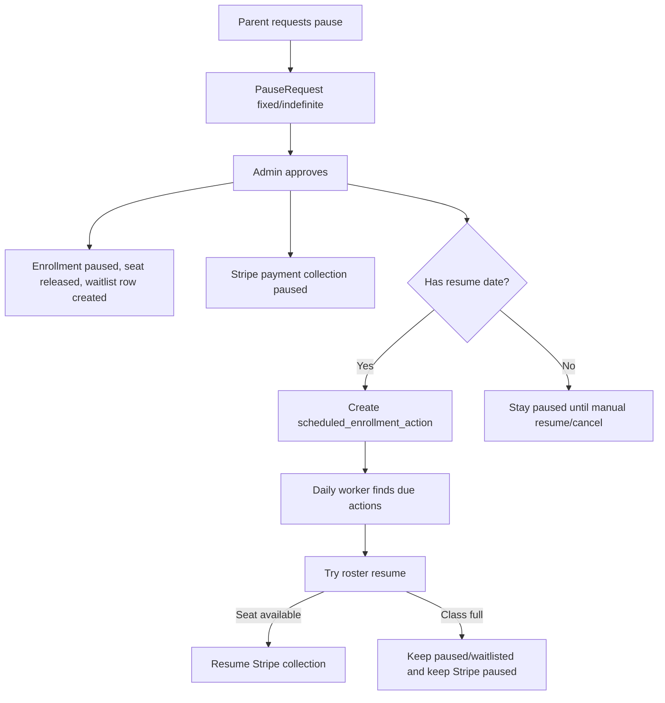

# Pause, Resume, and Autopay Coordination Design

## Status

Draft for review.

## Problem

Parent pause requests currently capture a single month and reason. The backend has roster pause and resume primitives, but pause approval does not yet represent the full product workflow: releasing the seat, moving the student to waitlist, pausing Stripe billing, and optionally attempting an automatic resume later.

The main risk is billing confusion. If Stripe resumes collection before the app can restore the student to the roster, the parent may be charged without an active seat, which can force refunds and create support issues.

## Product Decision

When a parent requests a pause, the app should ask whether the pause is fixed-date or indefinite.

- Fixed-date pause requires a requested resume date.
- Indefinite pause has no scheduled resume.
- Cancellation or withdrawal is a separate action, not a pause.

If the resume date arrives and the class is full, the enrollment stays paused and waitlisted, and Stripe billing stays paused until an admin resolves it.

## Recommended Architecture

Use the app as the source of truth for roster and billing coordination. Stripe follows app state; Stripe `resumes_at` should not be the primary resume trigger for pauses that release a seat.

## Backend Components

### Pause Request

Extend pause requests with:

- `pause_kind`: `fixed` or `indefinite`
- `resume_on`: date, required for `fixed`
- `reason`
- existing status fields: `pending`, `approved`, `declined`

Approval should orchestrate:

1. Approve the request.
2. Run the roster pause workflow.
3. Pause Stripe payment collection for the linked subscription.
4. Create a scheduled resume action only when `pause_kind` is `fixed`.

### Scheduled Enrollment Actions

Add a small `scheduled_enrollment_actions` collection:

- `action_id`
- `academy_id`
- `action_type`: `resume_from_pause`
- `enrollment_id`
- `pause_request_id`
- `run_at`
- `status`: `pending`, `succeeded`, `blocked_capacity`, `failed`, `cancelled`
- `attempt_count`
- `last_attempt_at`
- `last_error`
- `created_at`
- `updated_at`

Indexes:

- `(academy_id, status, run_at)` for due action lookup.
- unique `(academy_id, pause_request_id, action_type)` for idempotency.

### Worker

Run a daily lightweight worker, ideally off-hours in academy timezone.

The worker:

1. Finds due pending `resume_from_pause` actions where `run_at <= now`.
2. Attempts `ResumeEnrollment`.
3. If resume succeeds, clears Stripe pause collection and marks action `succeeded`.
4. If capacity is full, marks action `blocked_capacity` and leaves Stripe paused.
5. If an unexpected error occurs, increments attempt count and marks `failed` after retry policy is exhausted.

Daily is preferred over weekly because the cost is negligible for a short Mongo query, while weekly can delay a requested resume by up to seven days.

## Admin and Parent UX

Parent pause form should show:

- Pause type: fixed-date or indefinite.
- Requested resume date when fixed-date is selected.
- Reason.
- Separate cancellation/withdrawal path.

Admin pause queue should show:

- Pause type.
- Requested resume date or indefinite.
- What approval will do: release seat, move to waitlist, pause billing.
- If a scheduled resume later blocks due to capacity, show it as an admin attention item.

Copy should avoid promising guaranteed roster re-entry. Suggested wording:

> We will attempt to resume this enrollment on the requested date if a seat is available.

## Stripe Policy

For seat-releasing pauses:

- Pause payment collection when admin approves the pause.
- Do not rely on Stripe `resumes_at` as the main restore mechanism.
- Resume Stripe collection only after roster resume succeeds.

For indefinite pauses:

- Keep Stripe payment collection paused until admin resumes, parent cancels, or admin withdraws.

For cancellation/withdrawal:

- Use the separate cancellation or withdrawal flow.
- Cancel Stripe subscription according to policy, such as at period end or immediately.

## Failure Modes

- Class full on resume date: keep enrollment paused/waitlisted, keep Stripe paused, mark scheduled action `blocked_capacity`, surface to admin.
- Stripe resume fails after roster resume succeeds: keep action failed for retry and surface billing attention. The enrollment should not be silently reverted without an explicit policy.
- Duplicate worker run: unique action key and idempotent status transitions prevent duplicate resumes.
- App restart: scheduled action is durable in Mongo, so processing resumes on the next worker run.

## Verification Plan

- Unit tests for fixed-date and indefinite pause request validation.
- Application tests for pause approval creating scheduled action only for fixed-date pauses.
- Application tests for worker success path: paused enrollment resumes, waitlist entry removed, Stripe collection resumed.
- Application tests for worker capacity-blocked path: enrollment stays paused, waitlist remains, Stripe remains paused.
- Interface tests for parent request payload and admin pause queue fields.
- Contract tests for Stripe gateway pause and resume calls using fake gateway.

## Open Decision

Use a daily worker for automatic resume attempts. Weekly processing is rejected for now because it creates too much lag relative to the requested resume date.
