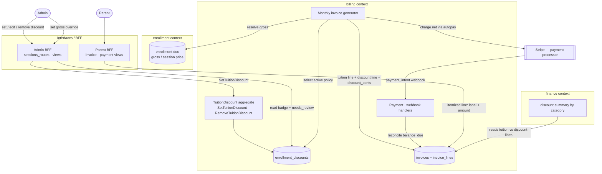

# First-class tuition discounts & waivers — Design

- **Date:** 2026-06-23
- **Issue:** [#244](https://github.com/Ramc4685/academy-manager/issues/244)
- **Status:** Design — pending review
- **Author:** Architecture session (Claude)

## 1. Problem

Admins can zero out or reduce a per-enrollment session fee today, but the reduction is an
invisible manual `amount_cents` with no recorded reason. Two consequences:

1. Admins cannot tell *why* a student is discounted/waived.
2. Billing/finance cannot distinguish gross tuition from discounted/waived tuition, and the
   reason is not reproducible after invoice generation.

We want **first-class, recurring, categorized tuition discounts and waivers** that are visible
in the admin UI, applied correctly to generated invoices, itemized for parents, and reportable
by finance — without disturbing onboarding legal/liability waivers.

## 2. Decisions (locked)

| # | Decision | Choice |
|---|----------|--------|
| D1 | Source of truth | New tenant-scoped `enrollment_discounts` collection (dedicated, versioned) |
| D2 | Scope | Full feature in one design; phased build order (§14) |
| D3 | Raw fee override | Stays for setting **gross** base price only; any net **below** gross must go through the categorized discount flow |
| D4 | Categories | Fixed list + **Other (custom label)**; no settings UI in v1; schema is catalog-ready |
| D5 | Parent visibility | Parent sees **category label + amount** on their own invoice; never the private note |
| D6 | Sibling discounts | Supported as a `category`; **manual** only |
| D7 | Out of scope | Automatic sibling detection; one-time courtesy credits (use existing credit ledger); legal/liability waivers |

## 3. Current behavior (verified against the codebase)

- Admin student detail fee modal copy: "Use 0.00 to waive this student's session fee."
  ([page.tsx:1574](../../../frontend/app/(admin)/admin/students/[studentId]/page.tsx#L1574))
- Frontend sends only `amount_cents`; the API client type `OverrideEnrollmentFeeRequest` already
  has an optional `reason` field, but the page never populates it
  ([students.ts:165-178](../../../frontend/lib/api/v2/students.ts#L165-L178)).
- Route `POST /api/v2/admin/enrollments/{id}/fee` accepts `amount_cents` + optional `reason`
  ([sessions_routes.py:442-459](../../../backend/v2/interfaces/admin/sessions_routes.py#L442-L459)).
- `OverrideEnrollmentFee` use case writes amount fields only via `update_amount_cents`; the
  `reason` is **dropped**
  ([admin_writes.py:627-639](../../../backend/v2/contexts/enrollment/application/use_cases/admin_writes.py#L627-L639)).
- `MongoEnrollmentWriter.update_amount_cents` sets `amount_cents`, `gross_amount_cents`,
  `final_amount_cents` to the same value
  ([mongo_enrollment_writer.py:50-72](../../../backend/v2/contexts/enrollment/infrastructure/mongo_enrollment_writer.py#L50-L72)).
- Admin read model `AdminStudentSessionSummary` exposes only `amount_cents`
  ([mongo_student_repo.py:511-530](../../../backend/v2/contexts/enrollment/infrastructure/mongo_student_repo.py#L511-L530)).
- Monthly invoice generation resolves tuition from the **session document** in
  `_resolve_charge_for_enrollment` → `_session_amount_cents`
  ([mongo_payment_repo.py:1393-1463](../../../backend/v2/contexts/billing/infrastructure/mongo_payment_repo.py#L1393-L1463)).
- **Key enabler:** the ledger invoice model already has `subtotal_cents`, `discount_cents`,
  `total_cents`, and typed `invoice_lines` (with `source_type`/`source_id`). `discount_cents`
  is currently hardcoded to `0`. This design lights up that dormant machinery rather than
  inventing parallel structure — and advances the billing-ledger-convergence plan.

## 4. Architecture: policy → projection

Two layers, separated:

- **`TuitionDiscount` policy** — durable, categorized, dated, audited source of truth. Set once
  by an admin, edited over time. Lives in `enrollment_discounts`.
- **Invoice projection** — at monthly generation the active policy becomes a real **discount
  line** on the ledger invoice plus the header `discount_cents`, with a **snapshot** of
  category/kind/gross/net so the math is reproducible forever, even if the policy later changes.

The discount aggregate lives in the **billing context** (billing already computes `gross`), so
`net = gross − discount` is computed entirely within billing — no cross-context coupling at
invoice time.

### 4.1 Context map & data flow

**Domain note:** *Discount* and *Invoice* are **not** separate domains — both are aggregates
**inside the single `billing` bounded context** (`contexts/billing/`). Only two bounded contexts
participate: **`enrollment`** (owns gross/session price) and **`billing`** (owns the discount
policy, the ledger invoice/lines, and payment). **Stripe** is the external payment processor;
the **`finance`** context optionally consumes discount reporting.



### 4.2 Monthly invoice generation (with discount + Stripe)

```mermaid
sequenceDiagram
  autonumber
  participant Job as Monthly job
  participant Gen as Invoice generator (billing)
  participant Enr as enrollment (session price)
  participant Disc as enrollment_discounts
  participant Inv as ledger invoice
  participant Stripe as Stripe

  Job->>Gen: generate_monthly_payments(period)
  Gen->>Enr: resolve gross (proration-aware)
  Gen->>Disc: active policy for (enrollment, period)?
  alt policy eligible (overlaps period)
    Disc-->>Gen: category · kind · value
    Gen->>Gen: net = gross − discount (per §6)
    Gen->>Inv: tuition line (+gross) · discount line (−discount) · header discount_cents + snapshot
  else no policy
    Gen->>Inv: tuition line (+gross) only
  end
  Inv-->>Gen: total_cents = subtotal_cents − discount_cents
  Gen->>Stripe: charge net (autopay)
  Stripe-->>Gen: payment_intent webhook
  Gen->>Inv: reconcile balance_due_cents
  Note over Gen,Inv: re-run uses deterministic id inv-monthly-{enrollment}-{period}<br/>→ updates in place, applied exactly once; finalized/paid not re-priced
```

## 5. Data model — `enrollment_discounts`

Tenant-scoped (`academy_id`), append-only versioned. At most one `active` policy per enrollment.

```text
enrollment_discounts
{
  discount_id:      str (uuid),
  academy_id:       str,            # tenant scope
  enrollment_id:    str,
  student_id:       str,            # denormalized for reporting

  category:         "owner_child" | "coach_child" | "scholarship" | "sibling" | "other",
  category_label:   str | null,     # required when category == "other"

  kind:             "waiver" | "percent" | "amount_off" | "fixed_net",
  percent_bps:      int | null,     # kind == percent  (e.g. 1000 = 10%)
  amount_off_cents: int | null,     # kind == amount_off
  fixed_net_cents:  int | null,     # kind == fixed_net (explicit final monthly tuition)

  effective_start:  date,
  effective_end:    date | null,    # null = ongoing
  note:             str | null,     # admin-private; never exposed to parents

  status:           "active" | "superseded" | "ended",
  set_by:           str,            # admin user id
  set_at:           datetime,
  ended_by:         str | null,
  ended_at:         datetime | null,
}
```

**Invariants**

- At most one `active` policy per `enrollment_id` per academy.
- Editing supersedes the prior active row (insert new `active`, mark old `superseded`) — history
  retained.
- Removing marks the active row `ended` (records `ended_by`/`ended_at`).
- `category == "other"` requires non-empty `category_label` (max 255 chars).

**Policy selection for a billing period** (deterministic, single-policy):

A policy is *eligible* for period `P = [period_start, period_end]` when:

```text
status == "active"
AND effective_start <= period_end
AND (effective_end IS NULL OR effective_end >= period_start)   # any overlap
```

Because the active-policy invariant allows at most one `active` row per enrollment, normally
exactly one policy is eligible. **Tiebreaker** (defensive, in case of data anomalies): pick the
eligible policy with the latest `set_at`. The chosen policy is snapshotted onto the invoice at
generation, so the selection is frozen even if the policy later changes (see §9).

> Note: a policy applies to the **whole** period if it overlaps at all — we do **not** time-slice
> a discount within a month. Mid-month start/stop takes effect on the **next** period's invoice.
> This keeps one discount line per monthly invoice and avoids partial-month discount math layered
> on top of first-month proration.

**Indexes:** `(academy_id, enrollment_id, status)`, `(academy_id, status, category)` for reporting.

## 6. Net computation (pure domain logic)

Given a proration-aware `gross_cents`:

| kind | net_cents |
|------|-----------|
| `waiver` | `0` |
| `percent` | `gross − round(gross × percent_bps / 10000)` |
| `amount_off` | `max(0, gross − amount_off_cents)` |
| `fixed_net` | `fixed_net_cents`, prorated by the same first-month ratio as gross |

`discount_cents = gross − net_cents`.

Edge rules (all explicitly tested):
- Floors: net never negative; `discount_cents` never exceeds `gross`.
- First-month proration runs on **gross first**, then the kind is applied. `fixed_net` is treated
  as a full-month target and prorated by the same first-month ratio.

Worked examples (full month `gross = $100.00`):
- `percent`, `percent_bps=1000` → net `$90.00`, discount `$10.00`.
- `amount_off`, `amount_off_cents=4000` → net `$60.00`, discount `$40.00`.
- `fixed_net`, `fixed_net_cents=4000` → net `$40.00`, discount `$60.00`.

First-month proration example (ratio `5/20` of the month, `gross_prorated = $25.00`):
- `percent` 10% → net `$22.50`.
- `fixed_net` `$40.00` → prorated target `$40.00 × 5/20 = $10.00` net.
- `amount_off` `$40.00` → `max(0, $25.00 − $40.00) = $0.00` net (floor applies; document this so
  admins know a large amount-off on a partial first month fully waives that month).

## 7. DDD boundaries

- **Billing context owns the aggregate:** `contexts/billing/domain/tuition_discount.py`
  (entity + net-computation), `contexts/billing/infrastructure/mongo_tuition_discount_repo.py`
  (extends `TenantScopedRepository`), use cases `SetTuitionDiscount` / `RemoveTuitionDiscount`.
- **Invoice projection** lives in billing (`_resolve_charge_for_enrollment` +
  `_dual_write_ledger_invoice`).
- **Admin BFF orchestrates:** admin routes call the billing use cases for writes; the admin
  student-detail **view** composes discount metadata into its response by querying the discount
  repo. Enrollment context takes **no** billing dependency (respects import-linter).
- **Enrollment context** unchanged for discounts; its raw fee override keeps writing `gross` only.
  `final_amount_cents` stops being overloaded for discounts — net is derived per invoice.

## 8. Contracts

### Backend (v2 admin BFF — no legacy `/api/*`)

- `PUT /api/v2/admin/enrollments/{enrollment_id}/tuition-discount`
  Body: `{ category, category_label?, kind, percent_bps?|amount_off_cents?|fixed_net_cents?,
  effective_start?, effective_end?, note? }` → returns the active policy + computed preview.
  Replaces any existing active policy (supersede). **Category required.**
- `DELETE /api/v2/admin/enrollments/{enrollment_id}/tuition-discount` → ends the active policy.
- `POST /api/v2/admin/enrollments/{id}/fee` (existing) — now **gross only**; reject a value below
  the **session base price** with an error directing to the discount endpoint.

**"Session base price" is defined** as the session document's `price_cents` (the same value
`_session_amount_cents` resolves from, see §3), resolved at validation time — **not** the
enrollment's possibly-already-overridden `amount_cents`. Guard:

```python
if amount_cents is not None and amount_cents < session_price_cents:
    raise ValueError(
        "Amount is below the session base price; use the tuition-discount "
        "endpoint to apply a categorized discount."
    )
```

Validation: category required; `other` ⇒ non-empty `category_label` (≤255 chars); exactly one
value field set per kind; value ranges (`0 < percent_bps ≤ 10000`, `amount_off_cents ≥ 0`,
`fixed_net_cents ≥ 0`); resulting net cannot exceed gross; `effective_end ≥ effective_start`.

### Admin read model

`AdminStudentSessionSummary` gains:

```text
discount: {
  category, category_label, kind,
  gross_cents, discount_cents, net_cents,
  label,            # "Scholarship", "Sibling discount", "Founding family rate", ...
  effective_start, effective_end,
  status,
  needs_review,     # derived: billed < gross AND no active policy
} | null
```

`needs_review` is **derived at read time** — no migration, no stored flag. Exact rule:

```text
needs_review = (enrollment.amount_cents < session_price_cents) AND (no active policy exists)
```

To derive this without N+1 queries, the admin BFF batch-loads active policies for the student's
enrollments and attaches the snapshot; `needs_review` is computed in the composition layer.

**Label mapping** (single source of truth, used by admin badge and parent line):

```text
owner_child  -> "Owner child"
coach_child  -> "Coach child"
scholarship  -> "Scholarship"
sibling      -> "Sibling discount"
other        -> category_label (verbatim)
```

### Parent read model

The discount appears as an `InvoiceLine` (`line_type='discount'`) on the parent's own invoice and
payment surfaces — concretely the parent BFF invoice/payment views backing
`frontend/lib/api/v2/...` parent billing pages. Each line exposes `{ label, amount_cents }` only;
`note` and internal snapshot fields are stripped at the parent BFF. Label comes from the mapping
above. (Per D5.)

## 9. Invoice projection details

In `_resolve_charge_for_enrollment`: after computing proration-aware `gross_cents`, look up the
active policy for `(enrollment, period)`, compute `net`/`discount_cents`.

In `_dual_write_ledger_invoice`:
- Existing tuition line at `gross` (positive).
- New `discount` line: `line_type='discount'`, `amount_cents = −discount_cents` (negative),
  `description = "<label> discount"` (label per §8 mapping), `source_type='tuition_discount'`,
  `source_id=discount_id`, plus snapshot fields `{category, category_label, kind, gross_cents,
  net_cents}`.

**Subtotal/discount/total accounting (explicit).** `subtotal_cents` is the sum of **positive
tuition lines only** and equals `gross`; the discount line does **not** roll into the subtotal.
The header `discount_cents` mirrors the discount line magnitude. `recompute_totals()` then yields
`total_cents = subtotal_cents − discount_cents`:

```text
tuition $100, 10% scholarship:
  Line 1  tuition   +$100.00
  Line 2  discount   −$10.00   source_type=tuition_discount
  subtotal_cents = 10000     # tuition only
  discount_cents =  1000     # header mirrors line 2 magnitude
  total_cents    =  9000     # subtotal − discount
  balance_due_cents recomputed from total
```

Implementers must verify against the existing `recompute_totals()` in the ledger domain whether it
already excludes the discount line from `subtotal_cents`; if it sums all lines, the discount line
must be excluded from the subtotal computation (or the header `discount_cents` derived from the
discount line) so the identity `total = subtotal − discount` holds exactly. This is a required
unit test (§13).

**Idempotency / re-run.** Monthly invoices use the deterministic id
`inv-monthly-{enrollment_id}-{period}` (verified in `mongo_payment_repo.py`), so re-running
`generate_monthly_payments` for a period **updates the same invoice** rather than creating a
duplicate. Required behavior: re-generation recomputes `discount_cents`, `total_cents`, and
`balance_due_cents` from the **currently active** policy and re-snapshots the discount line, while
leaving the tuition line (`gross`) unchanged. The discount is therefore applied **exactly once**
per invoice. If the invoice is already `paid`/finalized, re-generation must **not** silently
change a settled amount — it skips the discount mutation and logs, consistent with how the
generator already treats finalized invoices (implementer to confirm the existing finalized-state
guard and mirror it).

## 10. UI / UX

### Admin (student detail) — the common case is 2 clicks

- Next to the session fee: **"Add discount"** button; legacy `$0`/below-price rows show a
  **"Needs review"** chip that opens the *same* editor pre-filled.
- Compact editor with **live preview**:
  - **Category** (dropdown, required; `Other` reveals a label input)
  - **Type**: `Waive fully` · `% off` · `$ off` · `Set final price` (Waive = one tap)
  - **Value** (hidden for Waive)
  - **Dates**: start defaults to today; end blank = ongoing
  - **Private note** (optional)
  - Live line: `Gross $100.00 → Net $90.00 · Sibling 10%`
- Save → badge renders instantly: `$90.00 · Sibling` / `$0.00 · Scholarship`. Edit/remove inline.
- Inline validation (net cannot exceed gross; `Other` requires a label) — no surprise server
  errors.

### Parent (invoice/payment)

Itemized line: `Sibling discount  −$10.00`. No note, no management.

### Persona isolation

| Persona | Sees |
|---------|------|
| Admin | Full management UI, all categories, private notes, every student |
| Coach | Nothing (no route, no field) |
| Parent | Discount line on their **own** invoice only (label + amount) |

## 11. Backfill & reporting (no destructive migration)

- **Backfill** = read-time derivation only. Legacy `amount_cents < gross` with no active policy ⇒
  surfaced as **Unclassified / Needs review** in admin; classifying it creates a policy. Optional
  **read-only** script to *list* affected enrollments — never auto-mutates.
- **Finance reporting** = billing query `tuition_discount_summary(period)` summing tuition lines
  (gross) vs discount lines grouped by `category`, off the snapshotted invoice lines.

## 12. Out of scope (explicit)

- **Automatic sibling detection** — auto-applying a discount when a family has 2+ active
  enrollments. The schema holds a `sibling` category fine; the auto-derivation rules engine is a
  future feature requiring no schema change.
- **One-time courtesy credits** — single-month adjustments belong in the existing
  `account_credit_ledger`, not as a recurring policy here.
- **Legal/liability waivers** — onboarding signature flows are untouched; billing `kind=waiver`
  is a tuition-zeroing concept only, kept in a separate collection with separate naming.

## 13. Test strategy

- **Domain unit:** net computation for each kind incl. proration interplay, floors, `fixed_net`
  proration, `other`-requires-label.
- **Repo/contract:** set supersedes prior active; remove ends policy; tenant isolation; index
  behavior.
- **Invoice generation** (model on `tests/contract/test_mongo_payment_repo.py`): full waiver ⇒
  `total_cents == 0` + discount line present + `discount_cents` set; partial percent/amount_off/
  fixed_net; **the subtotal identity** `total_cents == subtotal_cents − discount_cents` with the
  discount line excluded from subtotal; `fixed_net` with first-month proration (`fixed_net=10000`,
  ratio `5/20` ⇒ `net==2500`); `amount_off` floor on a prorated first month ⇒ `net==0`;
  **idempotent re-run** updates the same `inv-monthly-...` invoice and does not double-apply;
  re-run after a policy edit re-snapshots; **finalized/paid invoice is not mutated** on re-run;
  policy-period overlap selection (start mid-month applies next period).
- **Interface:** route validation (category required, value ranges, raw override below gross
  rejected).
- **Read model/contract:** admin student detail returns discount metadata + `needs_review`.
- **Frontend:** typecheck; unit/node tests for badge rendering and submit payload.
- **E2E:** set scholarship full waiver + coach-child partial; confirm badge in admin and itemized
  line in admin + parent invoice.

## 14. Recommended build order

1. Billing domain + `enrollment_discounts` repo + set/remove use cases + tests.
2. Invoice projection (discount line + header + snapshot) + tests. *(billing correctness first)*
3. Admin BFF route + read-model `discount` + `needs_review` + contract/interface tests.
4. Admin UI: badge + editor, replace "0.00 to waive" + frontend tests.
5. Parent UI: itemized public label + tests.
6. Reporting query + "Needs review" listing + tests.
7. E2E across admin + parent.

## 15. Touched files (anticipated)

- `backend/v2/contexts/billing/domain/tuition_discount.py` *(new)*
- `backend/v2/contexts/billing/infrastructure/mongo_tuition_discount_repo.py` *(new)*
- `backend/v2/contexts/billing/application/use_cases/` — `SetTuitionDiscount`, `RemoveTuitionDiscount` *(new)*
- `backend/v2/contexts/billing/infrastructure/mongo_payment_repo.py` *(projection)*
- `backend/v2/interfaces/admin/sessions_routes.py` *(routes + gross-override guard)*
- `backend/v2/interfaces/admin/views.py` *(read-model composition)*
- `backend/v2/contexts/enrollment/infrastructure/mongo_student_repo.py` *(if summary shape changes)*
- `frontend/lib/api/v2/students.ts` *(types + client fns)*
- `frontend/app/(admin)/admin/students/[studentId]/page.tsx` *(badge + editor)*
- Parent invoice surface(s) *(itemized label)*
- Tests across `tests/contract`, `tests/application`, `tests/interface`, frontend, E2E.

## 16. Open questions for implementation

- Exact parent invoice surface(s) and component to itemize the discount line (parent BFF view +
  React component) — named at build step 5.
- `tuition_discount_summary(academy_id, period)`: confirm it reads `invoice_lines` where
  `source_type='tuition_discount'` grouped by `category` summing `amount_cents`; decide ship in
  this slice vs immediate fast-follow.
- Backfill script scope: produce a count of legacy enrollments (`amount_cents < session price`,
  no active policy) before deciding whether a default-classification pass is warranted; the script
  is **list-only** by default.
- Confirm the existing `recompute_totals()` subtotal behavior (sums all lines vs positive lines)
  to finalize the discount-line/subtotal exclusion approach (§9).
